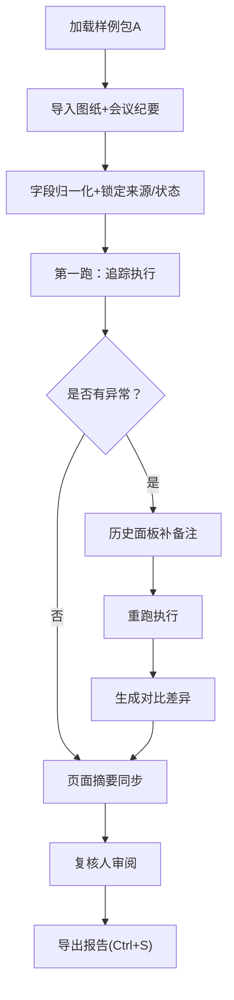

## 1. 产品概述

屋面排水材料追踪系统是面向设计院助理、复核人员的专业工具，解决会议纪要字段混乱、图纸版本确认困难、碰撞点追踪含糊等核心痛点。通过 Web3D 可视化与时间轴联动，实现材料追踪全链路可追溯。

- 核心目标：把混乱的会议纪要字段归一化，确认最新图纸版本，碰撞点追到原始说法，历史记录前后一致
- 目标用户：设计院助理（阿宁）、复核人

## 2. 核心功能

### 2.1 用户角色

| 角色 | 登录方式 | 核心权限 |
|------|----------|----------|
| 设计院助理 | 本地登录 | 上传图纸版本、导入会议纪要、执行材料追踪批次、查看3D可视化 |
| 复核人 | 本地登录 | 查看异常、审阅追踪结果、补备注重新执行、导出报告 |

### 2.2 功能模块

1. **主控制台**：批次管理面板、样例包导入区、当前状态摘要
2. **Web3D 可视化区**：屋面模型点选、图纸版本时间轴、材料高亮联动
3. **会议纪要处理链**：字段归一化映射、来源/状态锁定、原始说法追溯
4. **碰撞点追踪区**：碰撞清单、原始引用跳转、去重判定
5. **历史与导出**：执行历史对比、备注补录重跑、CSV/JSON 导出
6. **使用说明面板**：快速启动指引（样例包→重来→摘要）

### 2.3 页面详情

| 页面名称 | 模块名称 | 功能描述 |
|----------|----------|----------|
| 主控制台 | 批次管理 | 展示所有追踪批次，状态标签（待处理/进行中/已复核/异常），支持新建批次和补备注重跑 |
| 主控制台 | 样例包导入区 | 拖拽上传图纸包+会议纪要，内置「标准样例包A」一键加载 |
| 主控制台 | 页面摘要 | 实时汇总：材料总数、异常数、碰撞数、最新版本确认标记 |
| Web3D 可视化区 | 3D场景 | Three.js 渲染屋面排水系统，点选构件高亮对应材料记录 |
| Web3D 可视化区 | 时间轴控制器 | 水平滑动切换图纸版本节点，每个节点标注版本号+会议纪要来源 |
| Web3D 可视化区 | 筛选联动器 | 按材料类型/处理状态/异常等级筛选，3D场景同步高亮/灰显 |
| 会议纪要处理链 | 字段归一化 | 自动识别「材料/物料/构件」「状态/处理情况/进度」等同义字段，映射到标准字段 |
| 会议纪要处理链 | 来源状态锁定 | 强制保留「来源（会议纪要编号）」「处理状态」两字段，任何归一化不丢失 |
| 碰撞点追踪区 | 碰撞清单 | 去重展示碰撞点，每条附带置信度和涉及材料 |
| 碰撞点追踪区 | 原始引用追溯 | 点击碰撞点跳转至会议纪要原始段落，高亮对应原文 |
| 历史与导出 | 执行历史对比 | 同批次多次执行的差异对比（新增备注、状态变化） |
| 历史与导出 | 导出中心 | 选择批次+执行轮次导出 CSV/JSON，文件名自动携带批次号+时间戳 |
| 使用说明面板 | 快速指引卡片 | ①先跑哪包样例→②失败怎么重来→③从哪里看摘要，三步式图文指引 |

## 3. 核心流程

### 主流程描述
1. 设计院助理从样例包导入区加载「标准样例包A」（或上传自有图纸+纪要）
2. 系统自动归一化会议纪要字段，锁定来源和处理状态
3. 执行第一跑：生成材料清单、碰撞检测、版本标记
4. 若发现异常/失败，在历史面板补备注后点击「重跑」
5. 复核人接手：从异常中心查看问题→在3D区点选确认→从导出中心输出报告
6. 页面摘要实时同步所有关键指标，任一步骤均可查看

## 4. 用户界面设计

### 4.1 设计风格
- **主色**：工程蓝 `#1F3A5F`（专业、沉稳），辅色：警示橙 `#E8823D`（异常）、通过绿 `#3DAE6F`
- **按钮风格**：扁平直角2px圆角，主按钮带轻微投影，危险按钮橙红渐变
- **字体**：标题用 Noto Serif SC 600（工程严肃感），正文用 JetBrains Mono（数字/编号对齐友好）
- **布局**：左侧导航+右上时间轴+中央3D+右侧面板的工程工作站布局，卡片式模块分隔
- **图标风格**：线性+填充混合，关键操作使用Emoji强化识别（📦样例包、🔍碰撞、📤导出）

### 4.2 页面设计概览

| 页面名称 | 模块名称 | UI 元素 |
|----------|----------|----------|
| 主控制台 | 批次管理 | 列表卡片，状态标签带圆点脉冲动画，hover展开执行次数 |
| 主控制台 | 样例包导入区 | 虚线拖拽框，内置「🚀 一键加载样例包A」按钮居中放大 |
| 主控制台 | 页面摘要 | 4个大数字卡片，数字变化时滚动计数动画 |
| Web3D 区 | 时间轴 | 水平节点式，当前版本节点蓝环脉冲，hover显示纪要编号 |
| Web3D 区 | 3D场景 | 构件线框+半透明填充，点选后外发光+信息浮窗 |
| 处理链面板 | 字段映射表 | 左右对照：原始字段→标准字段，未映射行橙色高亮 |
| 碰撞区 | 原始引用 | 抽屉式侧滑，原文高亮黄色背景，右上角「📍 第X条」定位 |
| 历史面板 | 对比视图 | 左右分栏，差异行黄色背景，新增备注绿色标记 |
| 说明面板 | 三步指引 | 大号编号①②③，每步配简笔示意图+跳转按钮 |

### 4.3 响应式
桌面优先（最小1280px），3D场景自适应容器宽度，时间轴移动端改为垂直堆叠，侧边面板可折叠。

### 4.4 3D场景指引
- **环境**：HDRI 工厂室内柔光，基调偏冷蓝灰，屋面构件为灰白色混凝土质感
- **光照**：主光+两盏补光，排水管道用金属反光材质突出，雨水斗加微弱发光点
- **相机**：初始45°俯视角，支持轨道控制（OrbitControls），缩放限制在2-10倍
- **交互**：点选高亮（外发光+描边），hover显示材料编号标签，双击跳转详情
- **后处理**：轻微Bloom让发光材质突出，FXAA抗锯齿
- **性能**：控制面数<5万，使用实例化渲染（InstancedMesh）处理重复管道
