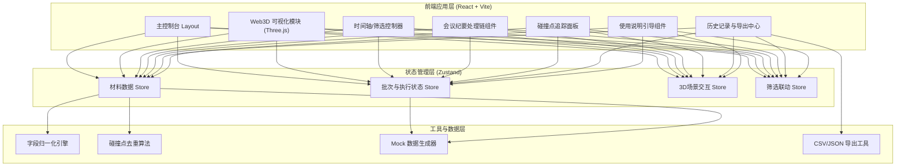
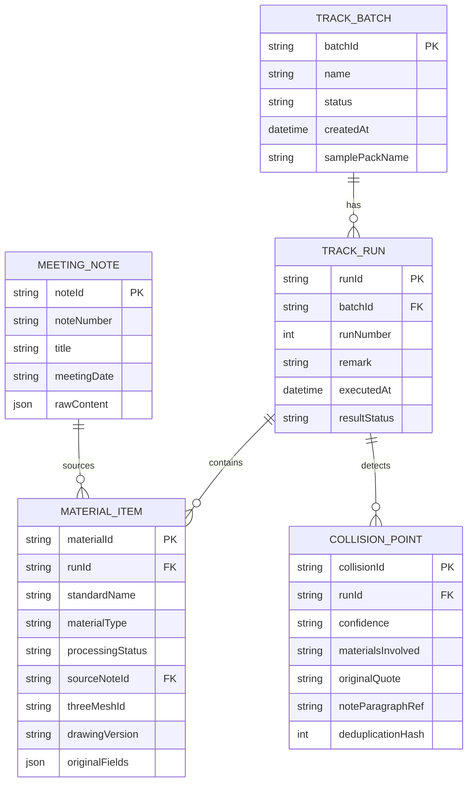

## 1. 架构设计



## 2. 技术说明

- **前端框架**: React@18 + TypeScript + Vite@5
- **样式方案**: TailwindCSS@3 + SCSS 变量（主题色管理）
- **3D渲染**: three@0.160 + @react-three/fiber@8 + @react-three/drei@9 + @react-three/postprocessing@2
- **状态管理**: zustand@4（轻量、免模板）
- **路由**: react-router-dom@6（单页应用，hash路由免配置）
- **后端**: 无后端，全部数据本地化 Mock + localStorage 持久化
- **数据持久化**: localStorage 存储批次/执行历史，导入导出用文件系统

## 3. 路由定义

| 路由 | 用途 |
|------|------|
| `/` | 主控制台（默认入口）：批次管理 + 样例导入 + 页面摘要 |
| `/tracker` | 追踪工作台：Web3D + 时间轴 + 筛选 + 会议纪要处理链 |
| `/collision` | 碰撞中心：碰撞清单 + 原始引用追溯 |
| `/history` | 历史与导出：执行对比 + 导出中心 + 使用说明 |

## 4. 数据模型

### 6.1 数据模型定义



### 6.2 字段归一化映射表

| 标准字段 | 可识别的同义字段（含大小写变体） |
|----------|----------------------------------|
| materialName / 材料名称 | 物料名、构件名、item、品名、排水材料名 |
| materialType / 材料类型 | 类型、类别、category、type、规格分类 |
| processingStatus / 处理状态 | 状态、处理情况、进度、status、state、处理结果 |
| source / 来源 | 来源、纪要编号、出处、from、reference、note_ref |
| drawingVersion / 图纸版本 | 版本号、图纸版本、ver、version、rev、修订号 |
| position / 位置 | 安装位置、坐标、location、position、区域 |

### 6.3 核心类型定义（TypeScript）

```typescript
// 批次
interface TrackBatch {
  batchId: string;
  name: string;
  status: 'pending' | 'running' | 'reviewed' | 'abnormal';
  createdAt: string;
  samplePackName: string;
  currentRunId?: string;
}

// 单次执行记录
interface TrackRun {
  runId: string;
  batchId: string;
  runNumber: number;
  remark: string;
  executedAt: string;
  resultStatus: 'success' | 'failed' | 'warning';
  drawingVersion: string;
  materialCount: number;
  collisionCount: number;
  abnormalCount: number;
}

// 材料追踪项（归一化后）
interface MaterialItem {
  materialId: string;
  runId: string;
  standardName: string;
  materialType: 'pipe' | 'hopper' | 'gutter' | 'fitting' | 'sealant';
  processingStatus: 'confirmed' | 'pending' | 'conflicted' | 'obsolete';
  sourceNoteId: string;
  sourceNoteNumber: string;
  threeMeshId: string;        // 关联3D模型网格ID
  drawingVersion: string;
  position: { x: number; y: number; z: number };
  originalFields: Record<string, unknown>;  // 保留原始字段（防丢失）
  lockedFields: ['source', 'processingStatus'];  // 强制锁定不被覆盖
}

// 碰撞点
interface CollisionPoint {
  collisionId: string;
  runId: string;
  confidence: 'high' | 'medium' | 'low';
  involvedMaterialIds: string[];
  originalQuote: string;       // 会议纪要原文
  noteParagraphRef: string;    // 第X条定位
  deduplicationHash: number;   // 去重哈希
}

// 会议纪要
interface MeetingNote {
  noteId: string;
  noteNumber: string;
  title: string;
  meetingDate: string;
  paragraphs: NoteParagraph[];
}

interface NoteParagraph {
  index: number;
  rawText: string;
  extractedFields: Record<string, string>;
  matchedStandards: string[];  // 匹配到的标准字段
}

// 筛选状态（联动3D场景）
interface FilterState {
  materialTypes: string[];
  processingStatuses: string[];
  drawingVersions: string[];
  collisionOnly: boolean;
}

// 时间轴节点
interface TimelineNode {
  version: string;
  label: string;
  timestamp: string;
  noteNumber: string;
  isLatest: boolean;
}
```

## 5. 核心算法说明

### 5.1 字段归一化引擎
- 输入：`Record<string, any>`（原始纪要字段）
- 处理：对每个 key 做中文分词+拼音首字母模糊匹配映射表
- 输出：`MaterialItem` + `originalFields` 深拷贝
- 强制规则：`source` 和 `processingStatus` 一旦识别即锁定，后续任何重映射不覆盖

### 5.2 碰撞点去重算法
- 对 `involvedMaterialIds.sort().join('|') + originalQuote.slice(0,20)` 做 FNV-1a 哈希
- 哈希相同即判重，保留置信度最高的一条，重复次数存入计数器

### 5.3 导出文件名规则
`{batchId}_run{runNumber}_{YYYYMMDD-HHmmss}.{csv|json}`

## 6. 目录结构

```
src/
├── assets/              # 静态资源（字体、3D纹理）
├── components/
│   ├── layout/          # 导航、面板容器
│   ├── console/         # 主控制台组件
│   ├── scene3d/         # 3D场景、时间轴、筛选器
│   ├── processing/      # 字段归一化面板
│   ├── collision/       # 碰撞追踪面板
│   └── history/         # 历史导出组件
├── stores/              # zustand stores
├── data/
│   ├── mock/            # 样例包A生成器
│   └── mappings/        # 字段映射表、同义词典
├── engine/              # 归一化引擎、去重算法
├── utils/               # 导出、哈希、localStorage
├── pages/               # 路由页面
├── types/               # TS类型定义
└── App.tsx
```
