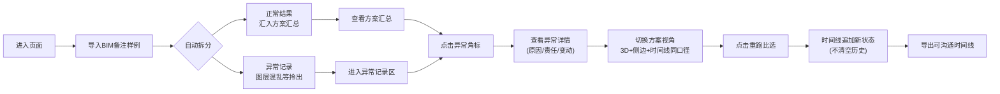

## 1. 产品概述

屋面排水方案比选工具，面向项目经理、结构工程师、施工方三方协同，在同一界面内完成多方案BIM比选、异常拎出、链路追溯与时间线沉淀。

- 解决的核心问题：比选过程中「场景标注/侧边说明/历史时间线三套口径」「晚到附件卡死流程」「图层命名混乱混入正常结果」「重跑后历史断线」四大痛点。
- 目标价值：交付可直接带去早会沟通的时间线视图，从汇总→异常→变动原因链路完整可追，重跑不断线。

---

## 2. 核心功能

### 2.1 用户角色

| 角色 | 使用场景 | 核心关注点 |
|------|---------|-----------|
| 项目经理 | 方案比选汇总、异常追责、早会汇报 | 口径统一、链路不中断、可沟通时间线 |
| 结构工程师 | BIM 备注录入、材料送审 | 晚到附件不卡流程、图层混乱单独拎出 |
| 施工方 | 施工口径对齐、状态变更追踪 | 与设计端同一套业务事实、变动原因清晰 |

### 2.2 功能模块（单页应用）

1. **3D 屋面场景区**：建模屋面、天沟、排水点、坡度方向，支持方案切换高亮
2. **方案汇总面板**：多方案比选结果总览，显示正常/异常计数、推荐等级
3. **侧边说明 + 场景标注面板**：与时间线共用同一数据源，口径严格一致
4. **异常记录区**：图层命名混乱等问题从正常结果中拆分，点入看详情与变动原因
5. **BIM 备注导入工具**：导入样例（正常、晚到附件、图层混乱、状态变更）
6. **历史时间线**：按时间顺序串联所有状态变化，是最终交付产物
7. **重跑比选动作**：不清空历史，仅追加新状态，可见"之前→现在→为什么变"

### 2.3 页面功能明细

| 页面区域 | 模块名称 | 功能描述 |
|---------|---------|---------|
| 左侧 | 3D 屋面场景 | 可旋转/缩放，方案切换时高亮对应屋面区域与排水点，图层异常区域标红闪烁 |
| 右上 | 方案汇总卡片 | 方案 A/B/C 的指标对比（排水效率、造价、工期、风险），异常数量角标 |
| 右中 | 侧边说明 + 场景标注 | 与时间线同源：选中方案的业务口径、责任方、当前状态、备注原文 |
| 右中 | 异常记录区 | 图层命名混乱/缺失/冲突列表，每条可点击展开查看具体异常、责任人、变动原因 |
| 右下 | 历史时间线 | 所有事件按时间排序：方案生成→备注录入→附件到齐→状态变更→重跑追加 |
| 顶部工具栏 | 导入/重跑/切换视角 | 导入 BIM 样例备注、触发重跑比选、切换方案视角 |

---

## 3. 核心流程

主流程描述：用户进入页面 → 导入 BIM 备注样例（自动拆分正常与异常） → 查看方案汇总 → 点击异常数量角标进入异常记录 → 选中单条异常查看原因与责任口径 → 切换方案视角看到 3D 高亮与侧边说明同步变化 → 触发「重跑比选」 → 观察时间线仅追加新状态、历史保留完整 → 最后在时间线视图向各方沟通。

---

## 4. 用户界面设计

### 4.1 设计风格

- **主色调**：深蓝工业灰底（#0F172A / #1E293B），辅以工程蓝（#3B82F6）与警示橙（#F59E0B）、异常红（#EF4444）
- **字体**：标题使用 "Chakra Petch"（工业科技感无衬线），正文使用 "Noto Sans SC"（中文易读）
- **按钮**：方形切角 4px，hover 发光描边，按下有微下陷
- **布局**：双栏高密度工作台布局，左侧 60% 为 3D 场景，右侧 40% 为三层堆叠（汇总/说明+异常/时间线）
- **视觉点缀**：HUD 风格边框、虚线连接线、栅格底纹、数值微滚动画

### 4.2 页面设计总览

| 页面区域 | 模块 | UI 细节 |
|---------|------|---------|
| 顶栏 | 工具条 | 深色 HUD 面板，左侧产品名「屋面排水方案比选」，右侧导入/重跑按钮 + 方案切换 Tabs |
| 左侧 | 3D 场景 | 深色背景带栅格地板，屋面半透明蓝色，排水点白色球体，异常区域红色描边脉冲动画，操作提示悬浮左上角 |
| 右上 | 方案汇总 | 三张对比卡片，指标用条形柱，异常数量红色圆形角标可点击 |
| 右中 | 说明+异常 | 标签页切换「侧边说明」与「异常记录」；说明区引用时间线同源文本；异常区每条有图层缩略名 |
| 右下 | 时间线 | 竖向时间轴，节点左侧为时间，右侧为事件卡片；晚到附件用虚线描边 + 橙色「待补齐」标签 |
| 底部 | 状态栏 | 显示当前选中方案、已录入备注数、异常数、最近重跑时间 |

### 4.3 响应性

- 桌面端（≥1440px）为默认优化分辨率
- 1024~1440px：右侧面板堆叠比例微调
- <1024px：上下堆叠布局，3D 场景在上，数据面板在下并支持内部滚动

### 4.4 3D 场景指引

- **环境**：深色 studio 风格，软阴影，泛光后处理
- **灯光**：主方向光 + 两盏补光，天沟与排水点略亮以突出重点
- **相机**：初始 45° 俯视，可 OrbitControls 自由旋转缩放，有复位按钮
- **交互**：点击方案 Tab 屋面切色，异常图层对应屋面边缘发光脉冲，悬停显示属性标签
- **后处理**：Bloom 泛光（仅发光边缘）、轻微 SSAO 增加深度感
- **性能**：单个屋面 < 5000 面，用几何体构建而非外部模型加载，保证秒开
