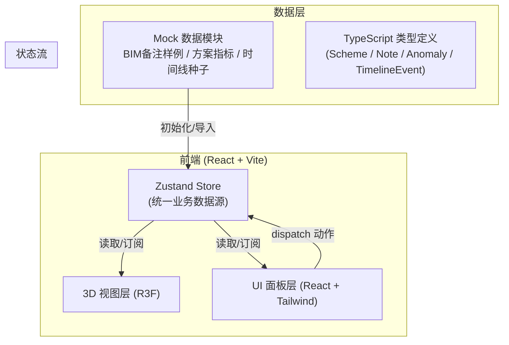
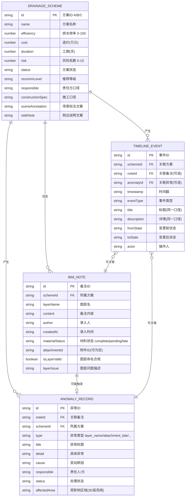

## 1. 架构设计



核心原则：**单数据源**（Zustand Store）——侧边说明、场景标注、历史时间线全部从同一个 Store 派生，绝对不会出现三套口径。

---

## 2. 技术选型说明

| 层 | 技术 | 版本 | 选型理由 |
|----|------|------|---------|
| 构建工具 | Vite | ^5 | 秒级冷启动 + HMR，适合本地演示 |
| 框架 | React | ^18 | 生态成熟，与 R3F 配合最好 |
| 语言 | TypeScript | ^5 | 类型安全，保证业务数据模型一致性 |
| 3D 渲染 | three + @react-three/fiber + @react-three/drei | latest | 声明式 Three.js，OrbitControls/Html 开箱即用 |
| 后处理 | @react-three/postprocessing | latest | Bloom 泛光实现 HUD 发光效果 |
| 状态管理 | zustand | ^4 | 轻量、扁平化、订阅粒度细，避免 UI 无谓重渲染 |
| 样式 | tailwindcss | ^3 + 自定义 CSS 变量 | 快速构建 HUD 风格界面 |
| 图标 | lucide-react | latest | 工业风线性图标，与整体气质一致 |
| 后端 | 无（纯前端 mock） | — | 演示工具，无需后端 |
| 部署 | 本地 dev server / 静态 dist | — | 用户要求可本地打开或启动 |

---

## 3. 路由定义（单页应用）

| 路由 | 页面 | 说明 |
|------|------|------|
| `/` | 主页（Dashboard） | 3D 场景 + 汇总 + 说明 + 异常 + 时间线 全部集成 |

---

## 4. 数据模型定义



---

## 5. 目录结构

```
/
├── index.html
├── package.json
├── vite.config.ts
├── tsconfig.json
├── tailwind.config.js
├── postcss.config.js
├── public/
│   └── (静态资源占位)
└── src/
    ├── main.tsx
    ├── App.tsx
    ├── index.css
    ├── types/
    │   └── index.ts           # 所有业务类型定义
    ├── data/
    │   └── mockData.ts        # 3 套方案 + 8 条 BIM 备注样例
    ├── store/
    │   └── useStore.ts        # Zustand: 单数据源 + 动作
    ├── components/
    │   ├── layout/
    │   │   ├── TopBar.tsx
    │   │   └── StatusBar.tsx
    │   ├── scene3d/
    │   │   ├── Scene3D.tsx
    │   │   ├── Roof.tsx
    │   │   ├── DrainPoints.tsx
    │   │   └── SceneAnnotations.tsx
    │   ├── panels/
    │   │   ├── SchemeSummary.tsx
    │   │   ├── SideNotes.tsx
    │   │   ├── AnomalyList.tsx
    │   │   ├── AnomalyDetail.tsx
    │   │   └── Timeline.tsx
    │   └── common/
    │       └── HudCard.tsx
    └── utils/
        └── helpers.ts         # 时间格式化/异常分类等工具
```

---

## 6. Zustand Store 核心动作

| 动作 | 说明 | 是否清空历史 |
|------|------|-------------|
| `selectScheme(id)` | 切换方案视角，3D/侧边/时间线同步过滤 | 否 |
| `importNotes(notes[])` | 导入 BIM 备注，自动校验图层、拆分异常 | 否（追加） |
| `rerunComparison()` | 重跑比选，生成新一轮状态变更事件 | **否（仅追加）** |
| `openAnomaly(id)` | 打开异常详情，3D 高亮受影响区域 | 否 |
| `markAttachmentArrived(noteId)` | 标记晚到附件已到齐，追加时间线事件 | 否 |
| `filterTimeline(params)` | 按方案/事件类型过滤时间线（保留全量，只改视图） | 否 |

**口径一致性保障**：所有文案（`sceneAnnotation` / `sideNote` / `timelineEvent.description`）均由 Store 在动作触发时通过**同一函数**生成并存入对应字段，从根源杜绝三套话。

---

## 7. 关键交互实现策略

| 需求点 | 实现方式 |
|--------|---------|
| 三套话问题 | Store 内 `buildCanonicalText(scheme, note)` 统一生成场景标注/侧边说明/时间线详情 |
| 晚到附件不卡死 | `materialStatus = 'late'` 的备注正常入库，时间线节点加虚线边框 + 橙色 `待补齐` 标签 |
| 图层混乱单独拎出 | 导入时校验 `layerName` 正则（`^[A-Z]{2,3}-\d{3}-[A-Z]{1,2}$`），不通过生成 `ANOMALY_RECORD` 并从正常计数排除 |
| 汇总→异常→原因链路 | 汇总卡片异常角标 → 筛选 `AnomalyList` → 点击展开 `AnomalyDetail`（显示 `cause` + `responsible`） |
| 重跑不断线 | `rerunComparison()` 只对各方案 `status` 做 transition，追加新 `TIMELINE_EVENT`（含 `fromState`/`toState`），不删除已有记录 |
| 3D 异常高亮 | `AnomalyRecord.affectedArea` 存屋面分区 id，R3F 中对匹配 mesh 加 `Bloom` 选频发光 + `useFrame` 脉冲缩放 |

---

## 8. 构建与运行命令

| 命令 | 说明 |
|------|------|
| `npm install` | 首次安装依赖 |
| `npm run dev` | 启动本地开发服务（默认 http://localhost:5173） |
| `npm run build` | 构建静态资源到 `dist/`（可直接用 `npx serve dist` 打开） |
| `npm run check` | TypeScript 类型检查 |
