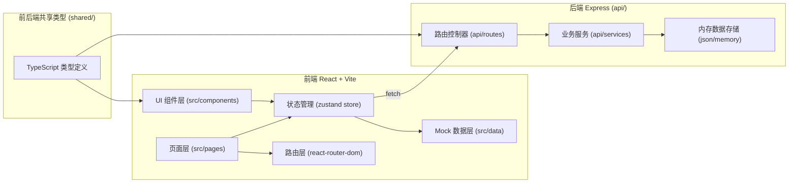
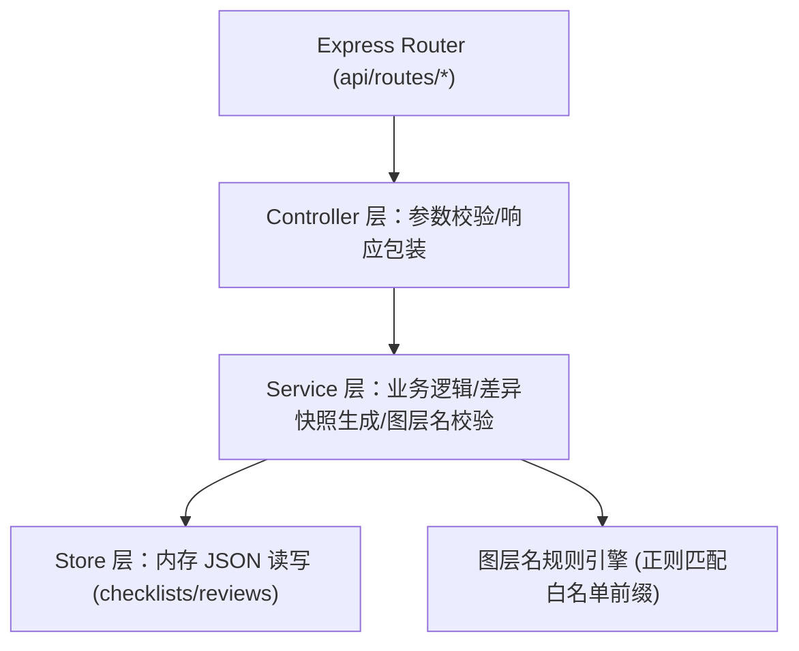
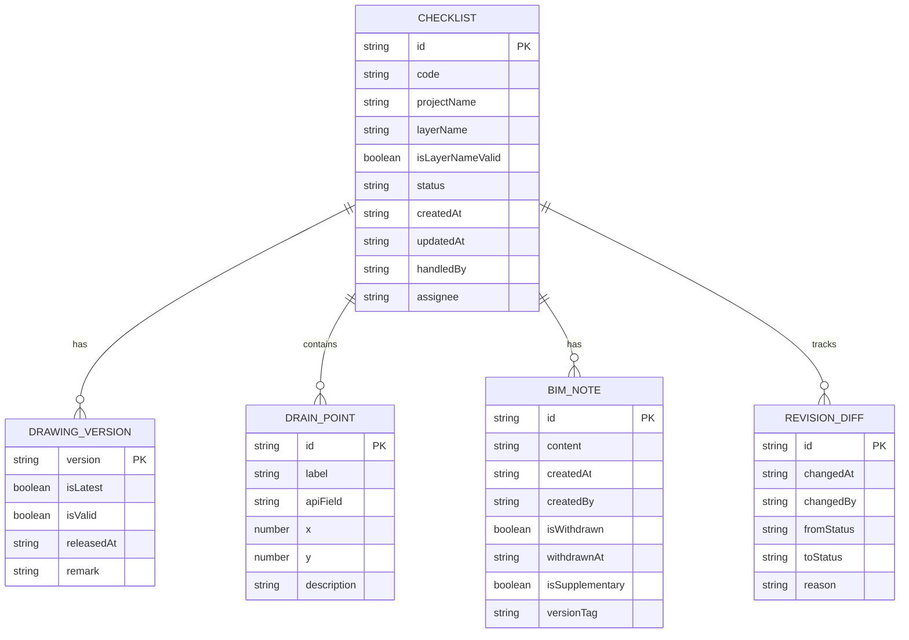

## 1. 架构设计



## 2. 技术描述

- **前端框架**：React@18 + TypeScript + Vite
- **样式方案**：tailwindcss@3 + CSS 变量（设计令牌）
- **路由管理**：react-router-dom（非懒加载，直接 import）
- **状态管理**：zustand（清单状态、当前角色、筛选条件）
- **图标库**：lucide-react（线性图标）
- **初始化工具**：vite-init（react-express-ts 模板）
- **后端框架**：Express@4 + TypeScript（ESM）
- **数据存储**：开发阶段使用内存 JSON 存储 + Mock 数据（4 条样例，不接入外部数据库）
- **前后端通信**：Fetch API + 共享 TS 类型

## 3. 路由定义

### 3.1 前端路由

| 路由路径 | 页面组件 | 用途 |
|----------|----------|------|
| `/` | `ChecklistListPage` | 清单列表页（默认页） |
| `/checklist/:id` | `ChecklistDetailPage` | 清单详情页（含场景标注、BIM备注、改判对比） |
| `/checklist/new` | `ChecklistEditPage` | 新建清单（图层名校验、BIM备注编辑） |
| `/checklist/:id/edit` | `ChecklistEditPage` | 编辑已有清单 |
| `/review` | `MonthlyReviewPage` | 月底复核面板（三态分类统计） |

### 3.2 后端 API 路由

| Method | Route | 用途 |
|--------|-------|------|
| GET | `/api/checklists` | 获取清单列表（支持 status 查询参数筛选） |
| GET | `/api/checklists/:id` | 获取单条清单详情（含版本历史、BIM备注、改判记录） |
| POST | `/api/checklists` | 新建清单 |
| PUT | `/api/checklists/:id` | 更新清单 |
| PATCH | `/api/checklists/:id/status` | 变更清单状态（含改判流程，自动保存差异快照） |
| POST | `/api/checklists/:id/notes` | 追加 BIM 备注（含后补说明类型） |
| PATCH | `/api/checklists/:id/notes/:noteId/withdraw` | 撤回备注（软删除，保留记录） |
| GET | `/api/review/stats` | 月底复核统计（三态计数 + 异常数） |
| GET | `/api/validate/layername` | 图层名实时校验接口 |

## 4. API 定义与类型

### 4.1 共享类型定义（shared/types.ts）

```typescript
export type ChecklistStatus = 'confirmed' | 'pending' | 'returned' | 'suspended';

export type Role = 'architect' | 'operations';

export interface DrainPoint {
  id: string;
  label: string;           // 场景标注文字（与说明、API字段同源）
  apiField: string;        // 对应接口返回字段名
  x: number;               // 标注图相对坐标
  y: number;
  description: string;     // 说明面板文字（与 label 同源同步）
}

export interface BimNote {
  id: string;
  content: string;
  createdAt: string;
  createdBy: Role;
  isWithdrawn: boolean;    // 是否已撤回
  withdrawnAt?: string;
  withdrawnBy?: Role;
  isSupplementary: boolean; // 是否为后补说明
  versionTag?: string;     // 关联图纸版本
}

export interface RevisionDiff {
  id: string;
  changedAt: string;
  changedBy: Role;
  fromStatus: ChecklistStatus;
  toStatus: ChecklistStatus;
  reason: string;          // 改判原因（必填）
  fieldChanges: Array<{    // 差异快照
    field: string;
    oldValue: string;
    newValue: string;
  }>;
}

export interface DrawingVersion {
  version: string;         // v1, v2, v3...
  isLatest: boolean;
  isValid: boolean;        // 是否已失效（被撤回的版本）
  releasedAt: string;
  remark?: string;
}

export interface Checklist {
  id: string;
  code: string;            // 编号 RD-001
  projectName: string;
  layerName: string;
  isLayerNameValid: boolean; // 图层命名是否规范
  status: ChecklistStatus;
  versions: DrawingVersion[];
  drainPoints: DrainPoint[];
  bimNotes: BimNote[];
  revisions: RevisionDiff[];
  createdAt: string;
  updatedAt: string;
  handledBy: Role;         // 当前处理人角色
  assignee: string;        // 处理人姓名 如"小赵"
}

export interface ReviewStats {
  month: string;
  total: number;
  confirmed: number;
  pending: number;
  returned: number;
  suspended: number;
  reviewedCount: number;
  anomalyCount: number;    // 含撤回或挂起的异常数
}

export interface LayerNameValidation {
  valid: boolean;
  suggestions?: string[];
  shouldSuspend: boolean;  // 是否建议挂起
}
```

### 4.2 请求/响应示例

**PATCH** `/api/checklists/:id/status`
```typescript
// 请求体
interface ChangeStatusReq {
  toStatus: ChecklistStatus;
  reason: string;          // 改判时必填
  changedBy: Role;
}
// 响应体：返回完整 Checklist + 新增 revisionDiff
```

## 5. 服务端架构图



## 6. 数据模型

### 6.1 ER 图



### 6.2 初始样例数据（4 条，覆盖顺利/补录/挂起/改判四场景）

- **RD-001**：`confirmed` 状态，图层名 `A-ROOF-DRAIN-MAIN`（符合规则），3 个标注点，BIM 备注 2 条均正常，版本 v1→v2→v3（v3 最新有效）
- **RD-002**：`pending` 状态，图层名 `B-SIPHON-DRAIN`（合规），BIM 备注含 1 条撤回（v3 版本编号错误）+1 条后补说明，版本 v1→v2→v3（v3 已失效，当前 v2 最新有效）
- **RD-003**：`suspended` 状态，图层名 `layer-x-drain`（不匹配前缀规则，建议挂起），版本 v1，备注提示"待运营主管确认"
- **RD-004**：`returned` 状态，含 1 条改判记录（从 `confirmed`→`returned`，原因"雨水斗规格与图纸标注不符"，保存差异快照）

### 6.3 图层命名校验规则

白名单前缀正则：`^[A-Z]-[A-Z0-9]{2,}-(DRAIN|ROOF|GUTTER)-[A-Z0-9-]+$`
- 命中 → `isLayerNameValid=true`，无需挂起
- 未命中 → `isLayerNameValid=false`，`shouldSuspend=true`，建议转运营主管确认
- 建筑师可强制提交但会标记"图层命名存疑"徽标
