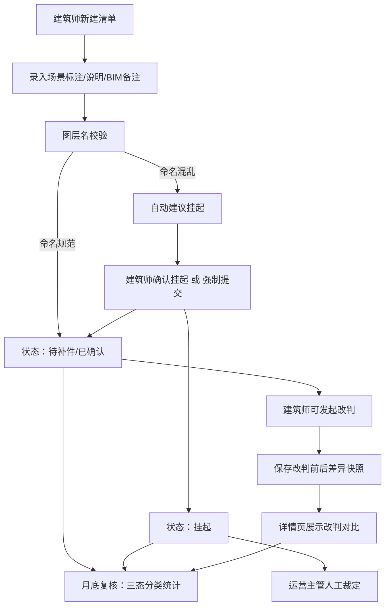

## 1. 产品概述

屋面排水交底清单管理系统，为建筑师和运营主管提供图纸版本确认、交底记录全生命周期管理与改判审计追踪能力。解决多版本图纸无人敢确认最新版、场景标注与接口描述不统一、图层混乱时给出假稳定结论等核心痛点。

- 核心目标：让交底记录从录入、补录、挂起到确认退回，每一步都可追溯、可复核、可解释
- 目标用户：建筑师（录入/改判）、运营主管（挂起确认/复核）

## 2. 核心功能

### 2.1 用户角色

| 角色 | 登录方式 | 核心权限 |
|------|----------|----------|
| 建筑师 | 账号切换 | 录入交底清单、补录记录、发起改判、撤回记录、提交待确认 |
| 运营主管 | 账号切换 | 挂起确认、图层命名混乱时人工裁定、月底复核、最终审批 |

### 2.2 功能模块

1. **清单列表页**：状态分区展示（已确认/待补件/退回/挂起）、版本标签、快捷切换角色、月底复核统计
2. **清单详情页**：场景标注区（与接口数据同源）、右侧统一说明面板、BIM备注（含撤回/后补记录）、版本时间线、改判对比视图
3. **新建/编辑清单**：图层名校验（命名规则触发挂起机制）、BIM备注编辑、图纸版本选择
4. **改判操作面板**：改判前后差别快照、原因说明、操作人留痕
5. **月底复核面板**：三态分类统计（已确认/待补件/退回）、批量导出、异常记录筛选

### 2.3 页面详情

| 页面名称 | 模块名称 | 功能描述 |
|----------|----------|----------|
| 清单列表页 | 顶部状态栏 | 角色切换、月底复核入口、今日待办计数 |
| 清单列表页 | 状态分区标签栏 | 全部/已确认/待补件/退回/挂起，每类带数量徽章 |
| 清单列表页 | 清单卡片列表 | 每条卡片含：项目名、图纸版本号、状态色标、操作人、最后更新时间、图层命名警告标识 |
| 清单详情页 | 场景标注主区 | 左侧排水点位标注图（模拟）、标注描述与后端接口字段名一一对应展示 |
| 清单详情页 | 统一说明面板 | 右侧说明区，文字与场景标注、API返回使用同一数据源，杜绝三套话 |
| 清单详情页 | BIM备注时间线 | 倒序展示：正常记录/撤回记录（红色斜体）/后补说明（黄色标签），撤回记录不可删除 |
| 清单详情页 | 版本对比条 | 图纸版本选择器 + 最新版高亮徽标，历史版本灰色标注"已失效" |
| 清单详情页 | 改判差异区块 | 改判前后字段并排对比，差异处高亮，附改判原因与操作人时间戳 |
| 新建/编辑页 | 图层名实时校验 | 输入图层名匹配命名规则，不匹配则自动标记"建议挂起"并提示运营主管确认 |
| 新建/编辑页 | BIM备注区 | 支持追加后补说明，支持撤回操作（撤回后原记录保留并标记红色） |
| 改判操作面板 | 改判表单 | 原状态→新状态选择、改判原因必填、差别自动快照保存 |
| 月底复核面板 | 三态分类统计表 | 已确认/待补件/退回三栏，每栏条目可点开详情 |
| 月底复核面板 | 复核进度条 | 当月总数/已复核数/异常数进度可视化 |

## 3. 核心流程

### 3.1 交底清单录入流程

建筑师登录后新建清单 → 录入场景标注（同步写入说明面板与接口数据模型）→ 输入图层名触发实时校验 → 图层名不规范则自动建议挂起 → 可选择直接挂起或强制提交 → 提交后进入"待补件"或"已确认"状态 → BIM备注区追加记录

### 3.2 改判与审计流程

建筑师在详情页点击"发起改判"→ 选择原状态与新状态 → 填写改判原因（必填）→ 系统自动保存改判前后差别快照 → 改判记录写入详情页差异区块与BIM备注 → 接班运营主管可通过差异视图完整还原改判逻辑

### 3.3 月底复核流程

运营主管切换角色 → 进入月底复核面板 → 三态分类分别浏览 → 已确认逐条过审 → 待补件联系补充 → 退回记录核对原因 → 异常数据（含撤回记录、图层挂起记录）重点标注 → 复核完成导出汇总

## 4. 用户界面设计

### 4.1 设计风格

- **主色调**：深蓝 `#1e3a5f`（建筑工程专业感），辅色琥珀橙 `#d97706`（警示/挂起）、翠绿 `#059669`（已确认）、砖红 `#dc2626`（撤回/退回）
- **按钮风格**：直角微圆角（2px）、实心主按钮配细描边、次要按钮用幽灵风格
- **字体**：标题用 "Noto Serif SC" 衬线（工程文档感），正文用 "JetBrains Mono" 等宽（数据/编号对齐），说明文字用 "Noto Sans SC"
- **布局风格**：左右分栏主从布局，左侧操作区右侧信息区，卡片之间 4px 细分割线，严格栅格（4px 基准）
- **图标风格**：lucide-react 线性图标，状态色配实色小圆点而非彩色图标

### 4.2 页面设计概述

| 页面名称 | 模块名称 | UI 要素 |
|----------|----------|---------|
| 清单列表页 | 顶部状态栏 | 深蓝底白字，角色切换下拉右对齐，左侧项目名衬线大号字 |
| 清单列表页 | 状态标签栏 | 横向标签，激活态下边框 2px 主色，未激活灰字，数量徽章圆角 10px |
| 清单列表页 | 清单卡片 | 白底浅灰边，hover 时左侧主色 3px 竖条，右上角状态色块（方角 4×16px），底部等宽字体显示时间与编号 |
| 清单详情页 | 场景标注主区 | 模拟排水图用淡蓝网格底，点位用编号圆圈+连线，标注描述右侧用小字灰色显示对应 API 字段名 |
| 清单详情页 | 统一说明面板 | 浅灰蓝底 `#f1f5f9`，标题与场景标注标题文字**完全相同**，底部小字提示"本说明与标注数据、接口返回同源" |
| 清单详情页 | BIM 备注时间线 | 竖线时间轴，每条记录左侧小圆点，撤回记录整行浅红底+删除线+红色斜体"已撤回"标签，后补说明黄底标签"后补" |
| 清单详情页 | 改判差异区块 | 左右两栏对比，左侧"改判前"灰边，右侧"改判后"橙边，差异字段背景高亮，底部操作人+时间戳等宽小字 |
| 新建/编辑页 | 图层名校验 | 输入框右侧实时校验图标，不通过时边框橙色，下方附"建议挂起，待运营主管确认"提示文字 |
| 月底复核面板 | 三态统计表 | 三列等宽卡片，每列顶部大数字+彩色状态条，下方可滚动条目列表，条目点击跳转详情 |

### 4.3 响应式

- 桌面端优先（1280px+），详情页左右分栏 7:5
- 平板端（768-1279px）：详情页改为上下堆叠，说明面板置于标注区下方
- 移动端（<768px）：标签栏可横向滚动，卡片简化为单行信息

### 4.4 演示数据（样例）

预置 4 条样例数据覆盖全流程，运营主管可照着走一遍：

| 编号 | 项目名 | 图纸版本 | 状态 | 设计意图 |
|------|--------|----------|------|----------|
| RD-001 | A3 栋屋面排水 | v3（最新） | 已确认 | 顺利记录：图层命名规范，无撤回，直接确认 |
| RD-002 | B1 栋虹吸排水 | v2（v3 已撤回） | 待补件 | 补录记录：BIM 备注含 1 条撤回记录（v3 编号错误）+ 1 条后补说明 |
| RD-003 | C2 栋雨水斗布置 | v1（图层命名混乱） | 挂起 | 异常记录：图层名 `layer-x-drain` 不匹配规则，待运营主管裁定 |
| RD-004 | D 区天沟排水 | v2（改判过） | 退回 | 改判追踪：从"已确认"改判为"退回"，详情页展示差异快照与改判原因 |
