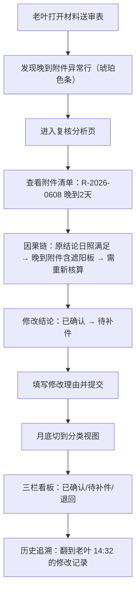

## 1. 产品概述

面向结构工程师的图纸复核审图管理工具，专注解决「日照体量图纸复核」中晚到附件影响结论、图层命名混乱异常、月底分类复核、结论历史追溯四大核心痛点。

- 目标用户：结构工程师（以老叶为典型代表）
- 核心价值：交底清单不漏旧意见、异常处理有因果、复核结论可追溯
- 场景：日常审图登记 → 异常项分析 → 月底分类复核 → 历史结论翻查

## 2. 核心功能

### 2.1 用户角色

| 角色 | 注册方式 | 核心权限 |
|------|----------|----------|
| 结构工程师 | 内部系统分配 | 登记复核、修改结论、查看历史、月底分类复核 |

### 2.2 功能模块

1. **材料送审表列表页**：复核记录表格，夹着晚到附件的异常行高亮展示
2. **复核分析页**：单条复核的因果链分析，晚到附件如何影响结论讲清楚
3. **图层异常处理**：图层命名混乱的待确认原因与处理去向说明
4. **月底分类视图**：已确认 / 待补件 / 退回 三栏分类看板
5. **结论历史追溯**：时间线式结论变更记录，老叶当天改过的痕迹可翻

### 2.3 页面详情

| 页面名称 | 模块名称 | 功能描述 |
|----------|----------|----------|
| 材料送审表 | 顶部统计卡 | 已确认数、待补件数、退回数、晚到附件警告数 |
| 材料送审表 | 复核记录表格 | 项目、图号、送审日期、状态、附件列；晚到附件行用琥珀色条标记 |
| 材料送审表 | 状态筛选 | 全部 / 已确认 / 待补件 / 退回 / 含晚到附件 / 图层异常 |
| 复核分析页 | 基本信息卡 | 项目名、图号、送审/复核日期、当前结论状态 |
| 复核分析页 | 附件清单面板 | 标注哪条是晚到附件，晚到时间差，与结论的关联标签 |
| 复核分析页 | 因果链时间线 | 初始意见 → 晚到附件到达 → 对结论产生何种影响 → 最终/当前结论 |
| 复核分析页 | 图层异常面板 | 混乱图层名称列表、待确认原因、处理去向（重命名/退回/暂挂） |
| 复核分析页 | 结论修改区 | 下拉选新结论，填写修改理由，提交后写入历史 |
| 月底分类视图 | 三栏看板 | 已确认（绿）、待补件（橙）、退回（红）卡片列表 |
| 结论历史追溯 | 变更时间线 | 按时间倒序展示每次结论变更，含修改人、前后值、理由 |

## 3. 核心流程

老叶打开系统 → 在材料送审表中看到夹着晚到附件的异常行（琥珀色条）→ 点击进入复核分析页 → 沿着因果链时间线看清：晚到附件 R-2026-0608 晚到 2 天，其中第 3 层遮阳板与原结论「日照满足」冲突 → 老叶修改结论为「待补件」，填写理由「需补充遮阳板区域日照再核算」 → 月底时切到分类视图，三栏中待补件栏已包含本条 → 在历史追溯中看到自己当天 14:32 修改的那条记录。

## 4. 用户界面设计

### 4.1 设计风格

- **主色调**：中性深蓝灰 `zinc-900` / `zinc-800` 作为底色背景，专业克制的工程审图工具气质
- **强调色**：
  - 已确认：`emerald-500`（稳重绿）
  - 待补件：`amber-500`（提醒琥珀）
  - 退回：`rose-500`（警示红）
  - 晚到附件高亮：`amber-400` 左侧竖条 + 浅琥珀背景
- **按钮风格**：方角微圆（rounded-md），2px 边框，hover 时内阴影 + 轻微背景加深
- **字体**：专业工程气质，`Noto Sans SC` 正文 + `JetBrains Mono` 图号/日期等编号列
- **布局风格**：高密度信息表格为主，左侧导航 + 顶部面包屑的经典工程系统布局
- **图标**：lucide-react 线性图标，保持统一 1.5px 描边

### 4.2 页面设计概览

| 页面名称 | 模块名称 | UI 元素 |
|----------|----------|----------|
| 材料送审表 | 统计卡 | 4 张并排小卡片，数字大号粗体，底部小字说明 |
| 材料送审表 | 异常行 | 左侧 4px 琥珀色竖条 + `bg-amber-50/60` 行底 + 「晚到」标签 |
| 材料送审表 | 图层异常行 | 左侧 4px 橙红色竖条 + 图层图标角标 |
| 复核分析页 | 因果链时间线 | 竖向步骤条，每步有日期、事件描述、影响说明，晚到附件步用琥珀色点 |
| 复核分析页 | 附件卡片 | 晚到附件右上角「晚到 X 天」红色标签，hover 展示具体送达时间 |
| 复核分析页 | 图层异常表 | 三列：混乱名称 / 待确认原因 / 处理去向，处理去向用 badge 颜色区分 |
| 月底分类视图 | 三栏看板 | 等宽三列，顶部带彩色标题条，卡片纵向排列可滚动 |
| 结论历史 | 变更时间线 | 横向日期分节，每节含「修改前→修改后」箭头+理由气泡 |

### 4.3 响应性

- Desktop-first，最小支持 1280px 宽度
- 表格列支持横向滚动
- 三栏看板在 1024px 以下改为上下堆叠布局
- 移动端不做重点支持，保持可读即可

### 4.4 动画与交互

- 异常行进入时 400ms 淡入 + 轻微从右滑入
- 状态 badge hover 时放大 1.05 倍
- 因果链步骤条按顺序逐条显示（300ms 间隔）
- 修改结论提交时按钮 loading 状态 + 成功提示滑出
