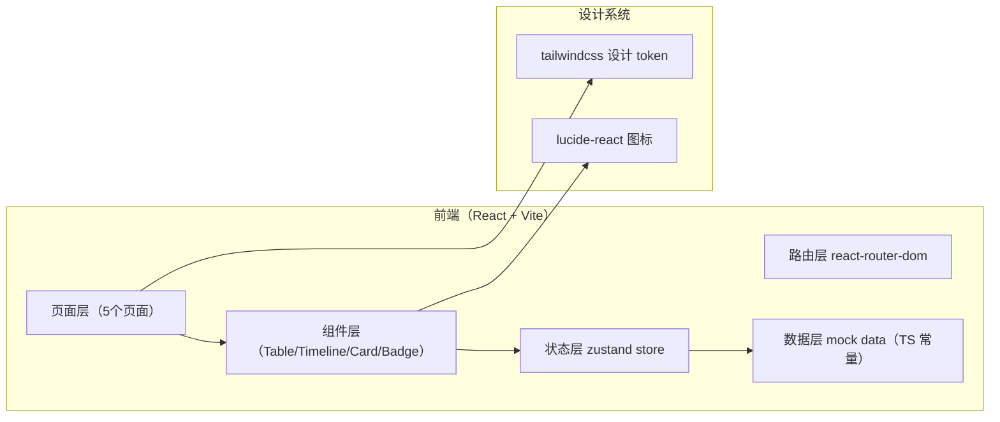
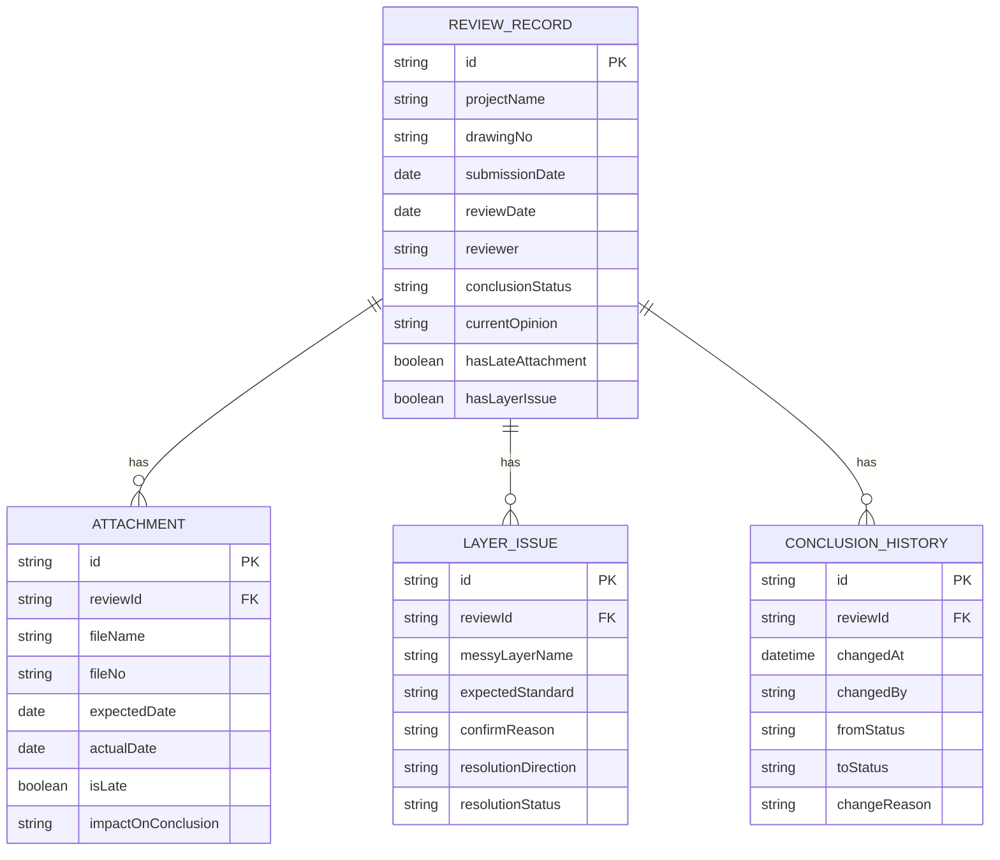

## 1. 架构设计



## 2. 技术描述

- **前端框架**：React@18 + TypeScript
- **构建工具**：Vite 6.x
- **样式方案**：Tailwind CSS 3.x（自定义 design token）
- **状态管理**：zustand 4.x（管理复核记录、筛选条件、历史记录）
- **路由**：react-router-dom 6.x
- **图标**：lucide-react
- **初始化方式**：`react-ts` 模板（纯前端，mock 数据）
- **后端/数据库**：无后端，全部使用 TypeScript 常量构造 mock 演示数据

## 3. 路由定义

| 路由路径 | 页面组件 | 页面用途 |
|----------|----------|----------|
| `/` | `ReviewListPage` | 材料送审表列表页（默认首页） |
| `/review/:id` | `ReviewAnalysisPage` | 复核分析页（因果链 + 图层异常 + 结论修改） |
| `/monthly-board` | `MonthlyBoardPage` | 月底分类三栏看板 |
| `/history` | `HistoryPage` | 结论历史追溯时间线 |

## 4. 数据模型

### 4.1 ER 关系图



### 4.2 TypeScript 类型定义

```typescript
type ConclusionStatus = 'confirmed' | 'pending-material' | 'returned' | 'draft';

interface Attachment {
  id: string;
  fileName: string;
  fileNo: string;
  expectedDate: string;
  actualDate: string;
  isLate: boolean;
  lateDays?: number;
  impactOnConclusion: string;
}

interface LayerIssue {
  id: string;
  messyLayerName: string;
  expectedStandard: string;
  confirmReason: string;
  resolutionDirection: 'rename' | 'return' | 'hold';
  resolutionStatus: 'pending' | 'done';
}

interface ConclusionChange {
  id: string;
  changedAt: string;
  changedBy: string;
  fromStatus: ConclusionStatus;
  toStatus: ConclusionStatus;
  changeReason: string;
}

interface CausalStep {
  id: string;
  date: string;
  title: string;
  description: string;
  impactNote: string;
  isLateStep?: boolean;
}

interface ReviewRecord {
  id: string;
  projectName: string;
  drawingNo: string;
  submissionDate: string;
  reviewDate: string;
  reviewer: string;
  conclusionStatus: ConclusionStatus;
  currentOpinion: string;
  attachments: Attachment[];
  layerIssues: LayerIssue[];
  causalChain: CausalStep[];
  history: ConclusionChange[];
}
```

## 5. 项目结构

```
src/
├── components/
│   ├── StatusBadge.tsx          # 状态徽章
│   ├── StatCard.tsx             # 顶部统计卡
│   ├── FilterTabs.tsx           # 状态筛选 Tab
│   ├── CausalTimeline.tsx       # 因果链时间线
│   ├── AttachmentList.tsx       # 附件清单（晚到高亮）
│   ├── LayerIssueTable.tsx      # 图层异常表
│   ├── ConclusionEditor.tsx     # 结论修改器
│   ├── ReviewCard.tsx           # 月底看板卡片
│   ├── HistoryTimeline.tsx      # 历史追溯时间线
│   └── Sidebar.tsx              # 左侧导航
├── pages/
│   ├── ReviewListPage.tsx       # 材料送审表列表
│   ├── ReviewAnalysisPage.tsx   # 复核分析页
│   ├── MonthlyBoardPage.tsx     # 月底分类看板
│   └── HistoryPage.tsx          # 结论历史追溯
├── store/
│   └── useReviewStore.ts        # zustand 全局状态
├── data/
│   └── mockReviews.ts           # 演示数据（含晚到附件+图层混乱脏数据）
├── types/
│   └── review.ts                # TS 类型定义
├── utils/
│   └── statusMappings.ts        # 状态文案/颜色映射
├── App.tsx
├── main.tsx
└── index.css
```

## 6. 演示数据构造要点

- **总记录数**：12 条复核记录
- **标准干净数据**：9 条（3 已确认 / 3 待补件 / 3 退回）
- **脏数据 1（晚到附件）**：1 条 `R-2026-037`，含 3 个附件，其中 `R-2026-0608-遮阳板补充.dwg` 晚到 2 天，因果链明确说明其如何推翻「日照满足」初始结论
- **脏数据 2（图层命名混乱）**：1 条 `R-2026-041`，含 4 个混乱图层（如 `图层1` / `新建图层 (3)` / `Copy of WALL-01` / `aaa_临时`），每个图层有待确认原因和处理去向
- **脏数据 3（双重异常）**：1 条 `R-2026-045`，同时含晚到附件 + 图层混乱，用于演示复合异常
- **历史记录**：老叶在 2026-06-10 当天至少有 3 次修改轨迹
