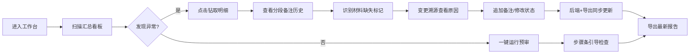

## 1. 产品概述

日照体量碰撞预审系统是面向建筑设计院结构工程团队的BIM图纸协同审核工具。解决图纸版本混乱、备注覆盖丢失、异常原因追溯困难等早会高频痛点。

- 核心问题：版本一多无人敢确认最新版、备注覆盖丢失历史判断、异常缺料无声无息、数字变动无源可溯
- 目标用户：结构工程师（老叶等）、项目负责人、月底封账复核人员
- 产品价值：让每一条备注有历史、每一次变更有原因、每一个异常有标记、负责人30秒看懂全貌

---

## 2. 核心功能

### 2.1 用户角色

| 角色 | 说明 | 核心权限 |
|------|------|----------|
| 结构工程师 | 录入BIM模型备注、标记异常 | 编辑图纸备注、追加材料批次、标记缺失 |
| 项目负责人 | 预审、复核、导出 | 修改状态、查看变更溯源、导出报告、运行预审 |
| 只读查看者 | 月底封账复核 | 全量只读、按流程自引导检查 |

### 2.2 功能模块

1. **预审工作台**：汇总数字看板 + 异常列表快捷入口 + 一键运行预审
2. **图纸版本中心**：版本时间线 + 最新版标识 + 版本差异对比
3. **预审详情页**：图纸卡片 + 分段备注（按追加时间展示）+ 材料批次标记 + 异常复核状态
4. **变更溯源面板**：数字变动记录 + 操作人时间戳 + 原因备注 + 原始线索保留
5. **导出中心**：实时同步最新数据导出 PDF/Excel + 导出日志

### 2.3 页面详情

| 页面名称 | 模块名称 | 功能描述 |
|----------|----------|----------|
| 预审工作台 | 汇总数字看板 | 项目总数/通过数/异常数/待复核数 四色卡片，异常数字可点击钻取 |
| 预审工作台 | 快速异常列表 | Top异常按严重程度排序，一键跳转详情 |
| 预审工作台 | 运行预审引导 | 步骤条引导负责人自助跑预审，材料位置可视化提示 |
| 图纸版本中心 | 版本时间线 | 垂直时间轴展示每次上传，LATEST徽章固定最新版，禁止误操作旧版 |
| 图纸版本中心 | 版本差异 | 两个版本备注差异高亮对比，旧版只读不可编辑 |
| 预审详情页 | 分段备注区 | 按追加时间分块展示，每块带操作人和时间，新备注以"追加"而非"覆盖"方式写入 |
| 预审详情页 | 材料批次标记 | 缺料行以橙色虚线框标记，悬浮显示"缺失待补，接手请复核"提示 |
| 预审详情页 | 异常状态流 | 正常→异常→复核中→已闭环，状态流转全程留痕 |
| 变更溯源面板 | 变动时间线 | 数字变动逐项记录：原值→新值→原因→操作人→时间 |
| 变更溯源面板 | 原始线索保留 | BIM模型原始备注以灰色引用块永久展示，异常处理时不可删除 |
| 导出中心 | 实时同步导出 | 修改备注后导出立即可见最新内容，版本号与导出时间水印 |

---

## 3. 核心流程

### 3.1 日常预审流程

负责人进入工作台 → 扫描汇总看板发现异常数字 → 点击异常卡片钻取明细 → 查看分段备注（含历次追加） → 识别材料缺失标记 → 调用变更溯源查看该数字历次变动原因 → 修改备注或状态 → 系统同步更新后端+导出缓存 → 点击导出获取最新报告

### 3.2 备注追加与防覆盖机制

工程师A录入初始判断 → 工程师B发现新材料 → 系统以"追加块"方式写入而非覆盖 → 原始块保留灰色底色 → 新块标注"后补材料"标签 → 负责人查看时两段并列显示 → 导出报告含完整时间序列

### 3.3 月底封账自服务

负责人点击"运行预审" → 步骤条引导：1.确认最新图纸版本 2.检查异常列表 3.核对缺料项 4.导出封账报告 → 每步完成打勾 → 材料位置用图标定位无需询问 → 全流程无人工介入完成封账

---

## 4. 用户界面设计

### 4.1 设计风格

**工业工程风（Engineering Brutalism）**

- **主色调**：钢蓝灰 `#1E2A3A` 背景 + 蓝图红 `#C0392B` 异常强调 + 警示橙 `#E67E22` 缺料标记 + 通过绿 `#27AE60`
- **辅助色**：图纸米黄 `#F5F0E1` 用于分段备注卡片、铅灰 `#7F8C8D` 用于时间戳和次要信息
- **按钮风格**：方角矩形，2px实边框，按下有内阴影凹陷感（工程图纸印章感）
- **字体**：标题用`Archivo Black`粗旷工程字体 + 正文用`JetBrains Mono`等宽字体（数字对齐，工程编号友好）
- **布局风格**：网格化蓝图布局，带细边框分区，左上角显示项目编号章
- **图标**：线性工程图标（图纸、标尺、印章、警告三角），禁用圆润卡通风格

### 4.2 页面设计概览

| 页面名称 | 模块名称 | UI元素设计 |
|----------|----------|------------|
| 预审工作台 | 汇总看板 | 四张大卡片，钢蓝灰底白字，异常数字用蓝图红放大加粗，点击有下沉动画 |
| 预审工作台 | 异常列表 | 表格行用斑马纹，异常行有橙色左侧竖条标记，hover高亮蓝图红边框 |
| 图纸版本中心 | 版本时间线 | 左侧垂直轴，圆形节点，最新版节点发光+LATEST红章，旧版灰色调 |
| 预审详情页 | 分段备注 | 时间倒序卡片堆叠，每张左上角带操作人印章头像+时间戳，追加块有橙色"后补"角标 |
| 预审详情页 | 材料批次区 | 缺料项用橙色虚线框包裹，右上角警告三角，tooltip显示接手提示 |
| 变更溯源面板 | 变动记录 | diff风格左右对比，原值删除线灰，新值加粗蓝，中间箭头+原因气泡 |
| 全局 | 导出按钮 | 印章风格圆形按钮，带浮雕效果，点击有盖章动画 |

### 4.3 响应式

桌面端优先（1440px+），工程团队均使用大屏显示器。平板端折叠侧栏，移动端仅保留汇总查看功能。

### 4.4 动效指引

- 页面加载：蓝图式从上到下逐行绘制展开
- 备注追加：新卡片从右侧滑入+橙色高亮闪烁3次后恢复
- 状态变更：状态徽章印章盖章动画（缩放+旋转3度）
- 数字变动：数字滚动动画，变动后底色短暂闪黄提示
- 导出成功：右下角"印章已盖"通知浮层
