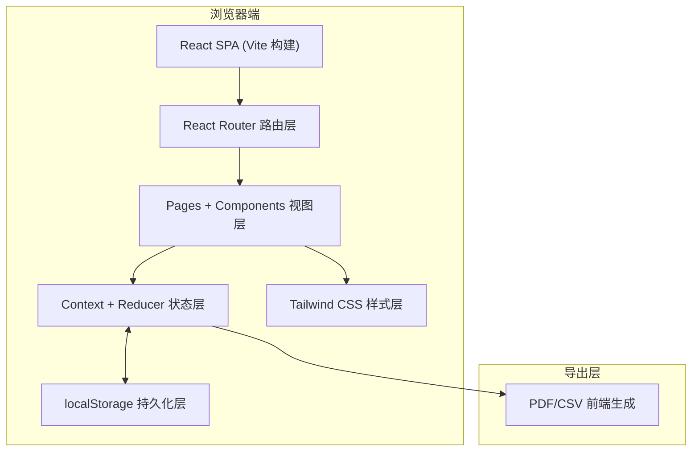
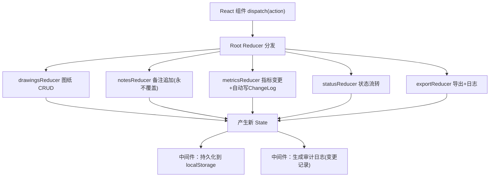
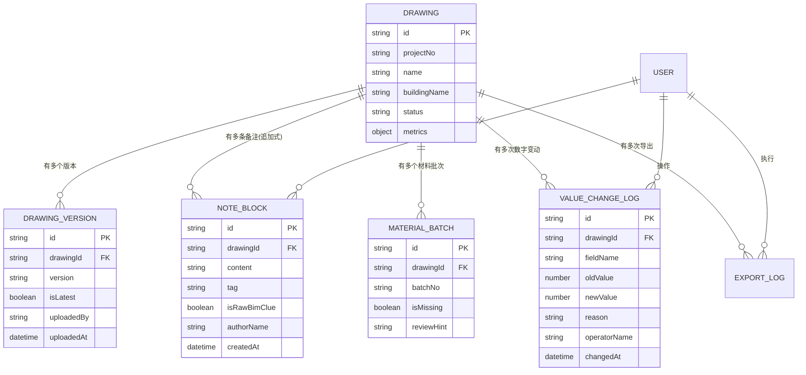

## 1. 架构设计

采用前后端分离的单页应用（SPA）架构，前端使用 React 18 渲染，使用 React Context + useReducer 模拟后端状态管理以实现无服务端运行。使用 localStorage 持久化存储数据，实现刷新不丢失。



---

## 2. 技术描述

- **前端框架**：React@18.2 + TypeScript@5
- **构建工具**：Vite@5
- **样式方案**：TailwindCSS@3.4 + PostCSS
- **路由管理**：React Router DOM@6
- **状态管理**：React Context + useReducer（模拟后端 CRUD + 审计日志）
- **数据持久化**：localStorage（自动序列化/反序列化）
- **导出方案**：jspdf（PDF）+ 原生 Blob（CSV），纯前端生成无需后端
- **UI 图标**：Lucide React（线性工程风格图标）
- **字体方案**：Google Fonts 引入 Archivo Black + JetBrains Mono
- **初始化方式**：`npm create vite@latest -- --template react-ts`

---

## 3. 路由定义

| 路由路径 | 页面组件 | 用途说明 |
|----------|----------|----------|
| `/` | DashboardPage | 预审工作台：汇总看板 + 异常列表 + 运行预审引导 |
| `/drawings` | DrawingsListPage | 图纸版本中心：图纸列表 + 最新版标识 |
| `/drawings/:id` | DrawingDetailPage | 预审详情页：图纸信息 + 分段备注 + 材料批次 + 状态流 |
| `/drawings/:id/versions` | VersionComparePage | 版本差异对比页：两个版本备注 diff 对比 |
| `/drawings/:id/trace` | ChangeTracePage | 变更溯源面板：数字变动完整时间线 + 原始线索 |
| `/export` | ExportCenterPage | 导出中心：实时预览 + PDF/CSV 导出 + 导出日志 |
| `/run-review` | RunReviewPage | 运行预审向导：步骤条引导月底封账自服务 |

---

## 4. 类型定义与数据契约

```typescript
// ========== 核心实体类型 ==========

export type UserRole = 'engineer' | 'manager' | 'viewer';

export interface User {
  id: string;
  name: string;
  role: UserRole;
  avatar: string; // 头像首字母
}

export type DrawingStatus = 'normal' | 'abnormal' | 'reviewing' | 'closed';

export interface DrawingVersion {
  id: string;
  drawingId: string;
  version: string; // "V1.0", "V2.1"
  uploadedBy: string;
  uploadedAt: string;
  isLatest: boolean;
  fileName: string;
  fileSize: number;
  changeLog: string; // 版本变更说明
}

/**
 * 备注块：采用追加式写入，永不覆盖旧备注
 * 对应业务需求："后补材料不能无声覆盖早先判断"
 */
export interface NoteBlock {
  id: string;
  drawingId: string;
  versionId: string;
  content: string;
  authorId: string;
  authorName: string;
  createdAt: string;
  /** 追加标签：后补材料/初始判断/复核意见/异常处理 */
  tag: 'initial' | 'supplement' | 'review' | 'fix';
  /** 是否为BIM模型原始线索（永不删除） */
  isRawBimClue: boolean;
}

/** 材料批次记录 */
export interface MaterialBatch {
  id: string;
  drawingId: string;
  batchNo: string;
  materialName: string;
  /** 缺失标记：对应业务需求"材料批次缺失" */
  isMissing: boolean;
  /** 接手复核提示 */
  reviewHint?: string;
  suppliedAt?: string;
  recordedBy: string;
}

/** 数字变更记录：对应"数字变动要能找得到原因" */
export interface ValueChangeLog {
  id: string;
  drawingId: string;
  fieldName: string; // 变更字段名，如"碰撞点数"、"不合格项"
  oldValue: number;
  newValue: number;
  reason: string; // 变更原因
  operatorId: string;
  operatorName: string;
  changedAt: string;
}

/** 图纸预审核心指标 */
export interface DrawingMetrics {
  collisionPoints: number;     // 碰撞点数
  unqualifiedItems: number;    // 不合格项
  sunShadowRisk: number;       // 日照阴影风险
  volumeDeviation: number;     // 体量偏差
}

export interface Drawing {
  id: string;
  projectNo: string;       // 项目编号，如"BIM-2026-017"
  name: string;            // 图纸名称
  buildingName: string;    // 楼栋名称
  status: DrawingStatus;
  currentVersionId: string;
  metrics: DrawingMetrics; // 预审核心指标（数字）
  createdAt: string;
  updatedAt: string;
}

/** 导出日志 */
export interface ExportLog {
  id: string;
  type: 'pdf' | 'csv';
  drawingId?: string; // 空=全量导出
  operatorName: string;
  exportedAt: string;
  fileName: string;
}

/** 预审运行步骤（月底封账向导） */
export interface ReviewStep {
  key: string;
  title: string;
  description: string;
  completed: boolean;
}

// ========== Store 状态结构 ==========
export interface AppState {
  currentUser: User;
  drawings: Drawing[];
  versions: DrawingVersion[];
  notes: NoteBlock[];
  materials: MaterialBatch[];
  changeLogs: ValueChangeLog[];
  exportLogs: ExportLog[];
}
```

---

## 5. 状态管理架构（模拟后端）



### 关键业务约束（Reducer 层强制实现）

| 约束编号 | 业务规则 | 实现位置 |
|----------|----------|----------|
| R1 | 备注永不覆盖，只能追加 | notesReducer：禁止 UPDATE 操作，仅允许 ADD |
| R2 | BIM原始线索不可删除 | notesReducer：isRawBimClue=true 的 block 禁止 DELETE |
| R3 | 修改指标强制记录原因 | metricsReducer：修改必须传 reason，自动写入 changeLogs |
| R4 | 旧版图纸禁止编辑 | 组件层：isLatest=false 时禁用所有编辑按钮 |
| R5 | 状态流转必须有备注 | statusReducer：状态变更时要求至少有一条 tag=fix/review 的 NoteBlock |
| R6 | 备注变更后自动更新导出缓存 | exportReducer：监听 notes/drawings 变更后标记导出为"待刷新" |

---

## 6. 数据模型（ER图）



---

## 7. Mock 初始数据

预置 5 个项目图纸、15 条分段备注、8 个材料批次（3 个缺失）、12 条变更记录，覆盖所有业务场景：
- V1.0 最新版 + V0.9 旧版 对比场景
- 初始备注 + 后补材料备注 追加场景
- 材料批次缺失 + 复核提示 场景
- 碰撞点数从 12→8→5 的变动溯源场景
- 状态从 normal→abnormal→reviewing→closed 的完整流转场景
