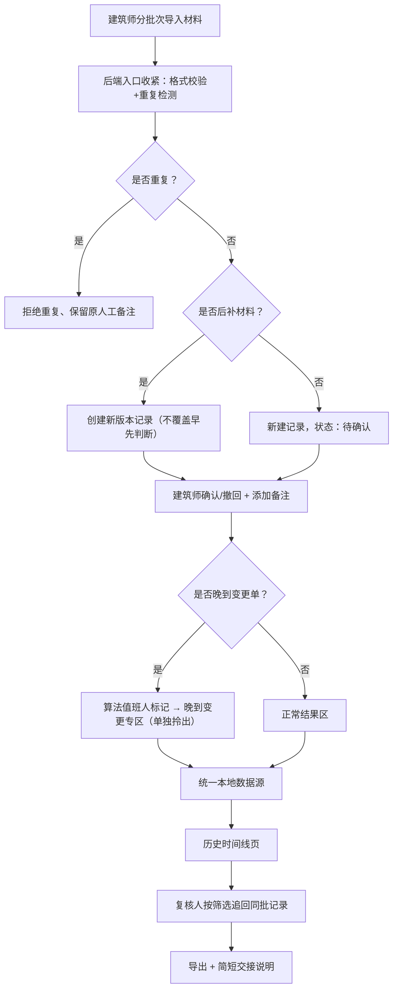

## 1. 产品概述
日照体量方案比选系统是面向建筑师和算法值班人的变更记录管理工具，解决材料送审表分批提交导致的模型回退遗漏、变更记录混杂、重复导入等问题，确保每一条变更记录可追溯、可筛选、可复核。

## 2. 核心功能

### 2.1 用户角色
| 角色 | 核心权限 |
|------|----------|
| 建筑师（小赵） | 导入材料、确认/撤回记录、添加人工备注、导出时间线、交接说明 |
| 复核人 | 按筛选条件批量追回同一批记录、导出复核结果 |
| 算法值班人 | 标记晚到变更单、隔离异常记录 |

### 2.2 功能模块
1. **导入面板**：材料送审表批量/分次导入、数据校验、重复检测
2. **记录管理**：确认、撤回、人工备注编辑、变更标记
3. **历史时间线**：全量记录时间轴、多条件筛选、批次追踪
4. **晚到变更专区**：单独拎出晚到变更单、与正常结果隔离
5. **导出与交接**：时间线导出、筛选追溯、简短交接说明生成

### 2.3 页面详情
| 页面名称 | 模块名称 | 功能描述 |
|----------|----------|----------|
| 主页（记录工作台） | 导入区 | 文件拖拽上传、格式校验、导入预览（高亮重复/冲突） |
| 主页（记录工作台） | 记录列表 | 待确认/已确认/已撤回分栏展示，支持搜索、筛选、批次标记 |
| 主页（记录工作台） | 操作栏 | 批量确认/撤回、人工备注编辑、晚到变更标记 |
| 历史时间线页 | 时间轴 | 按时间倒序展示全量操作记录，关联批次号 |
| 历史时间线页 | 筛选面板 | 按批次号、操作类型、操作员、日期范围筛选 |
| 历史时间线页 | 导出功能 | 导出当前筛选结果为 JSON/CSV |
| 晚到变更专区 | 异常列表 | 单独展示标记为"晚到"的变更单，标识与正常结果的隔离状态 |

## 3. 核心流程

建筑师分次导入材料送审表 → 系统检测重复记录并阻止翻倍 → 后补材料创建新版本（不覆盖早先判断）→ 建筑师逐条确认/撤回并添加备注 → 算法值班人将晚到变更单标记隔离 → 全量操作写入统一本地数据源 → 复核人按批次号/筛选条件追回同批记录 → 导出时间线完成交接

## 4. 界面设计

### 4.1 设计风格
- **主色调**：深青蓝 `#0F4C5C` 作为主色（专业、建筑感），暖橙 `#E36414` 作为警示/晚到标记色
- **辅助色**：苔藓绿 `#5F7367`（确认/通过），暖灰底 `#FBF7F2`（纸张质感）
- **字体**：标题用 Noto Serif SC（建筑图纸衬线感），正文用 Noto Sans SC
- **按钮风格**：微圆角 4px、细边框、点击下陷微交互
- **布局**：左右分栏 + 顶部全局筛选条，卡片式记录块，时间轴竖线引导
- **图标**：Lucide 线性图标，记录卡片配手写感序号标签

### 4.2 页面设计概览
| 页面名称 | 模块名称 | UI 元素 |
|----------|----------|---------|
| 记录工作台 | 导入区 | 虚线拖拽框 + 文件图标，拖入后高亮，冲突项橙色边框标记 |
| 记录工作台 | 记录列表 | 三栏（待确认/已确认/已撤回），每栏内卡片堆叠，悬停微上浮 |
| 记录工作台 | 晚到专区 | 橙色顶部条 + 独立分区，卡片左上角贴"晚到"标签 |
| 历史时间线 | 时间轴 | 左侧竖线，节点圆点，操作卡片错峰排列，批次号用印章样式 |
| 历史时间线 | 筛选面板 | 顶部横排条件 + 折叠展开，已选条件显示为可移除标签 |
| 交接弹窗 | 说明卡片 | 三栏对应：材料送审表 / 处理记录 / 历史时间线，每项配勾选框 |

### 4.3 响应式
桌面优先（≥1280px），中间尺寸（768-1279px）三栏变两栏，移动端（<768px）单栏堆叠，筛选面板收为抽屉。
