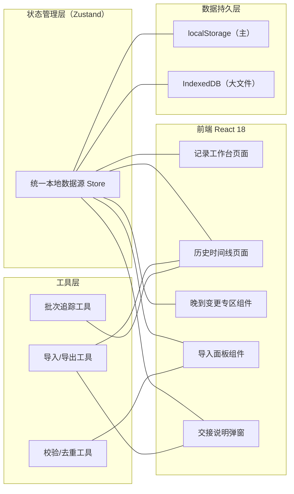
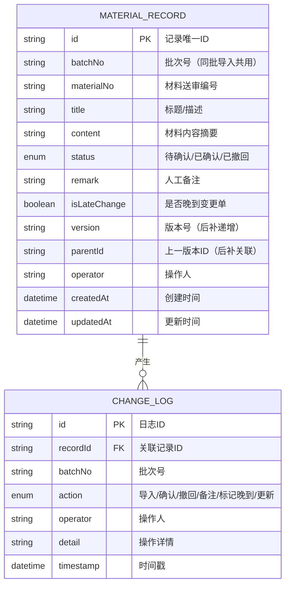

## 1. 架构设计



## 2. 技术选型
- **前端**：React@18 + TypeScript + Vite
- **状态管理**：Zustand（统一单源 Store，导入/确认/撤回/时间线共用）
- **样式**：TailwindCSS 3
- **图标**：lucide-react
- **数据持久化**：localStorage（主存储）+ 可选 IndexedDB（大体积文件）
- **导出格式**：JSON（完整结构）+ CSV（表格视图）
- **后端**：无（纯前端本地应用，后端入口通过严格校验函数模拟"收紧"）

## 3. 路由定义
| 路由 | 用途 |
|------|------|
| `/` | 记录工作台（导入 + 记录列表 + 晚到专区） |
| `/timeline` | 历史时间线页（筛选 + 导出 + 批次追踪） |

## 4. 数据模型

### 4.1 ER 图



### 4.2 数据校验规则（后端入口收紧）
- **必填项**：materialNo、title、batchNo、operator
- **去重键**：`materialNo + version + batchNo`，重复则拒绝导入（不翻倍）
- **备注保护**：更新记录时若 remark 已有值且新 remark 为空 → 保留旧值
- **后补保护**：同 materialNo 已有记录 → 新建 version+1 的新记录，原记录 status 不变
- **晚到标记**：isLateChange=true 的记录单独渲染且在正常筛选中被排除

## 5. Store 设计（Zustand 统一数据源）

```typescript
interface MaterialStore {
  records: MaterialRecord[];
  logs: ChangeLog[];
  // 操作
  importRecords: (items: ImportItem[], operator: string) => ImportResult;
  confirmRecord: (id: string, operator: string) => void;
  revokeRecord: (id: string, operator: string) => void;
  updateRemark: (id: string, remark: string, operator: string) => void;
  markLateChange: (id: string, isLate: boolean, operator: string) => void;
  // 查询
  filterRecords: (filter: FilterOptions) => MaterialRecord[];
  filterLogs: (filter: FilterOptions) => ChangeLog[];
  // 导出
  exportTimeline: (filter: FilterOptions, format: 'json' | 'csv') => Blob;
  // 持久化
  hydrate: () => void;
  persist: () => void;
}
```

## 6. 核心算法要点

1. **重复导入去重**：导入前对每条记录计算 `hash(materialNo + title.slice(0,20))`，与 Store 中已存在 hash 比对，命中则跳过并返回"已跳过"列表。
2. **后补材料版本链**：同 materialNo 的后续导入自动递增 version，并设置 parentId 指向上一版本；时间线中按链展示。
3. **批次号生成**：`B + YYYYMMDDHHmm + 3位随机`，同一次导入所有记录共享该批次号。
4. **晚到变更隔离**：查询正常结果时默认附加 `isLateChange=false` 过滤；晚到专区仅查询 `isLateChange=true`。
5. **备注保留策略**：`updateRemark(id, newRemark)` → 仅当 `newRemark.trim().length > 0` 才覆盖，否则保留原 remark。
6. **筛选追回同批**：按 batchNo 精确匹配或按日期+操作人组合模糊匹配，一键定位同批全部记录与日志。
