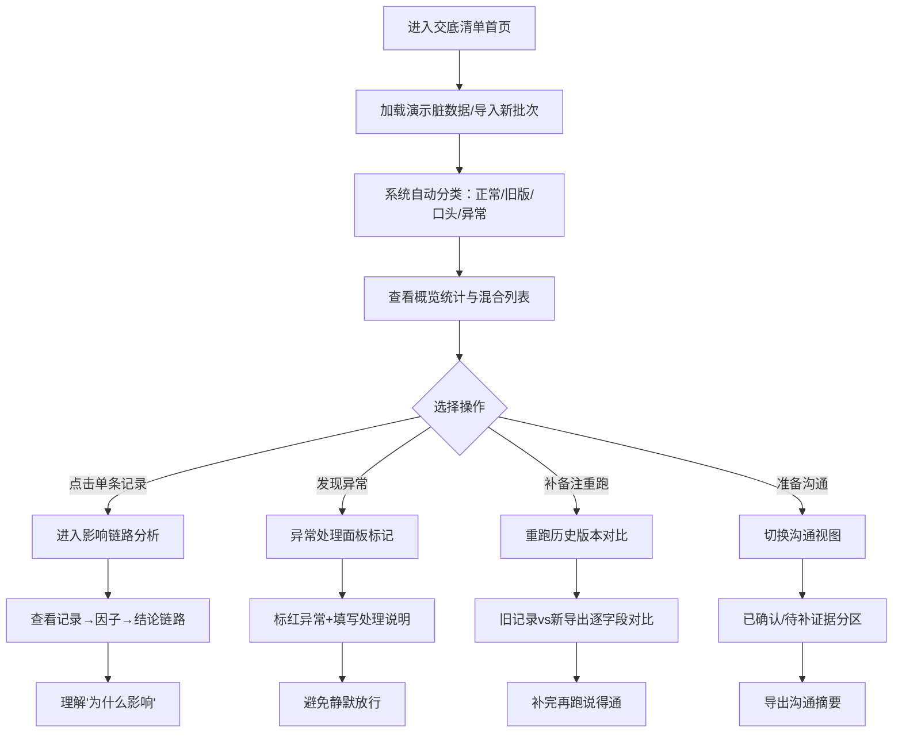

# 日照体量交底清单分析系统 - 产品需求文档 (PRD)

## 1. 产品概述

面向建筑工程设计阶段的日照分析交底清单审核工具，解决施工经理人工兜底、旧版签证单混入、模型坐标偏移漏检等核心痛点，通过来源溯源、影响链路可视化、异常标记、重跑版本对比等功能，让交底清单中"每一条记录为什么影响结论"都讲得清、说得通。

- 解决问题：人工审核效率低、旧版文件混入、异常数据静默放行、记录影响不透明、重跑版本难追溯
- 目标用户：算法值班工程师、施工经理、设计交底人员、项目监理
- 产品价值：从"人工兜底"转向"系统可解释"，每一条记录的影响、来源、状态都一目了然

---

## 2. 核心功能

### 2.1 用户角色

| 角色 | 使用场景 | 核心诉求 |
|------|----------|----------|
| 算法值班人 | 拿着分析结果与各方沟通 | 快速区分"已确认/待补证据"，讲清每条记录影响 |
| 施工经理（阿乔） | 日常审核交底清单 | 自动识别混入的旧版签证单、口头备注、异常坐标 |
| 设计交底人员 | 补充备注后重新跑分析 | 旧记录和新导出的版本对比，补完再跑说得通 |
| 项目监理 | 抽查交底质量 | 影响链路清晰，异常处理透明，不静默放行 |

### 2.2 功能模块

1. **交底清单首页**：多来源混合记录列表、来源分类标签、状态筛选、顶部概览统计
2. **影响链路分析页**：单条记录深度解析、从记录→影响因子→结论的完整链路图
3. **异常处理面板**：模型坐标偏移检测、异常标记、异常处理说明（非静默放行）
4. **重跑历史与版本对比**：多次运行记录、旧记录 vs 新导出差异对比、备注补充追踪
5. **沟通视图**：已确认/待补证据分区、导出沟通摘要、状态切换

### 2.3 页面详情

| 页面名称 | 模块名称 | 功能描述 |
|----------|----------|----------|
| 交底清单首页 | 顶部概览卡 | 总记录数、正常/异常/待确认/旧版分类计数、最后运行时间 |
| 交底清单首页 | 筛选过滤条 | 按来源（正常记录/旧版签证单/口头备注/异常数据）、按状态（已确认/待补证据）筛选 |
| 交底清单首页 | 混合记录列表 | 行展示记录编号、内容摘要、来源标签、影响标记、状态徽章、操作按钮 |
| 交底清单首页 | 脏演示数据开关 | 一键加载内置演示数据（含正常记录+模型坐标偏移+旧版签证单+口头备注） |
| 影响链路分析页 | 记录基本信息卡 | 编号、来源、创建时间、关联批次、当前状态 |
| 影响链路分析页 | 影响因子分解 | 展示该记录拆解为哪些日照影响因子（遮挡系数/时间带/角度等） |
| 影响链路分析页 | 结论贡献链路图 | 从因子→中间计算→最终结论的贡献权重可视化 |
| 影响链路分析页 | "为什么影响"解释面板 | 自然语言说明 + 数值对比表格 + 同类记录参照 |
| 异常处理面板 | 异常检测列表 | 模型坐标偏移、数值越界、格式异常等自动检测 |
| 异常处理面板 | 异常详情卡 | 偏移量计算、期望值范围、检测依据、处理建议 |
| 异常处理面板 | 异常状态标记 | 明确标红"异常处理中"，而非静默放行，支持备注说明 |
| 重跑历史与版本对比 | 运行时间线 | 每次运行的时间、触发人、备注补充说明 |
| 重跑历史与版本对比 | 两版差异对比 | 旧记录与新导出的逐字段对比，高亮新增/修改/删除 |
| 重跑历史与版本对比 | 备注补全追踪 | 补备注前后结论变化说明，确保补完再跑说得通 |
| 沟通视图 | 已确认区 | 折叠式卡片展示已确认记录（编号+结论摘要+确认人+时间） |
| 沟通视图 | 待补证据区 | 醒目卡片展示待补记录（缺失项说明+建议补充人+截止提醒） |
| 沟通视图 | 沟通摘要导出 | 一键生成可复制的沟通摘要文本 |

---

## 3. 核心流程

### 3.1 主流程描述

用户进入系统后，默认展示"交底清单首页"，顶部显示批次概览。用户可通过筛选快速定位异常记录或旧版签证单。点击任意记录进入"影响链路分析页"，看清该记录如何一步步影响最终结论。发现坐标偏移等异常时，系统在"异常处理面板"明确标记为异常处理（而非静默放行），支持补充备注。用户补完备注后点击"重新运行"，系统在"重跑历史"中保留旧记录并与新导出做差异对比。最后，算法值班人切换到"沟通视图"，拿着已确认/待补证据的分区结果去沟通。

### 3.2 流程图

---

## 4. 用户界面设计

### 4.1 设计风格

- **主色调**：工程蓝 `#1e40af` 作为主色（专业、可信赖），警戒橙 `#ea580c` 标记异常，森林绿 `#15803d` 标记已确认，石灰黄 `#ca8a04` 标记待补证据
- **辅助色**：深蓝灰背景分区，浅灰白卡片，柔和阴影
- **按钮风格**：方中带微圆角（4px），强调工程严谨感，非完全圆润；主按钮使用填充色+细边框，次要按钮使用描边
- **字体**：标题使用思源宋体/Noto Serif SC（工程文档感），正文使用 Noto Sans SC（清晰易读），数据表格使用等宽字体 JetBrains Mono
- **布局风格**：顶部全局导航 + 左侧二级页签 + 主内容区卡片网格。数据密度适中，不松散不拥挤
- **图标/表情**：使用线性图标（Lucide风格），异常用⚠️、确认用✅、待补用📋、旧版用📜、口头用💬

### 4.2 页面设计概览

| 页面名称 | 模块名称 | UI元素描述 |
|----------|----------|-----------|
| 交底清单首页 | 顶部概览卡 | 4张并排彩色统计卡（正常/异常/旧版/待补），右侧"最后运行""重跑""加载演示数据"按钮 |
| 交底清单首页 | 筛选过滤条 | 标签组式筛选（来源+状态双维度），搜索框支持编号/关键词 |
| 交底清单首页 | 混合记录列表 | 斑马纹表格行，每行左侧来源色块竖条+标签，右侧状态徽章，悬停高亮 |
| 影响链路分析页 | 链路流向图 | 横向三栏布局：记录卡 →(箭头)→ 因子分解卡 →(箭头+权重)→ 结论贡献卡 |
| 影响链路分析页 | 为什么影响面板 | 左侧自然语言解释区，右侧数值对比表格，底部同类记录参照小卡片 |
| 异常处理面板 | 异常详情卡 | 左侧红色竖向警示条，中间偏移量数值大字展示，右侧处理状态下拉与备注输入 |
| 重跑历史与版本对比 | 时间线 | 左侧垂直时间线圆点，右侧每次运行卡片，点击选中两个版本做对比 |
| 重跑历史与版本对比 | 差异对比表 | 左右分栏：旧版/新版，中间连线，差异行高亮底色 |
| 沟通视图 | 双栏分区 | 左侧绿色"已确认"（卡片折叠），右侧橙黄色"待补证据"（卡片醒目展开） |

### 4.3 响应式

- Desktop-first，主适配 1440px 宽度（工程人员双屏办公场景）
- 1024px 以下：左侧二级页签收窄为图标导航
- 768px 以下：统计卡改为2列，表格允许横向滚动
- Touch 优化：按钮最小点击区 44px，行高适当增加

### 4.4 动画与交互细节

- 列表行悬停：背景色微变 + 左侧色条延展 2px
- 链路分析页：进入时三栏依次渐入（stagger 100ms），箭头有缓慢流动动效
- 异常标记切换：红色闪烁一次后稳定
- 重跑对比：差异行从左至右滑过高亮
- 沟通视图分区切换：平滑展开/折叠动画
