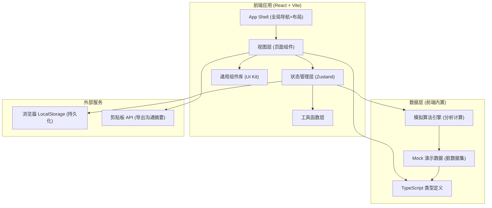
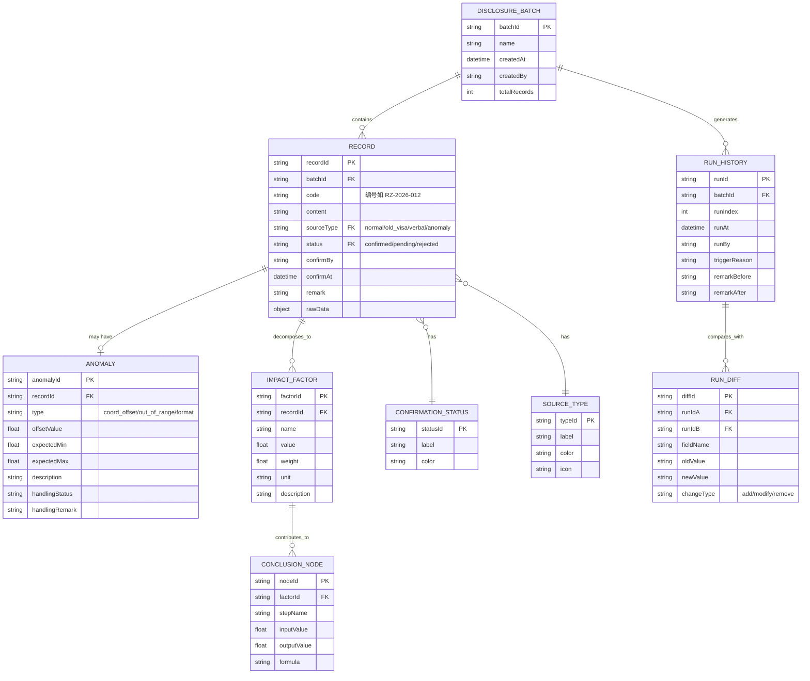

# 日照体量交底清单分析系统 - 技术架构文档

## 1. 架构设计



---

## 2. 技术说明

- **前端框架**：React@18 + TypeScript@5
- **构建工具**：Vite@5
- **样式方案**：TailwindCSS@3 + CSS 变量（主题管理）+ 少量 CSS Keyframes 动画
- **状态管理**：Zustand@4（轻量级，避免 Redux 过度设计）
- **路由**：React Router DOM@6（单页多视图导航）
- **图标库**：Lucide React@0.344（线性工程风格图标）
- **数据可视化**：纯 SVG + CSS（影响链路图），不引入 D3/ECharts 以控制包体积
- **持久化**：浏览器 LocalStorage（保存重跑历史、确认状态、备注）
- **初始化工具**：`npm create vite@latest . -- --template react-ts`

---

## 3. 路由定义

| 路由路径 | 页面名称 | 核心功能 |
|----------|----------|----------|
| `/` | 交底清单首页 | 概览统计、混合列表、筛选、加载演示数据 |
| `/analysis/:recordId` | 影响链路分析页 | 单条记录链路图、因子分解、"为什么影响"解释 |
| `/anomalies` | 异常处理面板 | 异常检测列表、坐标偏移详情、处理状态标记 |
| `/history` | 重跑历史与版本对比 | 运行时间线、两版差异对比、备注补全追踪 |
| `/communicate` | 沟通视图 | 已确认/待补证据分区、摘要导出 |

---

## 4. 数据模型

### 4.1 核心实体关系图



### 4.2 TypeScript 类型定义

```typescript
// 来源类型枚举
export type SourceType = 'normal' | 'old_visa' | 'verbal' | 'anomaly';

// 确认状态枚举
export type ConfirmStatus = 'confirmed' | 'pending_evidence' | 'rejected' | 'processing';

// 异常类型枚举
export type AnomalyType = 'coord_offset' | 'out_of_range' | 'format_error' | 'missing_data';

export interface RecordItem {
  id: string;
  batchId: string;
  code: string;
  title: string;
  content: string;
  source: SourceType;
  status: ConfirmStatus;
  createdAt: string;
  createdBy: string;
  confirmBy?: string;
  confirmAt?: string;
  remark?: string;
  anomaly?: AnomalyDetail;
  impactSummary: string;
}

export interface AnomalyDetail {
  id: string;
  type: AnomalyType;
  typeLabel: string;
  offsetValue?: number;
  expectedMin?: number;
  expectedMax?: number;
  actualValue?: number;
  description: string;
  detectionBasis: string;
  handlingSuggestion: string;
  handlingStatus: 'open' | 'in_progress' | 'resolved' | 'ignored';
  handlingRemark?: string;
  handledBy?: string;
  handledAt?: string;
}

export interface ImpactFactor {
  id: string;
  name: string;
  value: number;
  unit: string;
  weight: number;
  description: string;
  threshold: number;
  isExceeded: boolean;
}

export interface ConclusionStep {
  id: string;
  stepOrder: number;
  stepName: string;
  description: string;
  inputValue: string;
  outputValue: string;
  formula?: string;
  contributionPct: number;
}

export interface ImpactChain {
  recordId: string;
  factors: ImpactFactor[];
  steps: ConclusionStep[];
  finalConclusion: string;
  explanation: string;
  similarReferences: {
    code: string;
    title: string;
    conclusion: string;
    diff: string;
  }[];
}

export interface RunHistoryItem {
  id: string;
  batchId: string;
  runIndex: number;
  runAt: string;
  runBy: string;
  triggerReason: string;
  remarkBefore?: string;
  remarkAfter?: string;
  recordCount: number;
  anomalyCount: number;
  summary: string;
}

export interface DiffField {
  fieldName: string;
  fieldLabel: string;
  oldValue: string;
  newValue: string;
  changeType: 'add' | 'modify' | 'remove';
}

export interface BatchDiff {
  runIdA: string;
  runIdB: string;
  runLabelA: string;
  runLabelB: string;
  fields: DiffField[];
  recordDiffs: {
    recordCode: string;
    recordTitle: string;
    fields: DiffField[];
  }[];
}
```

---

## 5. 脏演示数据设计

演示数据刻意设计为"不太干净"，覆盖所有用户提到的场景，确保跑完不像是只展示了正常样例：

| 数据项 | 设计意图 | 覆盖痛点 |
|--------|----------|----------|
| RZ-2026-008 正常记录（3#楼东侧遮挡） | 一条真正影响结论的正常记录 | "一条正常记录为什么影响结论要讲得清" |
| RZ-2026-007 模型坐标偏移（X偏移+2.35m） | 标记为异常而非静默放行 | "模型坐标偏移要标成异常处理，不是默默放行" |
| RZ-2026-005 现场签证单旧版（V2023旧意见） | 混入的旧版数据，带"旧版"标签 | "混进现场签证单旧版，分清谁影响了结论" |
| RZ-2026-006 口头备注（阿乔现场口述） | 混入的非正式来源数据 | "几句口头备注，分清谁影响了结论" |
| RZ-2026-009~012 其他混合记录 | 正常/轻微异常/待补证据组合 | 整体数据"不干净"，不像只展示正常样例 |
| Run #1 → Run #2 重跑对比 | Run #2 补了备注又跑了一次 | "补完备注再重跑时旧记录和新导出都说得通" |
| 已确认2条 + 待补证据2条 + 异常1条 | 分区状态混合 | "算法值班人沟通时已确认和待补证据说清楚" |
