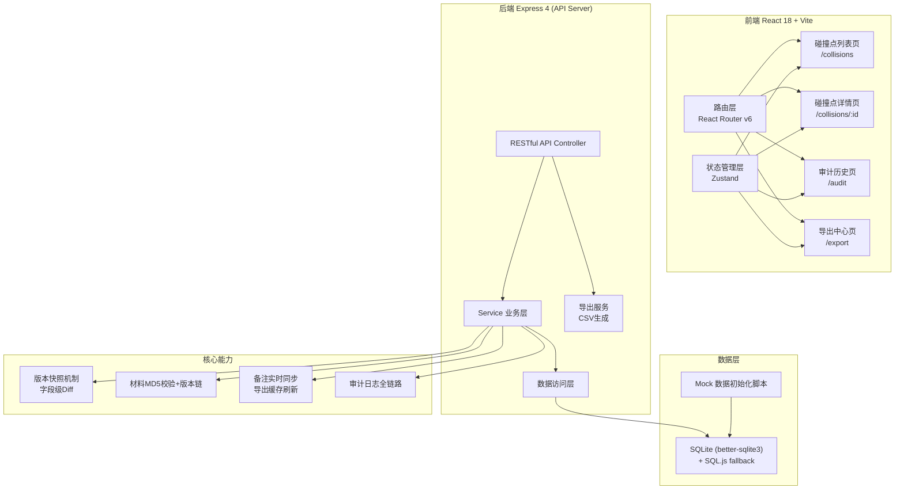
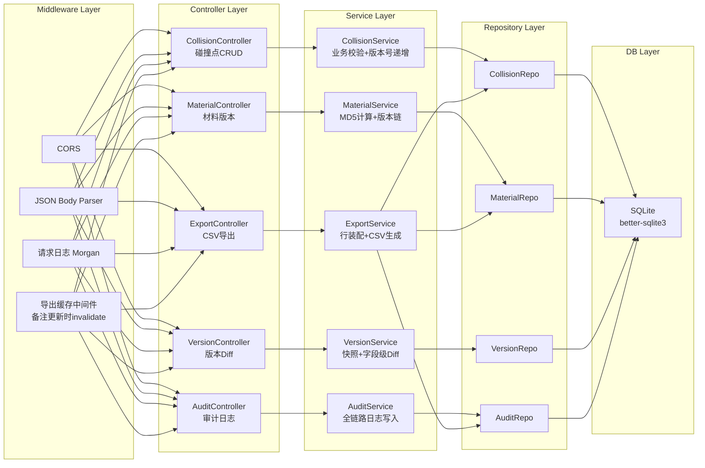
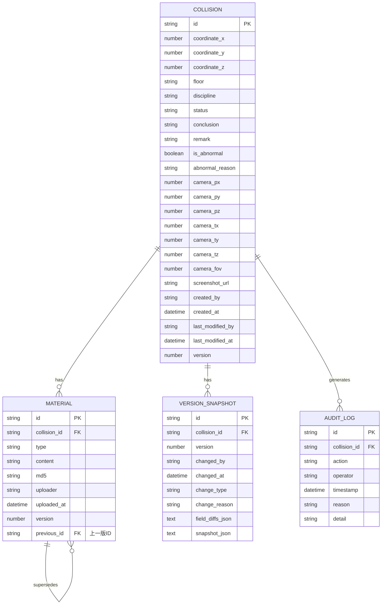

## 1. 架构设计



## 2. 技术说明

- **前端**：React 18 + TypeScript + Vite 5 + React Router v6 + Zustand 4 + Tailwind CSS 3 + Lucide React 图标
- **后端**：Express 4 + TypeScript + better-sqlite3 (同步驱动)
- **数据库**：SQLite 3（嵌入式，零配置），开发环境通过 `npm run seed` 初始化 Mock 数据
- **数据校验**：Zod 3
- **HTTP客户端**：Axios（前端请求层统一封装）
- **Diff引擎**：自研极简字段级 Diff（JSON patch 风格），材料版本内容 diff 用字符级 diff

## 3. 路由定义

| 路由 | 页面 | 用途 |
|------|------|------|
| `/` | 重定向 | 重定向到 `/collisions` |
| `/collisions` | 碰撞点列表 | 筛选/搜索/预览/快捷操作 |
| `/collisions/:id` | 碰撞点详情 | 视角上下文/备注编辑/材料档案/版本对比/改判/异常标记 |
| `/audit` | 审计历史 | 全链路追溯筛选 |
| `/export` | 导出中心 | CSV预览+BIM备注关联导出 |

## 4. API 定义

### 4.1 TypeScript 核心类型

```typescript
// 碰撞点
interface Collision {
  id: string;                    // 碰撞点编号 CP-2026-06-00123
  coordinateX: number;
  coordinateY: number;
  coordinateZ: number;
  floor: string;                 // 楼层 B2/F1/F3
  discipline: string;            // 专业 机电/结构/建筑
  status: 'pending' | 'processing' | 'resolved' | 'waived';
  conclusion: string;            // 结论
  remark: string;                // 备注（实时同步）
  isAbnormal: boolean;           // 是否异常
  abnormalReason?: string;       // 异常原因（为什么没走正常流程）
  cameraPosition: { px: number; py: number; pz: number };
  cameraTarget: { tx: number; ty: number; tz: number };
  cameraFov: number;
  screenshotUrl: string;
  createdBy: string;             // 提交人工号
  createdAt: string;             // ISO
  lastModifiedBy: string;
  lastModifiedAt: string;
  version: number;               // 递增版本号
}

// 材料（BIM备注/边界样本/口头说明）
interface Material {
  id: string;
  collisionId: string;
  type: 'bim_note' | 'boundary_sample' | 'verbal_note' | 'supplement';
  typeLabel: string;
  content: string;               // 文本内容
  md5: string;                   // 内容MD5
  uploader: string;              // 上传人工号
  uploaderName: string;
  uploadedAt: string;
  version: number;               // 同一材料类型内的版本号
  isModifiedSinceLast: boolean;  // 相比上一版是否改了口径
}

// 版本快照（每次变更）
interface VersionSnapshot {
  id: string;
  collisionId: string;
  version: number;
  changedBy: string;
  changedByName: string;
  changedAt: string;
  changeType: 'remark' | 'conclusion' | 'status' | 'abnormal' | 'material_add' | 'material_modify';
  changeReason?: string;         // 改判/变更原因
  fieldDiffs: FieldDiff[];       // 字段级差异
  snapshot: Partial<Collision>;  // 当时快照
}

interface FieldDiff {
  field: string;
  oldValue: any;
  newValue: any;
}

// 审计日志条目
interface AuditLog {
  id: string;
  collisionId: string;
  action: string;                // 操作类型中文名
  actionBadgeColor: string;
  operator: string;
  operatorName: string;
  timestamp: string;
  reason?: string;
  detail: string;
}

// 导出行
interface ExportRow {
  collisionId: string;
  coordinate: string;
  floor: string;
  discipline: string;
  status: string;
  bimNoteOriginal: string;       // BIM备注原文
  remark: string;                // 最新备注
  conclusion: string;
  isAbnormal: boolean;
  abnormalReason?: string;
  lastModifiedAt: string;
  lastModifiedBy: string;
}
```

### 4.2 REST API 列表

| 方法 | 路径 | 说明 |
|------|------|------|
| GET | `/api/collisions` | 获取碰撞点列表（支持 query: floor/discipline/status/isAbnormal/keyword） |
| GET | `/api/collisions/:id` | 详情（含视角上下文） |
| PATCH | `/api/collisions/:id` | 局部更新（remark/status/conclusion/isAbnormal/abnormalReason），触发版本快照+导出缓存刷新 |
| GET | `/api/collisions/:id/materials` | 材料列表（含版本） |
| POST | `/api/collisions/:id/materials` | 新增/补录材料（触发版本快照） |
| GET | `/api/collisions/:id/versions` | 版本历史列表 |
| GET | `/api/collisions/:id/versions/:v1/diff/:v2` | 两版 Diff |
| GET | `/api/audit-logs` | 审计日志（query: collisionId/operator/timeRange/actionType） |
| GET | `/api/export/preview` | 导出预览（含BIM备注关联） |
| GET | `/api/export/csv` | 下载 CSV（文件名含时间戳+版本号） |
| GET | `/api/users/me` | 当前用户信息 |

## 5. 服务器架构图



## 6. 数据模型

### 6.1 ER 图



### 6.2 DDL (SQLite)

```sql
CREATE TABLE collision (
  id TEXT PRIMARY KEY,
  coordinate_x REAL NOT NULL,
  coordinate_y REAL NOT NULL,
  coordinate_z REAL NOT NULL,
  floor TEXT NOT NULL,
  discipline TEXT NOT NULL,
  status TEXT NOT NULL CHECK(status IN ('pending','processing','resolved','waived')),
  conclusion TEXT DEFAULT '',
  remark TEXT DEFAULT '',
  is_abnormal INTEGER NOT NULL DEFAULT 0,
  abnormal_reason TEXT,
  camera_px REAL NOT NULL,
  camera_py REAL NOT NULL,
  camera_pz REAL NOT NULL,
  camera_tx REAL NOT NULL,
  camera_ty REAL NOT NULL,
  camera_tz REAL NOT NULL,
  camera_fov REAL NOT NULL DEFAULT 60,
  screenshot_url TEXT NOT NULL,
  created_by TEXT NOT NULL,
  created_at TEXT NOT NULL,
  last_modified_by TEXT NOT NULL,
  last_modified_at TEXT NOT NULL,
  version INTEGER NOT NULL DEFAULT 1
);
CREATE INDEX idx_collision_floor ON collision(floor);
CREATE INDEX idx_collision_status ON collision(status);
CREATE INDEX idx_collision_abnormal ON collision(is_abnormal);

CREATE TABLE material (
  id TEXT PRIMARY KEY,
  collision_id TEXT NOT NULL REFERENCES collision(id),
  type TEXT NOT NULL CHECK(type IN ('bim_note','boundary_sample','verbal_note','supplement')),
  content TEXT NOT NULL,
  md5 TEXT NOT NULL,
  uploader TEXT NOT NULL,
  uploader_name TEXT NOT NULL,
  uploaded_at TEXT NOT NULL,
  version INTEGER NOT NULL DEFAULT 1,
  previous_id TEXT REFERENCES material(id)
);
CREATE INDEX idx_material_collision ON material(collision_id);
CREATE INDEX idx_material_md5 ON material(md5);

CREATE TABLE version_snapshot (
  id TEXT PRIMARY KEY,
  collision_id TEXT NOT NULL REFERENCES collision(id),
  version INTEGER NOT NULL,
  changed_by TEXT NOT NULL,
  changed_by_name TEXT NOT NULL,
  changed_at TEXT NOT NULL,
  change_type TEXT NOT NULL,
  change_reason TEXT,
  field_diffs_json TEXT NOT NULL,
  snapshot_json TEXT NOT NULL
);
CREATE INDEX idx_version_collision ON version_snapshot(collision_id);

CREATE TABLE audit_log (
  id TEXT PRIMARY KEY,
  collision_id TEXT NOT NULL REFERENCES collision(id),
  action TEXT NOT NULL,
  action_badge_color TEXT NOT NULL,
  operator TEXT NOT NULL,
  operator_name TEXT NOT NULL,
  timestamp TEXT NOT NULL,
  reason TEXT,
  detail TEXT NOT NULL
);
CREATE INDEX idx_audit_collision ON audit_log(collision_id);
CREATE INDEX idx_audit_operator ON audit_log(operator);
CREATE INDEX idx_audit_timestamp ON audit_log(timestamp);
```
