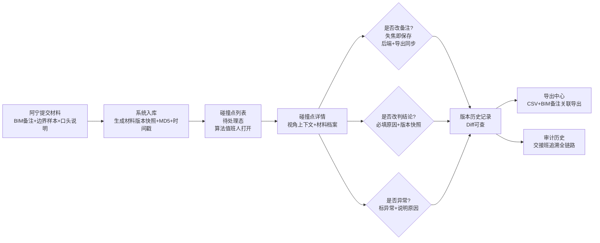

## 1. 产品概述

面向设计院与算法团队的施工变更碰撞预审管理系统，解决月底封账前碰撞预审材料的**审计追溯问题。核心痛点是：碰撞点无视角上下文、备注变更不同步、材料改口径不留痕、异常记录说不清、改判无历史链、导出数据与BIM备注脱钩。

目标用户：设计院助理（提交材料、取结果）、算法值班人（处理碰撞点、改备注改判）、交接班人员（追溯历史）。

## 2. 核心特性

### 2.1 用户角色

| 角色 | 登录方式 | 核心权限 |
|------|----------|----------|
| 设计院助理 | 工号登录 | 上传BIM备注/边界样本/口头说明、查看预审结果、导出CSV |
| 算法值班人 | 工号登录 | 编辑碰撞点备注、标记异常原因、补录材料、改判结论、查看全量历史 |
| 审核/交接班 | 工号登录 | 只读查看全链路审计历史、对比新旧材料与结论 |

### 2.2 功能模块

1. **碰撞点列表页**：筛选/搜索、状态标签、异常标记、视角缩略预览
2. **碰撞点详情页**：3D视角上下文固定展示、备注编辑器、材料档案时间线、版本历史对比、改判原因面板
3. **材料档案面板**：BIM原始备注、边界样本、口头说明的上传与版本比对
4. **审计历史页**：按操作人/时间/变更类型筛选的全链路追溯
5. **导出中心**：CSV明细+BIM备注关联导出

### 2.3 页面详情

| 页面名称 | 模块名称 | 功能描述 |
|---------|---------|------------|
| 碰撞点列表 | 筛选栏 | 按楼层/专业/状态/异常/提交人筛选，关键词搜索 |
| 碰撞点列表 | 数据表格 | 碰撞点编号、坐标、楼层、专业、状态标签、异常标记徽章、最后操作人、最后修改时间 |
| 碰撞点列表 | 缩略预览列 | 鼠标悬停显示碰撞点视角快照+视角参数（相机位置/朝向/缩放） |
| 碰撞点列表 | 快捷操作 | 一键编辑备注、一键标记异常、跳转详情 |
| 碰撞点详情 | 视角上下文区 | 固定显示：碰撞点截图+视角参数卡（相机位置px,py,pz / 朝向tx,ty,tz / 缩放fov）+坐标卡（x,y,z,楼层） |
| 碰撞点详情 | 备注编辑器 | 实时编辑、失焦即保存、保存后自动写入后端与导出缓存同步 |
| 碰撞点详情 | 材料档案时间线 | 按时间倒序：材料卡片（类型/上传人/上传时间/MD5校验/内容缩略/变更标记） |
| 碰撞点详情 | 版本历史对比 | 左右分栏：旧版本 vs 新版本字段级Diff（备注/结论/材料/状态） |
| 碰撞点详情 | 改判原因面板 | 必填原因下拉+自由输入、关联历史版本跳转 |
| 碰撞点详情 | 异常说明区 | 重复碰撞点等异常的原因标记、为什么没走正常流程的文字说明 |
| 审计历史 | 时间线视图 | 谁（操作人头像+工号）在什么时间做了什么（改备注/补材料/改判/标异常）+原因 |
| 审计历史 | 筛选面板 | 按碰撞点/操作人/时间范围/变更类型过滤 |
| 导出中心 | CSV预览 | 碰撞点明细行关联BIM备注原文+处理结果列，可搜索筛选 |
| 导出中心 | 导出按钮 | 一键导出（CSV+PDF审计报告），含版本号与导出时间戳 |

## 3. 核心流程

### 3.1 主流程：算法值班人处理碰撞点

设计院助理阿宁提交材料 → 系统生成碰撞点记录（附带材料版本快照+MD5）→ 算法值班人打开详情查看视角上下文+材料 → 编辑备注（失焦同步后端+导出缓存）→ 若改判必须填写原因（自动生成版本快照）→ 标记异常（如重复碰撞点，填写异常原因）→ 阿宁在导出中心取最新结果（含BIM备注+处理结果关联）→ 交接班人通过审计历史追溯全链路。

## 4. 用户界面设计

### 4.1 设计风格

- **主色调**：工程深蓝 `#1e3a5f（主），警示橙 `#e67e22（异常/改判），审计绿 `#27ae60（正常），历史灰 `#7f8c8d（旧版本）
- **按钮风格**：直角硬边，1px边框，hover时背景填充+2px左边框高亮（工程面板风）
- **字体**：标题用思源宋体（工程文档感），正文与数据用JetBrains Mono等宽（便于对齐坐标/编号）
- **布局风格**：三栏工式布局——左侧筛选树+中间数据表格/详情+右侧审计面板/版本对比
- **视觉元素**：细分割线、角落标头背景条纹（1px灰线分隔、版本卡片带序号徽章（编号前缀、编号颜色标签）

### 4.2 页面设计概览

| 页面名称 | 模块名称 | UI元素 |
|---------|---------|--------|
| 碰撞点列表 | 表头区 | 深蓝顶栏+白色工程编号展示Logo+工程名+用户工号+日期
| 碰撞点列表 | 筛选栏 | 浅灰条纹背景+筛选框紧凑排列 |
| 碰撞点列表 | 数据表格 | 斑马纹行、异常行橙底、悬停视角弹层（截图+参数卡 |
| 碰撞点详情 | 视角上下文区 | 左截图+右参数卡网格布局、卡片工程线框边框、参数用等宽字体右对齐 |
| 碰撞点详情 | 材料时间线 | 左侧竖线时间线、节点圆标记材料类型色点、变更卡片、MD5末4位角标 |
| 碰撞点详情 | 版本对比 | 左右双栏、Diff高亮、旧版灰底+新版白底、变更字段红绿色块 |
| 审计历史 | 时间线 | 头像+工号+操作类型徽章+原因文字+跳转链接 |
| 导出中心 | 表格 | 首列BIM备注原文（等宽）、末列处理结果（绿/橙标签）、可导出行 |

### 4.3 响应式

桌面端优先（1440px+），次要信息可折叠；1024px以下转为两栏（筛选折叠为抽屉）。触控设备优化表格行高与按钮点击区域。

### 4.4 动画
- 备注保存成功：右侧对勾淡入+背景极浅绿闪一下
- 新版本生成：时间线节点脉冲高亮（警示橙圈扩散）
- 异常标记：徽章从无到有弹性缩放出现
- 页面切换：顶部进度条200ms滑过
