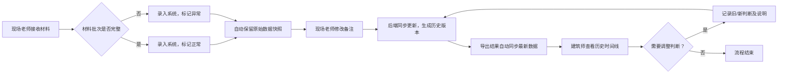

## 1. 产品概述

施工变更方案比选管理系统，解决建筑工程项目中会议纪要不完整、交底清单遗漏旧意见、数据修改无痕迹等痛点。系统实现施工变更方案比选记录的全链路追踪，确保数据可追溯、变更可审计、异常可识别。

- 目标用户：建筑师（小赵）、现场工程师（现场老师）
- 核心价值：保留原始数据痕迹，建立完整处理链，实现变更前后的全量历史回溯

## 2. 核心功能

### 2.1 用户角色

| 角色 | 注册方式 | 核心权限 |
|------|----------|----------|
| 现场工程师 | 系统内置 | 修改备注、补录材料、标记异常 |
| 建筑师 | 系统内置 | 调整判断结论、查看历史时间线、导出数据 |
| 系统管理员 | 系统内置 | 配置管理、数据备份 |

### 2.2 功能模块

1. **方案比选列表页**：记录列表展示、异常筛选、搜索、快速编辑
2. **方案详情页**：完整信息展示、历史时间线、备注编辑、判断调整
3. **历史时间线**：版本对比、变更原因、操作人追踪
4. **导出功能**：同步最新数据导出、保留原始来源标记

### 2.3 页面详情

| 页面名称 | 模块名称 | 功能描述 |
|---------|---------|----------|
| 方案比选列表页 | 顶部筛选栏 | 按状态（正常/异常）、批次号、时间范围筛选 |
| 方案比选列表页 | 数据表格 | 展示方案编号、项目名称、原始意见、当前备注、状态、操作 |
| 方案比选列表页 | 快捷操作 | 一键标记异常、快速编辑备注、查看历史 |
| 方案详情页 | 基础信息卡片 | 展示方案完整元数据，保留原始来源不可修改 |
| 方案详情页 | 备注编辑区 | 支持富文本备注，每次修改生成新版本 |
| 方案详情页 | 判断调整区 | 记录旧判断、新判断及调整说明 |
| 方案详情页 | 历史时间线 | 按时间倒序展示所有变更，支持版本对比 |
| 方案详情页 | 材料补录区 | 支持补录缺失材料，自动记录补录时间和原因 |
| 历史对比弹窗 | 版本对比 | 双栏展示新旧版本差异，高亮变更内容 |

## 3. 核心流程

### 3.1 主工作流程

### 3.2 历史追踪流程

## 4. 用户界面设计

### 4.1 设计风格

- **主色调**：工业蓝 #1E40AF（专业、可靠），辅以深灰 #1F2937
- **强调色**：异常状态用琥珀橙 #D97706，正常状态用翡翠绿 #059669
- **按钮风格**：直角、轻微阴影、hover 状态下边框高亮，体现工业感
- **字体**：标题用"Noto Sans SC"粗体，正文用"JetBrains Mono"等宽字体（数据展示清晰）
- **布局风格**：卡片式分区，左侧导航 + 右侧内容区，强调数据层级
- **图标风格**：线性图标，统一 2px 线宽，科技感十足

### 4.2 页面设计概览

| 页面名称 | 模块名称 | UI 元素 |
|---------|---------|---------|
| 方案比选列表页 | 顶部筛选栏 | 深色背景、白色文字、下拉筛选器带图标 |
| 方案比选列表页 | 数据表格 | 斑马纹行、异常行高亮橙色边框、hover 行阴影 |
| 方案比选列表页 | 快捷操作 | 图标按钮组，tooltip 提示 |
| 方案详情页 | 基础信息卡片 | 灰色背景、原始数据区域加锁图标、不可编辑 |
| 方案详情页 | 历史时间线 | 垂直时间轴、节点用不同颜色区分操作类型、连线动画 |
| 方案详情页 | 备注编辑区 | 带版本号的编辑框、底部显示修改历史 |
| 历史对比弹窗 | 版本对比 | 双栏布局、删除线标记旧内容、绿色高亮新内容 |

### 4.3 响应式设计

- 桌面端（>=1280px）：三栏布局，左侧导航、中间列表、右侧详情
- 平板端（768px-1279px）：两栏布局，列表 + 详情抽屉
- 移动端（<768px）：单栏布局，底部 Tab 切换，详情页全屏展示

### 4.4 动效设计

- 页面加载：内容区域从下往上渐入， staggered 延迟 50ms
- 历史时间线：滚动到视图时，节点逐个弹出动画
- 备注保存：成功时绿色对勾缩放动画
- 异常标记：状态切换时边框闪烁提示
