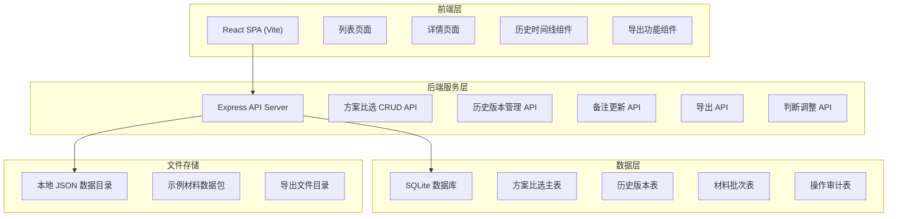
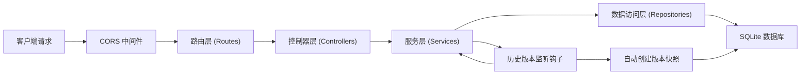
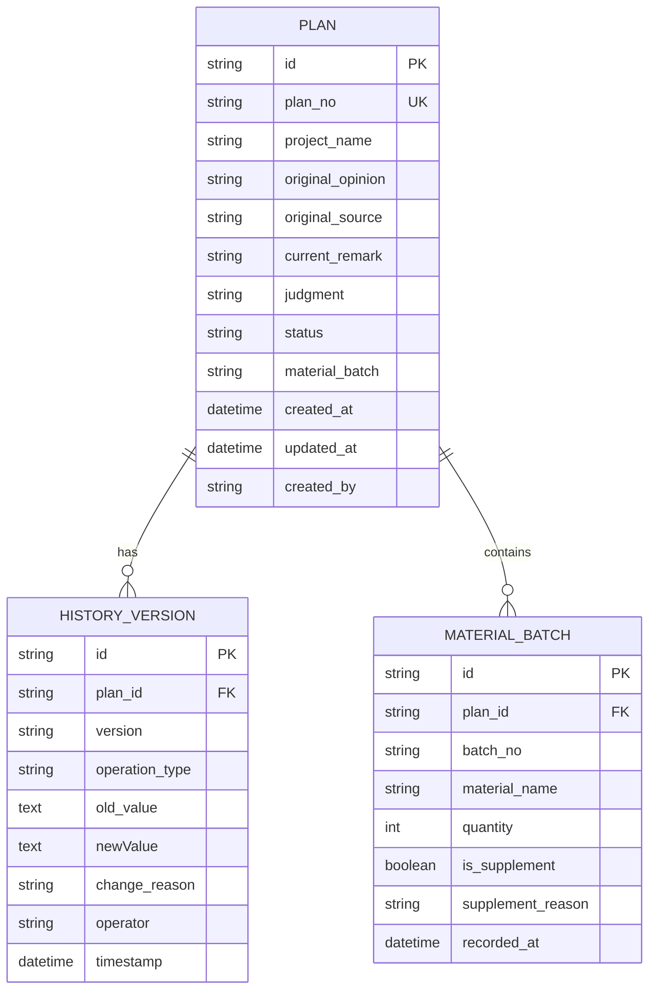

## 1. 架构设计



## 2. 技术描述

- **前端**: React@18 + TypeScript + tailwindcss@3 + vite@5 + react-router-dom@6 + lucide-react@0.344
- **初始化工具**: vite-init
- **后端**: Express@4 + cors@2 + better-sqlite3@9
- **数据库**: SQLite (better-sqlite3) + 本地 JSON 示例数据
- **开发工具**: concurrently@7 (前后端并发启动)

## 3. 路由定义

| 前端路由 | 页面/组件 | 功能说明 |
|---------|----------|----------|
| `/` | 方案比选列表页 | 展示所有记录，支持筛选、搜索、快捷操作 |
| `/plan/:id` | 方案详情页 | 展示完整信息、历史时间线、编辑功能 |
| `/plan/:id/compare?v1=V1&v2=V2` | 版本对比弹窗 | 双栏对比两个历史版本 |

| 后端 API 路由 | 方法 | 功能说明 |
|--------------|------|----------|
| `/api/plans` | GET | 获取方案列表，支持筛选参数 |
| `/api/plans/:id` | GET | 获取单条方案详情 |
| `/api/plans` | POST | 创建新方案记录 |
| `/api/plans/:id/remark` | PUT | 更新备注，自动生成历史版本 |
| `/api/plans/:id/judgment` | PUT | 调整判断结论，记录新旧判断及说明 |
| `/api/plans/:id/material` | POST | 补录材料批次 |
| `/api/plans/:id/status` | PUT | 标记状态（正常/异常） |
| `/api/plans/:id/history` | GET | 获取历史版本列表 |
| `/api/plans/:id/export` | GET | 导出方案数据（JSON/CSV） |

## 4. API 类型定义

```typescript
// 核心数据模型
interface Plan {
  id: string;
  planNo: string;
  projectName: string;
  originalOpinion: string;
  originalSource: string;
  currentRemark: string;
  judgment: 'approved' | 'rejected' | 'pending';
  status: 'normal' | 'abnormal';
  materialBatch: string | null;
  createdAt: string;
  updatedAt: string;
  createdBy: string;
}

interface HistoryVersion {
  id: string;
  planId: string;
  version: string;
  operationType: 'create' | 'remark_update' | 'judgment_change' | 'material_add' | 'status_change';
  oldValue: any;
  newValue: any;
  changeReason: string;
  operator: string;
  timestamp: string;
}

interface MaterialBatch {
  id: string;
  planId: string;
  batchNo: string;
  materialName: string;
  quantity: number;
  isSupplement: boolean;
  supplementReason: string;
  recordedAt: string;
}

// 请求/响应类型
interface UpdateRemarkRequest {
  remark: string;
  changeReason: string;
  operator: string;
}

interface UpdateJudgmentRequest {
  newJudgment: 'approved' | 'rejected' | 'pending';
  changeReason: string;
  operator: string;
}

interface AddMaterialRequest {
  batchNo: string;
  materialName: string;
  quantity: number;
  supplementReason: string;
  operator: string;
}

interface ApiResponse<T> {
  code: number;
  message: string;
  data: T;
}
```

## 5. 服务器架构图



## 6. 数据模型

### 6.1 ER 图



### 6.2 DDL 语句

```sql
-- 方案比选主表
CREATE TABLE IF NOT EXISTS plans (
  id TEXT PRIMARY KEY,
  plan_no TEXT UNIQUE NOT NULL,
  project_name TEXT NOT NULL,
  original_opinion TEXT NOT NULL,
  original_source TEXT NOT NULL,
  current_remark TEXT DEFAULT '',
  judgment TEXT CHECK(judgment IN ('approved', 'rejected', 'pending')) DEFAULT 'pending',
  status TEXT CHECK(status IN ('normal', 'abnormal')) DEFAULT 'normal',
  material_batch TEXT,
  created_at DATETIME DEFAULT CURRENT_TIMESTAMP,
  updated_at DATETIME DEFAULT CURRENT_TIMESTAMP,
  created_by TEXT NOT NULL
);

-- 历史版本表
CREATE TABLE IF NOT EXISTS history_versions (
  id TEXT PRIMARY KEY,
  plan_id TEXT NOT NULL,
  version TEXT NOT NULL,
  operation_type TEXT NOT NULL,
  old_value TEXT,
  new_value TEXT,
  change_reason TEXT,
  operator TEXT NOT NULL,
  timestamp DATETIME DEFAULT CURRENT_TIMESTAMP,
  FOREIGN KEY (plan_id) REFERENCES plans(id) ON DELETE CASCADE
);

-- 材料批次表
CREATE TABLE IF NOT EXISTS material_batches (
  id TEXT PRIMARY KEY,
  plan_id TEXT NOT NULL,
  batch_no TEXT NOT NULL,
  material_name TEXT NOT NULL,
  quantity INTEGER NOT NULL DEFAULT 0,
  is_supplement BOOLEAN DEFAULT 0,
  supplement_reason TEXT,
  recorded_at DATETIME DEFAULT CURRENT_TIMESTAMP,
  FOREIGN KEY (plan_id) REFERENCES plans(id) ON DELETE CASCADE
);

-- 索引
CREATE INDEX IF NOT EXISTS idx_history_plan_id ON history_versions(plan_id);
CREATE INDEX IF NOT EXISTS idx_material_plan_id ON material_batches(plan_id);
CREATE INDEX IF NOT EXISTS idx_plans_status ON plans(status);
CREATE INDEX IF NOT EXISTS idx_plans_judgment ON plans(judgment);
```

### 6.3 示例数据初始化

系统启动时自动从 `data/sample-plans.json` 加载示例数据，包含：
- 5 条正常记录（完整材料批次）
- 3 条异常记录（材料批次缺失）
- 2 条已补录材料的记录
- 每条记录附带 2-3 个历史版本，模拟真实操作场景
