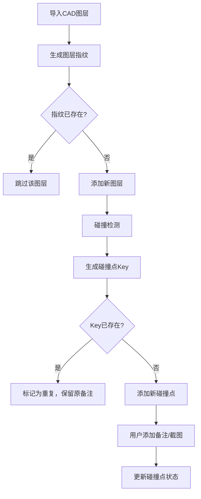

## 1. 产品概述

"旧楼测绘图纸复核"是面向建筑师和施工管理人员的CAD图纸碰撞检测与复核工具，解决口头解释不清、碰撞点追溯难、重复导入数据翻倍等实际问题。

- 核心价值：将CAD图层背后的碰撞点可视化，空间位置、异常高亮与CAD图层来源精准对应
- 目标用户：建筑师、结构工程师、施工管理人员、现场监理

## 2. 核心功能

### 2.1 用户角色

| 角色 | 注册方式 | 核心权限 |
|------|----------|----------|
| 建筑师 | 无需注册，本地使用 | 导入CAD图层、检测碰撞、添加备注、截图存档 |
| 施工管理 | 无需注册，本地使用 | 查看碰撞点、更新处理状态、添加现场复核记录 |

### 2.2 功能模块

1. **主工作区**：CAD图层可视化面板、碰撞点列表、空间位置展示
2. **碰撞点详情**：原始CAD说明追溯、人工备注、截图说明、边界样本标识
3. **导入管理**：批量导入、去重机制、导入历史记录
4. **演示模式**：预置"不干净"演示数据（边界样本、碰撞点重复、后补说明）

### 2.3 页面详情

| 页面名称 | 模块名称 | 功能描述 |
|----------|----------|----------|
| 主工作区 | 图层控制面板 | 显示所有CAD图层来源、颜色、可见性切换、原始说明 |
| 主工作区 | 碰撞点列表 | 按严重程度分组、边界样本高亮、重复碰撞标识、状态筛选 |
| 主工作区 | 空间视图 | 2D平面展示碰撞点空间位置、异常高亮、点击定位 |
| 碰撞点详情 | 原始CAD追溯 | 显示碰撞涉及的两个图层的原始CAD说明，可追踪来源文件 |
| 碰撞点详情 | 人工备注 | 富文本备注、更新时间记录、重复导入时备注不被覆盖 |
| 碰撞点详情 | 截图说明 | 碰撞点截图上传、与碰撞点关联存储 |
| 导入管理 | 重复导入检测 | 基于图层指纹去重、重复碰撞点自动标记、导入统计 |
| 演示模式 | 演示数据加载 | 一键加载包含边界样本和碰撞重复的演示数据 |

## 3. 核心流程

用户导入CAD图层数据 → 系统自动检测碰撞并去重 → 用户查看碰撞点列表 → 点击具体碰撞点查看详情 → 追溯原始CAD说明 → 添加人工备注和截图 → 更新处理状态 → 重复导入相同数据时系统自动跳过重复项并保留原有备注

## 4. 用户界面设计

### 4.1 设计风格

- 主色调：工业蓝 `#1e3a5f`，警示红 `#c0392b`，边界黄 `#f39c12`
- 按钮风格：扁平直角、轻微阴影、悬停时亮度提升
- 字体：使用 `JetBrains Mono` 作为代码和数据展示字体，`Noto Sans SC` 作为正文
- 布局：三栏布局（左：图层列表，中：空间视图，右：碰撞点详情）
- 图标风格：线性简洁图标，使用 lucide-react

### 4.2 页面设计概述

| 页面名称 | 模块名称 | UI元素 |
|----------|----------|--------|
| 主工作区 | 图层列表 | 卡片式列表，颜色标识图层，显示来源文件和原始说明 |
| 主工作区 | 碰撞点列表 | 表格视图，严重程度用颜色标签，边界样本用黄色虚线边框 |
| 主工作区 | 空间视图 | SVG 2D平面图，网格背景，碰撞点用不同颜色圆点标记 |
| 碰撞点详情 | 来源追溯 | 引用样式区块，灰色背景，显示CAD原始说明和来源文件 |
| 碰撞点详情 | 备注区域 | 文本框，显示最后更新时间，保护样式边框 |
| 碰撞点详情 | 截图区域 | 缩略图网格，点击放大查看 |

### 4.3 响应性

- 桌面端三栏布局，平板端两栏（图层列表收起为抽屉），移动端单栏滚动
- 触控优化：碰撞点点击区域 ≥ 44x44px
- 断点：1200px（桌面）、768px（平板）、480px（移动）

### 4.4 2D场景说明

- 背景：浅灰网格线，模拟CAD图纸背景
- 图层：用不同颜色的半透明矩形表示
- 碰撞点：圆形标记，严重程度越高半径越大、颜色越鲜艳
- 边界样本：虚线圆形边框，黄色填充半透明
- 交互：悬停显示tooltip，点击高亮显示详情
