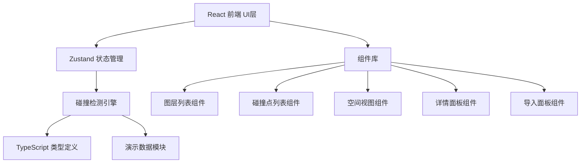
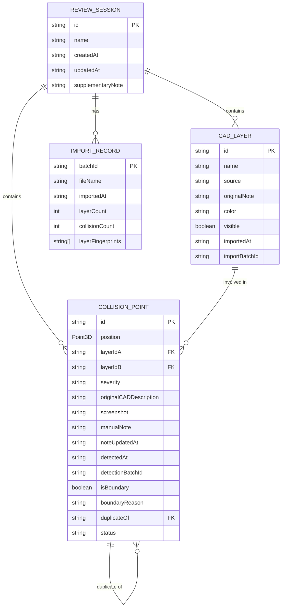

## 1. 架构设计



## 2. 技术描述

- 前端：React@18 + TypeScript + tailwindcss@3 + Vite
- 状态管理：zustand
- 图标库：lucide-react
- 后端：无（纯前端本地应用，数据存储在 localStorage）
- 初始化工具：vite-init

## 3. 路由定义

| 路由 | 用途 |
|------|------|
| / | 主工作区，包含图层列表、空间视图、碰撞点详情 |

## 4. 数据模型

### 4.1 数据模型定义



### 4.2 核心类型定义

```typescript
interface Point3D {
  x: number;
  y: number;
  z: number;
}

interface CADLayer {
  id: string;
  name: string;
  source: string;
  originalNote: string;
  color: string;
  visible: boolean;
  importedAt: string;
  importBatchId: string;
}

interface CollisionPoint {
  id: string;
  position: Point3D;
  layerIdA: string;
  layerIdB: string;
  severity: 'warning' | 'error' | 'critical';
  originalCADDescription: string;
  screenshot?: string;
  manualNote?: string;
  noteUpdatedAt?: string;
  detectedAt: string;
  detectionBatchId: string;
  isBoundary: boolean;
  boundaryReason?: string;
  duplicateOf?: string;
  status: 'pending' | 'resolved' | 'ignored';
}

interface ImportRecord {
  batchId: string;
  fileName: string;
  importedAt: string;
  layerCount: number;
  collisionCount: number;
  layerFingerprints: string[];
}

interface ReviewSession {
  id: string;
  name: string;
  createdAt: string;
  updatedAt: string;
  layers: CADLayer[];
  collisions: CollisionPoint[];
  importHistory: ImportRecord[];
  supplementaryNote?: string;
}
```

### 4.3 核心算法

1. **图层指纹生成**：`name:source:originalNote` 组合字符串，用于去重
2. **碰撞点Key生成**：`x:y:z:layerA:layerB`（坐标保留2位小数，图层排序后拼接）
3. **去重逻辑**：导入时比对指纹，碰撞检测时比对空间位置+图层组合
4. **备注保护**：合并碰撞点时保留已有 `manualNote` 和 `noteUpdatedAt` 字段
