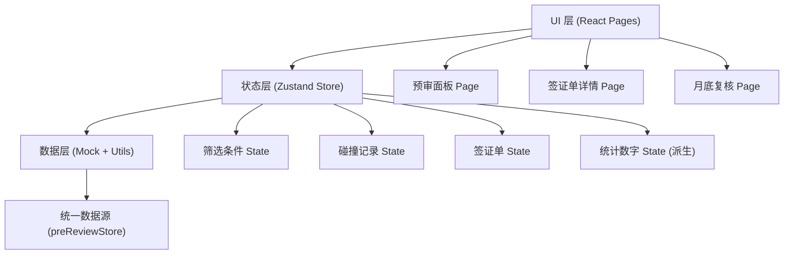
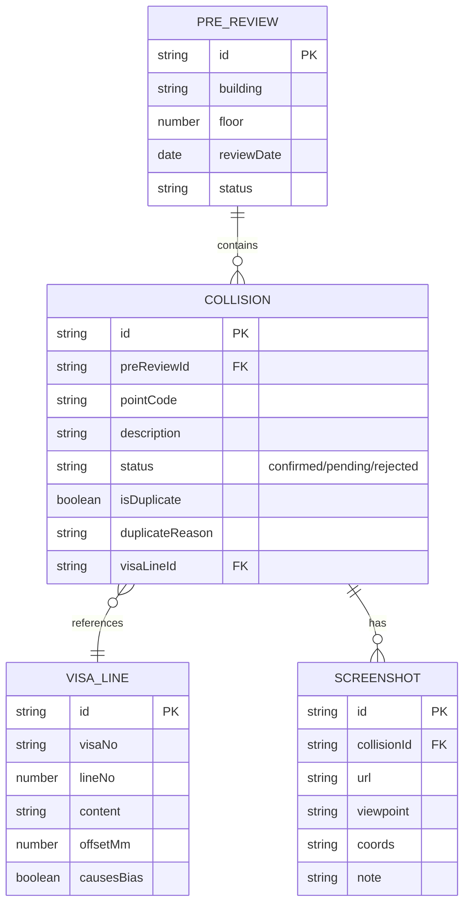

## 1. 架构设计



## 2. 技术描述

- 前端：React@18 + TypeScript + Vite@5 + TailwindCSS@3 + Zustand@4
- 路由：react-router-dom@6
- 图标：lucide-react
- 后端：无（纯前端 Mock 数据）
- 初始化：react-ts 模板

## 3. 路由定义

| Route | 用途 |
|-------|------|
| `/` | 预审面板（筛选 + 统计 + 明细 + 截图说明） |
| `/visa/:id` | 签证单详情（行级追踪） |
| `/review` | 月底复核（三Tab：已确认 / 待补件 / 退回） |

## 4. 数据模型

### 4.1 ER 图



### 4.2 TypeScript 类型定义

```typescript
type CollisionStatus = 'confirmed' | 'pending' | 'rejected';

interface Collision {
  id: string;
  preReviewId: string;
  pointCode: string;
  description: string;
  status: CollisionStatus;
  isDuplicate: boolean;
  duplicateReason?: string;
  duplicateCount?: number;
  visaLineId: string;
  screenshot: Screenshot;
}

interface VisaLine {
  id: string;
  visaNo: string;
  lineNo: number;
  content: string;
  offsetMm: number;
  causesBias: boolean;
}

interface Screenshot {
  id: string;
  url: string;
  viewpoint: string;
  coords: string;
  note: string;
}

interface PreReviewFilters {
  building?: string;
  floor?: number;
  dateFrom?: string;
  dateTo?: string;
  status?: CollisionStatus | 'all';
}
```

## 5. Store 设计

单一 `usePreReviewStore` 管理统一数据源，派生统计数字：

```typescript
const usePreReviewStore = create((set, get) => ({
  filters: { ... },
  collisions: [ ... ],
  visaLines: [ ... ],
  setFilters: (f) => set({ filters: { ...get().filters, ...f } }),
  filteredCollisions: () => get().collisions.filter(byFilters(get().filters)),
  stats: () => computeStats(get().filteredCollisions()),
  markCollision: (id, status) => set(/* 更新状态 */),
}));
```
