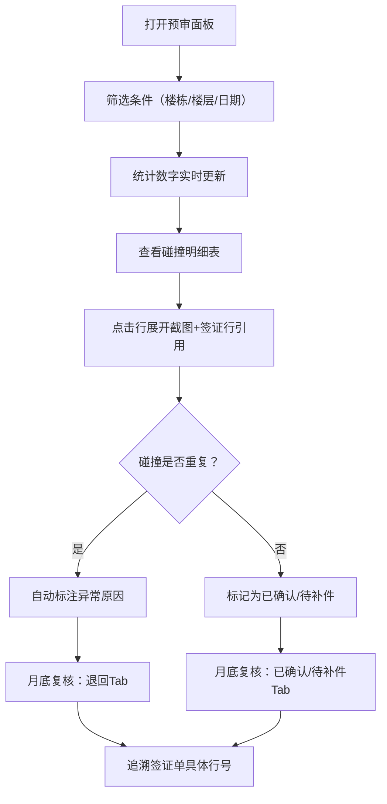

## 1. 产品概述

旧楼测绘碰撞预审系统，为结构工程师老叶解决碰撞点截图说不清、签证单追踪困难、月底复核混乱的日常痛点。统一数据源驱动筛选、统计、明细、截图，确保报告可追溯。

- 核心用户：结构工程师老叶
- 核心价值：碰撞预审流程可走通、可复核、可追溯

## 2. 核心功能

### 2.1 用户角色

| 角色 | 注册方式 | 核心权限 |
|------|----------|----------|
| 结构工程师 | 本地登录 | 预审、复核、签证追踪、异常标注 |

### 2.2 功能模块

1. **预审面板**：筛选条件、统计数字、碰撞明细表、截图说明（同一数据源）
2. **签证单详情**：行级追踪，定位拖偏预审的那一行
3. **月底复核**：已确认 / 待补件 / 退回 三分页切换
4. **异常标注**：重复碰撞点自动标记异常原因，避免假通过

### 2.3 页面详情

| 页面名称 | 模块名称 | 功能描述 |
|----------|----------|----------|
| 预审面板 | 筛选栏 | 按楼栋、楼层、日期、状态筛选，数据源与明细统一 |
| 预审面板 | 统计卡片 | 总碰撞数、已确认、待补件、退回、异常重复数 |
| 预审面板 | 碰撞明细表 | 每条碰撞关联签证行号、截图ID、状态标签 |
| 预审面板 | 截图说明 | 点击明细行展开视角说明、坐标、签证单引用 |
| 签证单详情 | 行级列表 | 每行标注关联碰撞点、偏移量、是否拖偏预审 |
| 月底复核 | 三Tab切换 | 已确认/待补件/退回，数量徽标实时同步 |
| 月底复核 | 异常详情 | 重复碰撞点显示异常原因、重复次数 |

## 3. 核心流程

结构工程师老叶打开预审面板 → 筛选当月碰撞数据 → 查看统计确认待办 → 点击明细行查看截图与签证行 → 发现重复碰撞自动标注异常 → 月底切换复核Tab分类处理 → 退回记录可追溯至签证单具体行号

## 4. 用户界面设计

### 4.1 设计风格
- **主色调**：深蓝灰 `#1e293b` 为主，工业工具感
- **强调色**：琥珀 `#f59e0b`（待补件）、绿 `#10b981`（已确认）、红 `#ef4444`（退回/异常）
- **按钮样式**：方角细边，悬停底色微亮，工程感
- **字体**：正文 Inter，数据表格 JetBrains Mono 等宽
- **布局**：顶栏筛选 + 左统计卡片 + 右明细表格，数据密度优先
- **图标**：lucide-react 线性图标，保持细线一致

### 4.2 页面设计概述

| 页面名称 | 模块名称 | UI 元素 |
|----------|----------|---------|
| 预审面板 | 筛选栏 | 下拉选择器、日期范围、状态徽章，横向紧凑排列 |
| 预审面板 | 统计卡片 | 5张卡片横向，大号数字+标签，颜色区分状态 |
| 预审面板 | 碰撞明细表 | 斑马纹行，可展开子行显示截图与说明，行高紧凑 |
| 签证单详情 | 行级列表 | 表格行左侧竖条标记拖偏行（红色粗条），右侧偏移量数字 |
| 月底复核 | 三Tab | 顶部Tab，带数量徽标，切换时数据区平滑过渡 |

### 4.3 响应式
桌面优先设计，表格横向滚动适配。最小支持 1280px 宽度。
