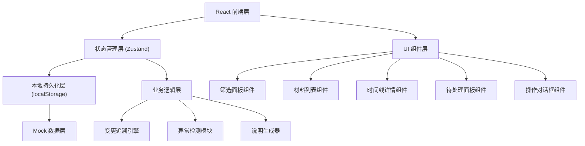
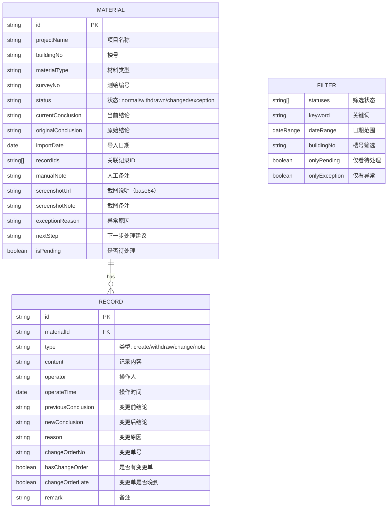

## 1. 架构设计



## 2. 技术栈说明

- 前端：React@18 + TypeScript + Vite
- 状态管理：Zustand（轻量、支持持久化中间件）
- 样式：TailwindCSS@3 + CSS 变量主题
- 图标：Lucide React（工程风格线条图标）
- 日期处理：date-fns
- 文件处理：浏览器原生 File API（截图上传）
- 数据持久化：localStorage + Zustand persist 中间件
- 无后端，数据完全本地存储，支持导出 JSON

## 3. 路由定义

| Route | Purpose |
|-------|---------|
| / | 材料追踪主页面（唯一页面，单页应用） |

## 4. 数据模型

### 4.1 数据模型定义



### 4.2 数据结构 TypeScript 定义

```typescript
type MaterialStatus = 'normal' | 'withdrawn' | 'changed' | 'exception';
type RecordType = 'create' | 'withdraw' | 'change' | 'note';

interface DateRange {
  start: string | null;
  end: string | null;
}

interface Record {
  id: string;
  materialId: string;
  type: RecordType;
  content: string;
  operator: string;
  operateTime: string;
  previousConclusion: string;
  newConclusion: string;
  reason: string;
  changeOrderNo: string;
  hasChangeOrder: boolean;
  changeOrderLate: boolean;
  remark: string;
}

interface Material {
  id: string;
  projectName: string;
  buildingNo: string;
  materialType: string;
  surveyNo: string;
  status: MaterialStatus;
  currentConclusion: string;
  originalConclusion: string;
  importDate: string;
  recordIds: string[];
  manualNote: string;
  screenshotUrl: string;
  screenshotNote: string;
  exceptionReason: string;
  nextStep: string;
  isPending: boolean;
}

interface FilterState {
  statuses: MaterialStatus[];
  keyword: string;
  dateRange: DateRange;
  buildingNo: string;
  onlyPending: boolean;
  onlyException: boolean;
}

interface AppState {
  materials: Material[];
  records: Record[];
  filters: FilterState;
  selectedMaterialId: string | null;
  expandedRecordId: string | null;
}
```

## 5. 核心模块说明

### 5.1 变更追溯引擎
- 输入：材料ID
- 输出：按时间排序的完整变更时间线
- 逻辑：遍历所有关联记录，自动识别"撤回-重新提交"链条，生成变更说明文本

### 5.2 异常检测模块
- 检测条件：记录类型为 change 但 hasChangeOrder=false，或 changeOrderLate=true
- 异常处理：自动设置 status=exception，生成 exceptionReason 和 nextStep
- 提示方式：非阻塞式通知 + 待处理列表 + 列表异常标记

### 5.3 说明生成器
- 输入：变更记录对（前后状态）
- 输出：结构化的"结论变化说明"
- 模板："原结论为『{prev}』，因{reason}于{date}由{operator}操作{type}，变更为『{current}』。{remark}"

### 5.4 状态持久化
- 持久化内容：materials、records、filters、selectedMaterialId
- 恢复时机：应用初始化时自动从 localStorage 加载
- 恢复提示：筛选条件恢复时显示"筛选条件已从上次会话恢复"提示条

## 6. Mock 数据设计

预置5条旧楼测绘材料数据，覆盖以下场景：
1. 正常状态材料，无变更
2. 有撤回记录的材料，可追溯链条
3. 变更单晚到的异常材料，有 nextStep
4. 多轮变更的材料，完整时间线
5. 带备注和截图的材料，展示联动效果
