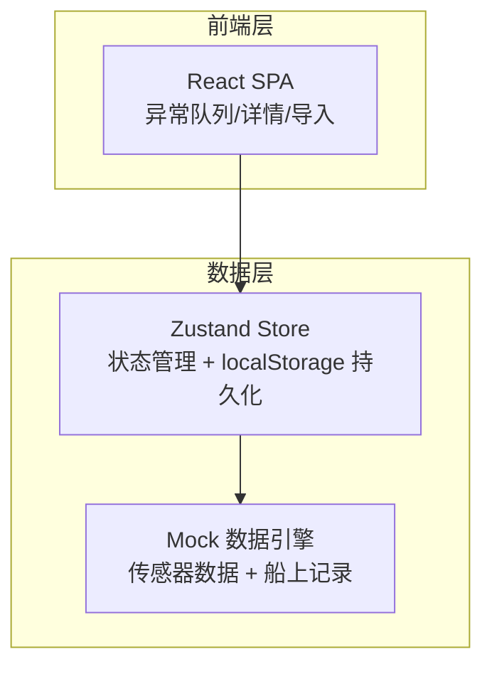
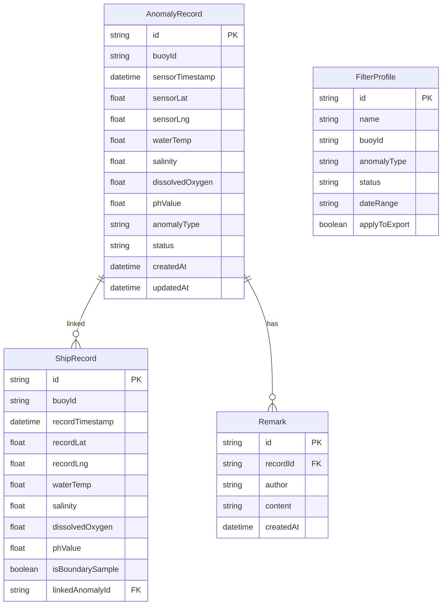

## 1. 架构设计



纯前端方案，使用 localStorage 实现数据持久化，确保服务重启（页面刷新）后数据与历史备注可恢复。

## 2. 技术说明

- **前端**：React@18 + TypeScript + Tailwind CSS@3 + Vite
- **初始化工具**：vite-init（react-ts 模板）
- **状态管理**：Zustand（含 persist 中间件，自动同步 localStorage）
- **路由**：react-router-dom@6
- **后端**：无（纯前端，数据存于 localStorage）
- **数据库**：localStorage（结构化 JSON 持久化）

## 3. 路由定义

| 路由 | 用途 |
|------|------|
| `/` | 异常队列总览页（默认着陆页） |
| `/record/:id` | 记录详情与比对页 |
| `/import` | 船上记录导入页 |

## 4. 数据模型

### 4.1 数据模型定义



### 4.2 数据定义

**AnomalyRecord（异常记录）**
- `id`: UUID，主键
- `buoyId`: 浮标编号，如 "BY-001"
- `sensorTimestamp`: 传感器采集时间
- `sensorLat` / `sensorLng`: 传感器经纬度（反写检测目标）
- `waterTemp`: 水温（°C）
- `salinity`: 盐度（PSU）
- `dissolvedOxygen`: 溶解氧（mg/L）
- `phValue`: pH 值
- `anomalyType`: 异常类型枚举：`TEMP_ANOMALY` | `SALINITY_ANOMALY` | `DO_ANOMALY` | `PH_ANOMALY` | `MULTI_ANOMALY`
- `status`: 状态枚举：`UNCONFIRMED` | `CONFIRMED` | `SUSPENDED` | `RESOLVED`
- `createdAt` / `updatedAt`: 时间戳

**ShipRecord（船上记录）**
- `id`: UUID，主键
- `buoyId`: 浮标编号
- `recordTimestamp`: 人工记录时间（通常晚于传感器时间）
- `recordLat` / `recordLng`: 船上记录经纬度
- `waterTemp` / `salinity` / `dissolvedOxygen` / `phValue`: 船上测量值
- `isBoundarySample`: 是否为边界样本（布尔）
- `linkedAnomalyId`: 关联的异常记录 ID

**Remark（人工备注）**
- `id`: UUID，主键
- `recordId`: 关联的异常记录 ID
- `author`: 备注作者
- `content`: 备注内容
- `createdAt`: 备注时间

**FilterProfile（筛选口径）**
- `id`: UUID，主键
- `name`: 口径名称
- `buoyId`: 浮标编号筛选
- `anomalyType`: 异常类型筛选
- `status`: 状态筛选
- `dateRange`: 时间范围
- `applyToExport`: 是否应用到导出

## 5. 关键业务逻辑

### 5.1 经纬度反写检测

- 纬度正常范围：-90 ~ 90，经度正常范围：-180 ~ 180
- 如果传感器纬度绝对值 > 90 或经度绝对值 > 180，判定为反写
- 或者：如果纬度值落在中国海域经度范围（116~135），高度疑似反写
- 反写记录自动标记 `status = SUSPENDED`，系统生成默认备注"系统检测：经纬度疑似反写，需人工确认"

### 5.2 重复导入检测

- 判重键：`buoyId + sensorTimestamp`（传感器记录）或 `buoyId + recordTimestamp`（船上记录）
- 重复记录：跳过，不翻倍
- 重复记录上的人工备注：保留原有备注，新导入数据合并但不覆盖备注字段

### 5.3 导出口径绑定

- 导出文件头部写入当前筛选口径参数（JSON 格式）
- 导出数据范围 = 屏幕当前显示的数据范围
- 用户可在筛选面板中切换"是否将口径应用到导出"

### 5.4 边界样本

- 导入时可标记边界样本（`isBoundarySample = true`）
- 边界样本在列表中用蓝色标签标识
- 边界样本用于验证异常判定逻辑的临界阈值

### 5.5 持久化与接手

- 所有数据（异常记录、船上记录、备注、筛选口径）通过 Zustand persist 中间件存入 localStorage
- 页面刷新后自动恢复：异常队列、筛选状态、历史备注
- 接手同事打开页面即可看到完整历史

## 6. 项目结构

```
src/
  components/
    AnomalyCard.tsx          # 异常记录卡片
    AnomalyTable.tsx         # 异常记录表格
    FilterPanel.tsx          # 筛选口径面板
    MetricBar.tsx            # 顶部指标栏
    ComparisonView.tsx       # 传感器与船上记录比对视图
    CoordWarning.tsx         # 经纬度反写警告条
    RemarkTimeline.tsx       # 备注时间线
    StatusBadge.tsx          # 状态标签
    ImportPreview.tsx        # 导入预览校验表格
    ImportResult.tsx         # 导入结果报告弹窗
    Layout.tsx               # 全局布局（侧边栏+内容区）
  pages/
    Dashboard.tsx            # 异常队列总览页
    RecordDetail.tsx         # 记录详情与比对页
    ImportPage.tsx           # 船上记录导入页
  hooks/
    useAnomalyStore.ts       # Zustand store（异常记录+船上记录+备注+筛选）
  utils/
    coordCheck.ts            # 经纬度反写检测逻辑
    dedup.ts                 # 重复记录检测与合并逻辑
    exportData.ts            # 导出逻辑（含口径参数写入）
    mockData.ts              # 模拟传感器与船上记录数据
  App.tsx
  main.tsx
  index.css
```
