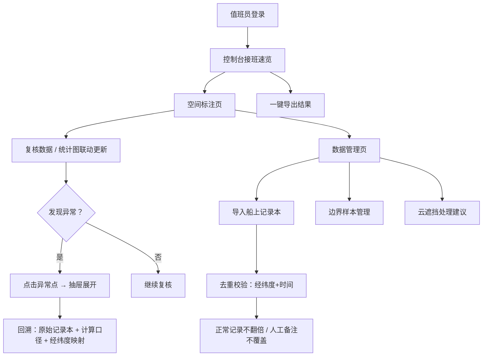

## 1. 产品概述

浮标海况空间标注系统是面向海洋站值班员的日常作业工具，解决船上记录本与经纬度格式不统一、异常追溯困难、边界样本散落在备注、重复导入数据混乱等痛点，让值班员接班时能快速找到样例、定位异常、导出结果。

- 目标用户：海洋站值班员（小宋等一线作业人员）、接班人
- 核心价值：降低人工记忆负担，固化经纬度映射规则，异常可追溯，数据不重复

## 2. 核心功能

### 2.1 用户角色

| 角色 | 登录方式 | 核心权限 |
|------|----------|----------|
| 值班员 | 站内账号 | 标注、复核、导入、导出、查看异常 |
| 接班人 | 站内账号 | 查看样例、异常位置、导出结果（只读为主） |

### 2.2 功能模块

1. **控制台（接班速览）**：样例入口、异常统计卡片、导出快捷按钮、操作指引折叠面板
2. **空间标注页**：海况数据列表/地图、统计图表随复核动作联动、标注与复核操作
3. **数据管理页**：船上记录本导入、经纬度格式统一映射、边界样本管理、云遮挡处理建议
4. **异常详情**：点击异常点可回溯到原始记录本条目与本次计算口径

### 2.3 页面详情

| 页面名称 | 模块名称 | 功能描述 |
|----------|----------|----------|
| 控制台 | 接班速览卡片 | 样例位置入口、异常数量统计、一键导出按钮 |
| 控制台 | 操作指引 | 折叠面板：样例放哪、怎么重跑、接口返回去哪看 |
| 空间标注页 | 数据列表/地图 | 展示浮标海况数据，支持空间视角切换 |
| 空间标注页 | 统计图表 | 贴在复核动作旁，随复核实时更新统计分布 |
| 空间标注页 | 异常点标记 | 异常点高亮，点击可追溯记录本和计算口径 |
| 空间标注页 | 复核操作区 | 标注按钮、备注输入、确认/驳回 |
| 数据管理页 | 记录本导入 | 上传船上记录本，支持重复导入去重 |
| 数据管理页 | 经纬度映射 | 船上格式 ↔ 标准经纬度 对应关系留存 |
| 数据管理页 | 边界样本 | 边界样本单独管理，不停留在备注里 |
| 数据管理页 | 云遮挡处理 | 遥感云遮挡样例单独显示，附处理建议 |

## 3. 核心流程

### 3.1 值班员日常工作流

值班员登录 → 控制台看异常数 → 进入空间标注页 → 复核数据（统计图跟着动）→ 点异常回溯记录本与计算口径 → 处理边界样本和云遮挡 → 导出结果

### 3.2 重复导入流程

上传记录本 → 系统按经纬度+时间去重 → 正常记录不翻倍 → 已有记录的人工备注保留不覆盖 → 提示新增/更新/跳过数量

### 3.3 异常追溯流程

在标注页点击异常点 → 抽屉展开 → 左侧显示原始船上记录本条目（含原始写法）→ 右侧显示本次计算口径（公式、参数、阈值）→ 底部显示经纬度映射关系

## 4. 用户界面设计

### 4.1 设计风格

- **主色调**：深海蓝 `#0B3D91`（专业、沉稳，贴合海洋主题）
- **辅助色**：浅青蓝 `#00B4D8`（高亮、交互）、警示橙 `#FF8C42`（异常标记）
- **中性色**：石板灰系列，文字清晰可辨
- **整体风格**：数据驱动的专业控制台风格，信息密度高但不拥挤，海洋氛围
- **按钮风格**：微圆角 4px，扁平+细边框，悬停有轻微上浮感
- **字体**：标题用系统衬线（类似 Source Serif Pro 风格）增加专业感，正文用无衬线保证可读性
- **图标**：线性图标，统一 20px 尺寸

### 4.2 页面设计概览

| 页面名称 | 模块名称 | UI 元素 |
|----------|----------|---------|
| 控制台 | 接班速览卡片 | 三卡片横向排列：样例入口（蓝）、异常数（橙警示）、导出（绿） |
| 控制台 | 操作指引 | 手风琴折叠面板，三步：样例位置 / 重跑方法 / 接口返回查看 |
| 空间标注页 | 顶部统计条 | 总标点数、已复核、异常数、边界样本数 —— 随复核实时刷新 |
| 空间标注页 | 左侧数据列表 | 带搜索筛选，异常行橙色高亮，可点击 |
| 空间标注页 | 中间地图/空间视图 | 浮标点按海况等级着色，异常点脉冲动画 |
| 空间标注页 | 右侧统计图表 | 贴复核动作旁，饼图/柱状图，复核后立即更新 |
| 空间标注页 | 底部复核操作栏 | 固定底部，标注按钮、备注输入、确认/驳回 |
| 异常详情抽屉 | 三栏布局 | 左：原始记录本 / 中：计算口径 / 右：经纬度映射 |
| 数据管理页 | 顶部 Tab | 导入记录 / 经纬度映射 / 边界样本 / 云遮挡 |
| 数据管理页 | 导入区 | 拖拽上传 + 去重结果反馈条 |

### 4.3 响应式

- 桌面端优先设计（1280px 起）
- 平板端：左右布局改为上下布局
- 移动端：折叠导航，卡片纵向堆叠

### 4.4 动效与细节

- 异常点：柔和脉冲动画（呼吸效果），不刺眼但能注意到
- 复核后统计图：数字滚动动画 + 柱状图高度过渡
- 抽屉展开：从右侧滑入，背景遮罩渐显
- 卡片悬浮：上移 2px + 阴影加深
- 表格行：斑马纹弱对比，hover 行背景微变
