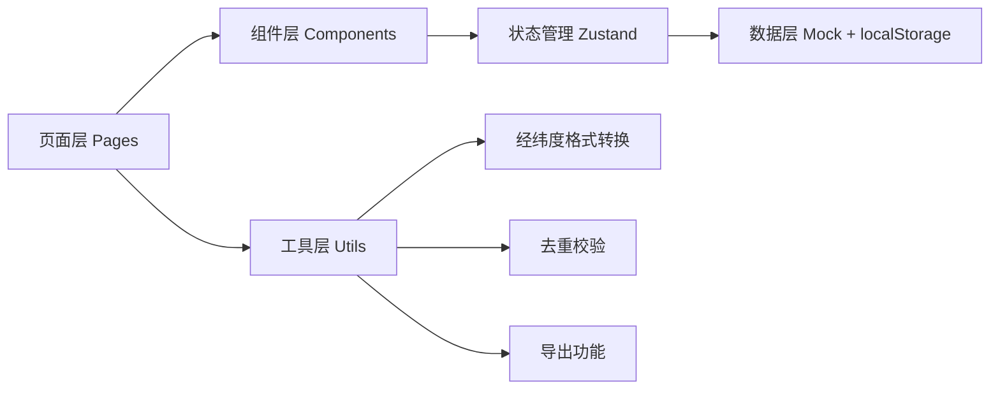

## 1. 架构设计

本系统为纯前端单页应用（SPA），数据使用 Mock + localStorage 持久化，模拟后端 API。架构上分为页面层、组件层、状态管理层、工具层。



## 2. 技术描述

- **前端框架**：React 18 + TypeScript
- **构建工具**：Vite
- **样式方案**：Tailwind CSS 3
- **状态管理**：Zustand
- **路由**：React Router DOM
- **图表库**：Recharts（轻量级，贴合数据展示需求）
- **图标**：Lucide React
- **数据持久化**：localStorage（模拟后端存储）
- **后端**：无（纯前端 Mock 数据 + localStorage）

## 3. 路由定义

| 路由 | 页面 | 说明 |
|------|------|------|
| `/` | 控制台 Dashboard | 接班速览：样例入口、异常统计、导出、操作指引 |
| `/annotation` | 空间标注页 Annotation | 海况数据列表/空间视图、复核操作、统计图表联动 |
| `/data` | 数据管理 DataManage | 记录本导入、经纬度映射、边界样本、云遮挡 |

## 4. 数据模型

### 4.1 浮标海况记录 (BuoyRecord)

```typescript
interface BuoyRecord {
  id: string;
  buoyId: string;           // 浮标编号
  recordTime: string;       // 记录时间 ISO
  // 经纬度（标准格式）
  latitude: number;         // 十进制度
  longitude: number;
  // 原始船上记录
  rawLogEntry: {
    latRaw: string;         // 船上原始写法，如 "30°15'N"
    lonRaw: string;
    logPage: string;        // 记录本页码
    logDate: string;
    notes?: string;         // 船上原始备注
  };
  // 海况数据
  seaState: number;         // 海况等级 0-9
  waveHeight: number;       // 波高 m
  windSpeed: number;        // 风速 m/s
  // 标注状态
  status: 'pending' | 'reviewed' | 'anomaly' | 'boundary';
  isAnomaly: boolean;
  isBoundary: boolean;      // 是否边界样本
  isCloudOccluded: boolean; // 是否遥感云遮挡
  manualRemark?: string;    // 人工备注（导入时不被覆盖）
  // 计算口径
  calculationCriteria: {
    formula: string;
    threshold: number;
    version: string;
    calculatedAt: string;
  };
  createdAt: string;
  updatedAt: string;
}
```

### 4.2 经纬度映射规则 (LatLonMapping)

```typescript
interface LatLonMapping {
  id: string;
  buoyId: string;
  rawFormat: string;        // 船上原始格式描述
  standardLat: number;
  standardLon: number;
  rawLatExample: string;    // 船上原始写法样例
  rawLonExample: string;
  description: string;      // 转换规则说明
  createdAt: string;
}
```

### 4.3 云遮挡处理建议 (CloudOcclusionSuggestion)

```typescript
interface CloudOcclusionSuggestion {
  id: string;
  recordId: string;
  suggestion: string;       // 处理建议
  severity: 'low' | 'medium' | 'high';
  referenceDoc: string;
}
```

## 5. 核心工具函数

| 函数名 | 所属模块 | 功能 |
|--------|----------|------|
| `parseLatLon` | `utils/coordinate.ts` | 船上经纬度格式 → 十进制度 |
| `formatLatLon` | `utils/coordinate.ts` | 十进制度 → 船上格式 |
| `deduplicateRecords` | `utils/deduplicate.ts` | 按 经纬度+时间 去重，保护人工备注 |
| `exportToCSV` | `utils/export.ts` | 导出标注结果为 CSV |
| `exportToGeoJSON` | `utils/export.ts` | 导出空间数据为 GeoJSON |

## 6. 状态管理 Store (Zustand)

```typescript
interface AppState {
  records: BuoyRecord[];
  mappings: LatLonMapping[];
  selectedRecordId: string | null;
  filters: { seaState?: number; status?: string };
  // Actions
  addRecords: (records: BuoyRecord[]) => { added: number; updated: number; skipped: number };
  updateRecord: (id: string, patch: Partial<BuoyRecord>) => void;
  setSelectedRecord: (id: string | null) => void;
  setFilter: (key: string, value: any) => void;
  getStatistics: () => Statistics;
}
```

## 7. 项目目录结构

```
src/
├── pages/
│   ├── Dashboard.tsx       # 控制台（接班速览）
│   ├── Annotation.tsx      # 空间标注页
│   └── DataManage.tsx      # 数据管理页
├── components/
│   ├── layout/
│   │   └── AppLayout.tsx   # 整体布局（侧边栏+内容区）
│   ├── dashboard/
│   │   ├── QuickCard.tsx   # 速览卡片
│   │   └── GuideAccordion.tsx # 操作指引折叠面板
│   ├── annotation/
│   │   ├── RecordList.tsx  # 数据列表
│   │   ├── SpatialView.tsx # 空间视图（示意地图）
│   │   ├── StatsChart.tsx  # 统计图表
│   │   ├── ReviewBar.tsx   # 底部复核操作栏
│   │   └── AnomalyDrawer.tsx # 异常详情抽屉
│   └── data/
│       ├── ImportPanel.tsx # 导入面板
│       ├── MappingTable.tsx # 经纬度映射表
│       ├── BoundaryList.tsx # 边界样本列表
│       └── CloudOcclusion.tsx # 云遮挡处理建议
├── store/
│   └── useRecordStore.ts   # Zustand store
├── utils/
│   ├── coordinate.ts       # 经纬度格式转换
│   ├── deduplicate.ts      # 去重逻辑
│   ├── export.ts           # 导出功能
│   └── mockData.ts         # Mock 数据
├── types/
│   └── index.ts            # 类型定义
├── App.tsx
├── main.tsx
└── index.css
```
