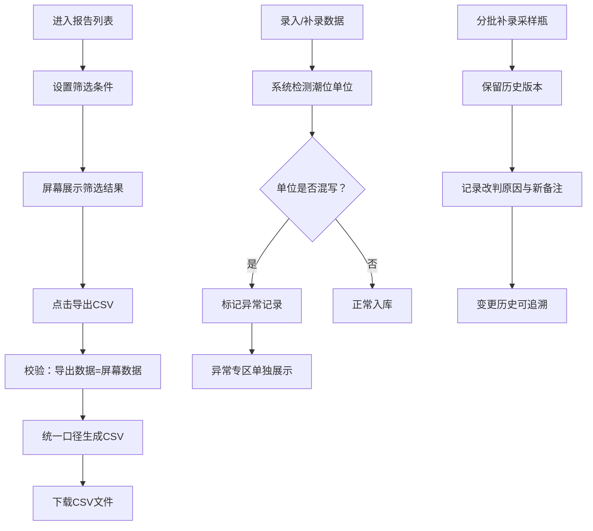

## 1. 产品概述

浮标海况报告汇总系统是一个面向港口工程师、运营主管等角色的海况数据管理平台，用于管理浮标采样的海况报告数据，解决采样瓶分批补录、数据口径不一致、异常数据混入、历史变更不可追溯等痛点问题。

- 主要解决问题：采样瓶编号与实验结果关联混乱、分批补录覆盖原数据、潮位单位混写异常难发现、CSV导出与屏幕口径不一致、历史变更无可追溯
- 目标用户：港口工程师（老何）、运营主管及其他业务人员
- 核心价值：让海况报告管理有迹可循、有数可依、有异常可察

## 2. 核心功能

### 2.1 用户角色

| 角色 | 使用场景 | 核心诉求 |
|------|----------|----------|
| 港口工程师 | 录入采样瓶数据、补录实验结果、查看报告 | 采样瓶与时间/结果关联清晰，补录不覆盖 |
| 运营主管 | 审核报告、导出CSV、关注数据质量 | 异常数据单独拎出，导出口径与屏幕一致 |
| 普通业务人员 | 查看报告、导出数据 | 入口清晰、操作简单、能看懂异常出口 |

### 2.2 功能模块

1. **报告列表页**：海况报告总览、筛选搜索、批量操作、CSV导出
2. **报告详情页**：基础信息、采样瓶关联、场景标注、侧边说明、变更历史
3. **采样瓶管理**：采样瓶录入、分批补录、与报告关联
4. **异常检测**：潮位单位混写识别、异常记录单独展示、异常出口
5. **历史追溯**：变更时间线、旧材料留存、改判原因记录
6. **CSV导出**：与屏幕筛选条件一致、统一口径导出

### 2.3 页面详情

| 页面名称 | 模块名称 | 功能描述 |
|----------|----------|----------|
| 报告列表页 | 顶部筛选区 | 按日期、海区、状态、异常类型筛选，搜索报告编号 |
| 报告列表页 | 数据表格区 | 报告编号、采样时间、海区、潮位、采样瓶数量、状态、异常标签 |
| 报告列表页 | 操作栏 | 新增报告、批量导出、异常筛选快捷入口 |
| 报告列表页 | 异常专区 | 独立Tab展示单位异常等问题记录 |
| 报告详情页 | 基础信息卡 | 报告编号、采样时间、海区、潮位、场景标注 |
| 报告详情页 | 采样瓶列表 | 分批次展示采样瓶，标注录入时间和批次 |
| 报告详情页 | 侧边说明区 | 统一说明文案，与CSV明细口径一致 |
| 报告详情页 | 变更历史 | 时间线展示每次变更，含旧值、新备注、改判原因 |
| 报告详情页 | 异常提示 | 潮位单位异常等醒目提示 |
| 采样瓶补录弹窗 | 补录表单 | 采样瓶编号、补录批次、实验结果、备注说明 |

## 3. 核心流程

### 3.1 报告创建与补录流程

工程师创建海况报告 → 录入第一批采样瓶数据 → 系统保存初始判断 → 后续分批补录采样瓶 → 系统保留历史版本不覆盖 → 可查看每次补录的变更记录 → 最终形成完整报告

### 3.2 异常检测与处理流程

数据录入/补录时 → 系统自动检测潮位单位是否一致 → 发现单位混写 → 标记为异常记录 → 异常在列表单独拎出展示 → 用户可查看异常详情并处理 → 处理后状态更新

### 3.3 CSV导出流程

用户在列表页设置筛选条件 → 屏幕展示筛选结果 → 点击导出CSV → 导出数据与屏幕完全一致（同字段、同顺序、同筛选） → 场景标注和说明与页面统一口径

## 4. 用户界面设计

### 4.1 设计风格

**设计方向：专业/工业风 + 清晰信息层级**

- 主色调：深海蓝（#1e3a5f），体现海洋/港口专业属性
- 辅助色：警示橙（#f59e0b）用于异常提示，成功绿（#10b981）用于正常状态
- 中性色：深灰到浅灰的层次感，确保数据可读性
- 按钮风格：直角微圆角（4px），工业感，主要按钮实心填充，次要按钮描边
- 字体：选择清晰易读的无衬线字体，数据表格用等宽数字
- 布局风格：卡片式布局 + 侧边栏导航，信息密度适中
- 图标风格：线性图标，简洁专业，使用 lucide-react

### 4.2 页面设计概述

| 页面名称 | 模块名称 | UI元素 |
|----------|----------|--------|
| 报告列表页 | 顶部筛选区 | 下拉选择器、日期范围、搜索框、筛选标签组 |
| 报告列表页 | 数据表格区 | 斑马纹表格、状态标签、异常徽标、悬停高亮 |
| 报告列表页 | 异常专区Tab | 橙色高亮Tab角标、异常数量徽章、独立表格 |
| 报告详情页 | 基础信息卡 | 蓝色头部、关键指标大字体、标签组 |
| 报告详情页 | 采样瓶时间线 | 竖线时间线、批次分组、录入时间戳 |
| 报告详情页 | 侧边说明 | 浅灰背景卡片、统一文案、与CSV口径一致 |
| 报告详情页 | 变更历史 | 折叠时间线、旧值删除线、新值高亮、改判原因标签 |
| 补录弹窗 | 表单区 | 分组表单、批次选择、备注多行文本、提交按钮 |

### 4.3 响应式

- 桌面优先设计，标准分辨率 1440px 起步
- 平板适配：侧边栏收起为图标导航，表格横向滚动
- 移动端：卡片堆叠展示，底部导航，筛选抽屉

### 4.4 动效与交互

- 表格行悬停：浅蓝背景过渡，150ms 缓动
- 异常徽标：轻微脉冲动画，吸引注意但不干扰
- 时间线展开/折叠：平滑高度过渡
- 页面切换：淡入淡出 + 轻微位移
- 按钮点击：scale 0.98 反馈
