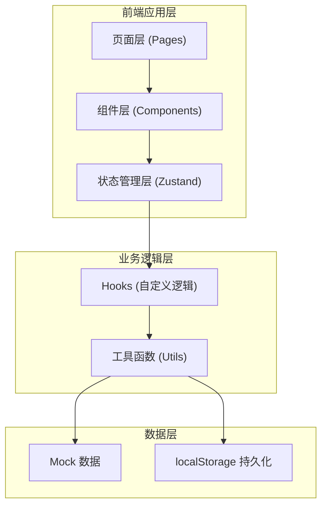
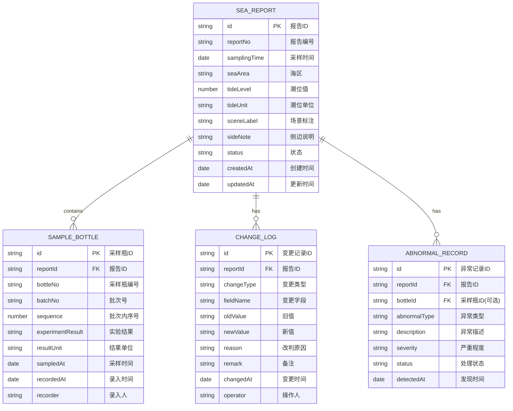

## 1. 架构设计

本项目为纯前端应用，数据使用本地 mock 数据 + localStorage 持久化，无需后端服务。整体采用分层架构：



## 2. 技术描述

- **前端框架**：React 18 + TypeScript
- **构建工具**：Vite 5
- **样式方案**：TailwindCSS 3
- **状态管理**：Zustand
- **路由管理**：react-router-dom v6
- **UI 组件**：Ant Design 5 + lucide-react 图标
- **CSV 导出**：原生实现（保证口径一致）
- **数据持久化**：localStorage
- **初始化工具**：vite-init

## 3. 路由定义

| 路由路径 | 页面名称 | 说明 |
|----------|----------|------|
| `/` | 报告列表页 | 海况报告总览、筛选、导出 |
| `/report/:id` | 报告详情页 | 查看报告详情、采样瓶、变更历史 |
| `/abnormal` | 异常专区 | 集中展示所有异常记录 |

## 4. 数据模型

### 4.1 数据实体关系



### 4.2 核心类型定义

```typescript
// 海况报告
interface SeaReport {
  id: string;
  reportNo: string;
  samplingTime: string;
  seaArea: string;
  tideLevel: number;
  tideUnit: 'm' | 'cm' | 'mm' | string;
  sceneLabel: string;
  sideNote: string;
  status: 'draft' | 'partial' | 'complete' | 'abnormal';
  createdAt: string;
  updatedAt: string;
}

// 采样瓶
interface SampleBottle {
  id: string;
  reportId: string;
  bottleNo: string;
  batchNo: string;
  sequence: number;
  experimentResult: string;
  resultUnit: string;
  sampledAt: string;
  recordedAt: string;
  recorder: string;
}

// 变更日志
interface ChangeLog {
  id: string;
  reportId: string;
  changeType: 'create' | 'update' | 'batch_add' | 'judgment_change';
  fieldName: string;
  oldValue: string;
  newValue: string;
  reason: string;
  remark: string;
  changedAt: string;
  operator: string;
}

// 异常记录
interface AbnormalRecord {
  id: string;
  reportId: string;
  bottleId?: string;
  abnormalType: 'tide_unit_mixed' | 'result_mismatch' | 'time_mismatch' | 'other';
  description: string;
  severity: 'low' | 'medium' | 'high';
  status: 'pending' | 'processing' | 'resolved';
  detectedAt: string;
}
```

## 5. 目录结构

```
src/
├── pages/
│   ├── ReportList/       # 报告列表页
│   ├── ReportDetail/     # 报告详情页
│   └── AbnormalZone/     # 异常专区
├── components/
│   ├── Layout/           # 布局组件
│   ├── ReportTable/      # 报告表格
│   ├── FilterBar/        # 筛选栏
│   ├── SampleBottleList/ # 采样瓶列表
│   ├── ChangeTimeline/   # 变更时间线
│   ├── AbnormalBadge/    # 异常徽标
│   ├── SideNote/         # 侧边说明
│   └── ExportCSV/        # CSV导出组件
├── hooks/
│   ├── useSeaReport.ts   # 报告业务逻辑
│   ├── useAbnormal.ts    # 异常检测逻辑
│   └── useExportCSV.ts   # CSV导出逻辑
├── store/
│   └── useReportStore.ts # Zustand 状态管理
├── utils/
│   ├── abnormalDetector.ts # 异常检测工具
│   ├── csvExport.ts      # CSV导出工具
│   ├── storage.ts        # 本地存储工具
│   └── format.ts         # 格式化工具
├── types/
│   └── index.ts          # 类型定义
├── data/
│   └── mockData.ts       # Mock数据
└── App.tsx               # 应用入口
```

## 6. 核心功能实现要点

### 6.1 分批补录不覆盖
- 每个采样瓶记录 `batchNo` 批次号和 `recordedAt` 录入时间
- 报告状态分为 `draft`(草稿) / `partial`(部分) / `complete`(完整) / `abnormal`(异常)
- 每次补录生成 `CHANGE_LOG` 记录，保留旧值和新值
- 不直接覆盖原数据，而是版本化管理

### 6.2 潮位单位异常检测
- 录入时自动检测同一份报告内潮位单位是否一致
- 检测到单位混写时生成 `ABNORMAL_RECORD`
- 异常记录在列表页有独立Tab单独展示，不混入正常结果
- 异常记录标红/标橙，醒目提示

### 6.3 CSV导出口径统一
- 导出时使用当前屏幕的筛选条件和排序
- 导出字段与表格列完全对应
- 场景标注、侧边说明使用同一数据源
- 保证"屏幕上看到什么，文件里就是什么"

### 6.4 历史可追溯
- 变更时间线展示每次改动
- 包含：变更时间、操作人、变更字段、旧值、新值、改判原因
- 旧材料（原始数据）永久保留，不被覆盖
- 支持查看某一时刻的历史快照

## 7. 状态管理设计

使用 Zustand 管理全局状态：

```typescript
interface ReportState {
  reports: SeaReport[];
  bottles: SampleBottle[];
  changeLogs: ChangeLog[];
  abnormals: AbnormalRecord[];
  filters: ReportFilters;
  
  // Actions
  setFilters: (filters: Partial<ReportFilters>) => void;
  getFilteredReports: () => SeaReport[];
  addSampleBottles: (reportId: string, bottles: SampleBottle[], reason: string) => void;
  exportCSV: () => void;
  detectAbnormals: (reportId: string) => AbnormalRecord[];
}
```
