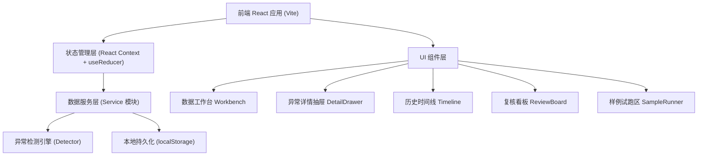
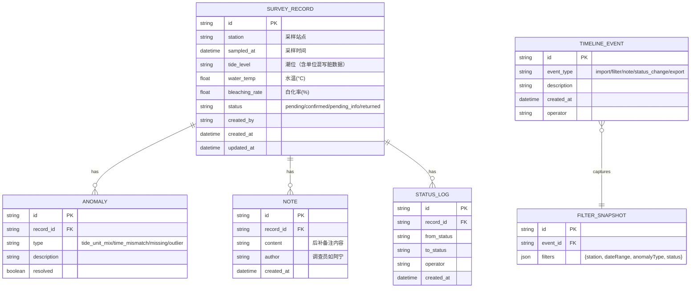

## 1. 架构设计



## 2. 技术说明
- **前端**：React@18 + TypeScript + tailwindcss@3 + Vite
- **初始化工具**：npm create vite@latest（React + TypeScript 模板）
- **后端**：无后端，纯前端 SPA，数据存储于 localStorage
- **数据**：内置 Mock 样例数据（含潮位单位混写脏数据 + 后补备注）
- **动画**：CSS 原生动画 + framer-motion（抽屉、时间线入场）

## 3. 路由定义
| Route | 用途 |
|-------|------|
| / | 数据工作台（主视图，包含所有核心功能区） |
| /timeline | 历史时间线独立视图（可从主视图切换） |
| /review | 复核看板独立视图 |

注：主要功能通过单页内组件切换（抽屉 / 折叠面板）实现，路由仅做深层入口。

## 4. 数据模型

### 4.1 核心数据定义



### 4.2 异常类型枚举
```typescript
type AnomalyType = 
  | 'tide_unit_mix'   // 潮位单位混写：如同时出现 m、厘米、ft
  | 'time_mismatch'   // 采样时间与实验结果时间错位
  | 'missing_value'   // 缺失值
  | 'outlier_value';  // 数值离群
```

### 4.3 记录状态枚举
```typescript
type RecordStatus = 
  | 'pending'        // 待处理
  | 'confirmed'      // 已确认
  | 'pending_info'   // 待补件
  | 'returned';      // 退回
```

## 5. 模块拆分
```
src/
├── data/
│   ├── mockData.ts        // 内置样例包（含脏数据）
│   └── types.ts           // 全局 TypeScript 类型
├── services/
│   ├── anomalyDetector.ts // 异常检测引擎
│   ├── recordService.ts   // 记录 CRUD + 状态流转
│   ├── timelineService.ts // 时间线事件管理
│   └── exportService.ts   // 导出（屏幕数据一致）
├── store/
│   └── AppContext.tsx     // 全局状态 + 持久化
├── components/
│   ├── layout/            // Header、Sidebar、StatsBar
│   ├── workbench/         // ImportZone、FilterBar、DataTable
│   ├── detail/            // DetailDrawer、AnomalyCard、NoteEditor
│   ├── timeline/          // TimelineView、TimelineItem、FilterSnapshot
│   ├── review/            // ReviewBoard、StatusColumn
│   └── sample/            // SampleRunner、StepGuide
├── hooks/
│   └── useLocalStorage.ts
├── App.tsx
├── main.tsx
└── index.css
```

## 6. 异常检测引擎核心逻辑
- **潮位单位混写**：扫描 `tide_level` 字段，正则匹配多种单位（m/米/厘米/cm/ft/英尺），若同批次数据出现 2 种以上单位或单条记录内单位不规范则标记异常
- **时间错位**：对比采样时间 `sampled_at` 与记录创建时间差，若超过阈值（如 24h）且无后补备注说明，则标记异常
- **缺失值**：关键字段（station、sampled_at、bleaching_rate）为空直接标记
- **数值离群**：水温 / 白化率超出 3σ 范围标记

## 7. 导出一致性保障
导出服务直接读取当前表格渲染的 state（含筛选后结果、排序、状态标签），不做二次查询，保证导出文件与屏幕数字完全一致。
