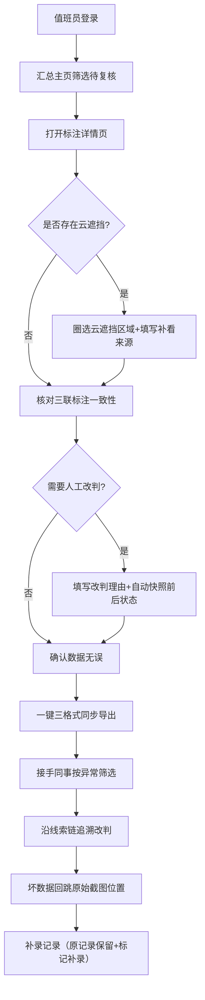

## 1. 产品概述

面向海洋站值班员的珊瑚白化空间标注复核管理系统，解决遥感截图溯源困难、采样时间与实验结果脱节、场景标注/侧边说明/CSV明细三套数据不一致、人工改判无迹可寻、云遮挡混入正常汇总、坏数据无法回跳原始对象等核心痛点。

- 核心价值：一条人工改判与结论之间建立线索链；云遮挡单独标记排除；统一数据出口杜绝三套话；3-4条典型示例覆盖正常/补录/异常场景
- 目标用户：海洋站值班员（小宋等）、复核接手同事

---

## 2. 核心功能

### 2.1 用户角色

| 角色 | 说明 | 核心权限 |
|------|------|----------|
| 值班员 | 日常标注录入与复核 | 新建/编辑标注、标记异常、发起改判、导出汇总 |
| 复核接手人 | 跨班次追溯与二次确认 | 查看全量线索链、跳转遥感截图原始对象、补录记录 |

### 2.2 功能模块

1. **标注汇总主页**：时间轴列表、筛选（正常/补录/异常/云遮挡）、统计看板、快速导出
2. **标注详情页**：遥感截图查看器、场景标注编辑面板、侧边说明编辑器、统一数据源预览、改判线索时间轴
3. **异常标记面板**：云遮挡范围圈选、补看来源填写、坏数据回跳链接、结论变更理由
4. **统一导出模块**：场景标注+侧边说明+CSV明细单一数据源三格式同步导出

### 2.3 页面详情

| 页面名称 | 模块名称 | 功能描述 |
|----------|----------|----------|
| 标注汇总主页 | 时间轴列表 | 按采样时间倒序排列记录，每条显示类型标签（正常/补录/异常/云遮挡），悬停展示关键线索 |
| 标注汇总主页 | 筛选与统计看板 | 按状态/站点/日期范围筛选，顶部显示四类记录数量与白化率概览 |
| 标注详情页 | 遥感截图查看器 | 左右对比（原始/标注后）、缩放平移、点击像素跳转至该位置标注条目、云遮挡区域高亮 |
| 标注详情页 | 统一数据源三联编辑 | 场景标注/侧边说明/CSV明细共享同一状态对象，任一字段修改三处同步预览 |
| 标注详情页 | 改判线索时间轴 | 展示本次记录所有修改：谁在何时从什么改判为什么，附带理由与截图锚点 |
| 标注详情页 | 异常标记面板 | 云遮挡多边形圈选、补看来源文本框（含数据源与链接）、影响范围估算、坏数据回跳按钮 |
| 统一导出模块 | 三格式同步导出 | 一键导出场景标注说明文档+侧边Markdown+CSV明细，三者内容完全一致，CSV含异常标记列 |

---

## 3. 核心流程

值班员小宋接到复核任务 → 进入汇总主页筛选"待复核" → 打开详情页看到遥感截图与三联标注面板 → 发现云遮挡：在异常面板圈选区域、填写补看来源（如Sentinel-2 L2A 2026-05-28轨道号T50QKF）与影响范围 → 系统自动将该区域从白化率计算中排除 → 如需人工改判：填写变更理由，系统自动快照前后状态并写入线索链 → 确认无误后一键三格式导出 → 接手同事从汇总页按"异常记录"筛选 → 进入详情页沿线索链回看每一次改判与结论变化 → 点击坏数据回跳按钮跳转至遥感截图原始像素位置 → 补录缺失数据时系统保留原记录并标记"补录"标签。

---

## 4. 用户界面设计

### 4.1 设计风格

- **主色调**：深海蓝 `#0F3B5F`（背景/头部）+ 珊瑚橙 `#FF7A59`（强调/异常标记）+ 海沫灰 `#E8F1F5`（面板底色）
- **辅助色**：正常绿 `#3A9D85`、补录蓝 `#4A90D9`、异常红 `#D9534F`、云遮挡紫 `#8B7BBF`
- **按钮风格**：圆角 8px，悬停时上浮 2px + 阴影扩散，点击时轻微下陷
- **字体**：标题用"思源宋体 SemiBold"（海洋报告庄重感），正文用"Inter"（数据可读性），等宽字段（坐标/时间戳）用"JetBrains Mono"
- **布局风格**：左侧时间轴导航 + 中央三联工作区（截图查看器居左，标注编辑居中，线索时间轴居右），顶部站点与日期筛选
- **图标风格**：Lucide 线性图标，异常/云遮挡使用填充变体；视觉隐喻：珊瑚、海浪纹理、卫星轨道线

### 4.2 页面设计概述

| 页面名称 | 模块名称 | UI 元素 |
|----------|----------|----------|
| 汇总主页 | 顶部看板 | 四张统计卡片（正常/补录/异常/云遮挡），卡片左下角带彩色小图标，右下角显示环比趋势箭头 |
| 汇总主页 | 时间轴列表 | 左侧垂直彩色时间线，每条记录为卡片，左侧边栏显示类型色条，悬停时卡片向右滑移 4px 展示线索预览条 |
| 标注详情页 | 三联工作区 | 3:4:2 三栏网格：左栏遥感截图（带对比滑块），中栏三联编辑（三Tab切换但数据同源），右栏线索时间轴（气泡式节点） |
| 标注详情页 | 异常面板 | 悬浮抽屉从右侧滑入，内含画布圈选工具、补看来源多行输入、影响范围自动计算（km²）、回跳按钮 |
| 导出模块 | 导出弹窗 | 三个格式预览缩略图并排，下方统一数据源摘要（确认三者一致的勾选提示），底部"一键导出"按钮 |

### 4.3 响应式

桌面端优先（≥1440px 保证三栏布局完整），≥1024px 线索轴折叠为可展开抽屉，<768px 截图与编辑上下堆叠，仅保留核心功能。

### 4.4 动效指引

- 页面入场：各模块从底部 20px 渐入，按统计卡片→时间轴→详情面板顺序错开 80ms
- 改判提交：线索时间轴新增节点以脉冲光环扩散 3 次后稳定
- 云遮挡圈选：封闭多边形以半透明紫填充并附"云雾"纹理覆盖层
- 导出成功：三个缩略图依次打勾，伴随轻微海浪波动背景动画
