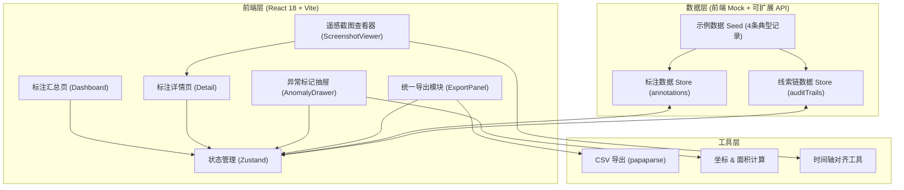
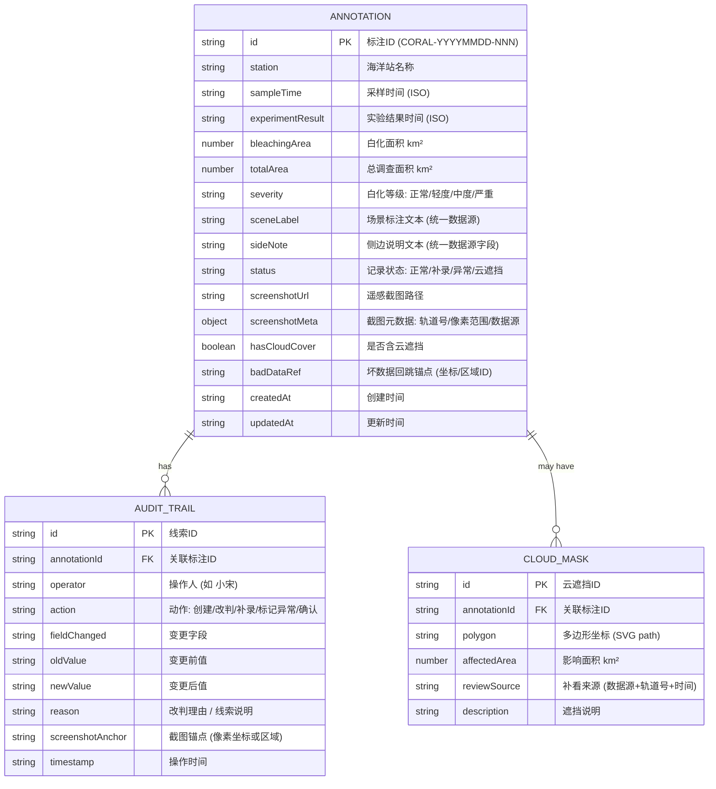

## 1. 架构设计

## 2. 技术描述

- **前端**：React@18 + TypeScript + Tailwind CSS@3 + Vite@5 + Zustand@4 + React Router DOM@6
- **初始化工具**：vite-init（react-ts 模板）
- **后端**：无（纯前端 Mock 数据，可扩展 Express@4 API）
- **数据库**：无（localStorage 持久化 + 内置 4 条种子数据）
- **第三方依赖**：lucide-react（图标）、papaparse（CSV）、dayjs（时间处理）

## 3. 路由定义

| 路由 | 用途 |
|------|------|
| `/` | 标注汇总主页（时间轴列表 + 看板统计） |
| `/annotations/:id` | 标注详情页（三联工作区 + 线索链 + 异常面板） |

## 4. 数据模型

### 4.1 数据模型定义

### 4.2 种子数据（4 条典型记录）

| 编号 | 类型 | 场景描述 | 包含要素 |
|------|------|----------|----------|
| 1 | 正常记录 | 西沙站 2026-05-20 无云正常白化 | 三联数据一致、无改判、无云遮挡 |
| 2 | 补录记录 | 南沙站 2026-05-18 初次数据缺失后补录 | 原记录保留 + 补录标签 + 2 条线索（创建→补录） |
| 3 | 异常记录（人工改判） | 中沙站 2026-05-25 轻度→中度改判 | 改判线索链 + 理由 + 截图锚点 + 结论变化说明 |
| 4 | 云遮挡记录 | 东沙站 2026-05-28 大片云遮挡 | 云遮挡多边形 + 补看来源（Sentinel-2 轨道号） + 影响面积排除 + 单独汇总标记 |

## 5. 核心业务规则

1. **统一数据源**：`sceneLabel`、`sideNote`、CSV 行均从 `ANNOTATION` 对象的同源字段渲染，修改一处即时同步预览
2. **云遮挡排除**：当 `hasCloudCover=true` 时，`CLOUD_MASK.affectedArea` 从白化统计与正常汇总中自动扣减，CSV 中 `异常标记` 列写入 "云遮挡-已排除"
3. **改判不可覆盖**：每次改判均追加 `AUDIT_TRAIL`，原字段值以快照形式永久保留，不做 UPDATE 删除
4. **坏数据回跳**：`badDataRef` 存储截图像素坐标，详情页点击回跳按钮时，`ScreenshotViewer` 自动缩放到该坐标并高亮闪烁 3 次
5. **补录不覆盖**：补录操作生成新的 `AUDIT_TRAIL`（action=补录），同时 `status` 标记为 "补录"，原始 `createdAt` 字段保留不变
6. **导出一致性校验**：导出前对三份内容做哈希比对，一致时允许导出并在文件头部写入相同的 `导出批次号`
