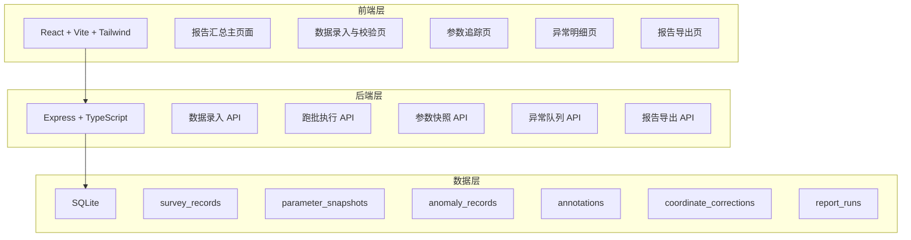
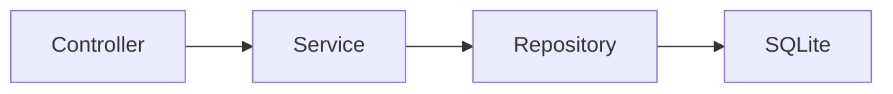
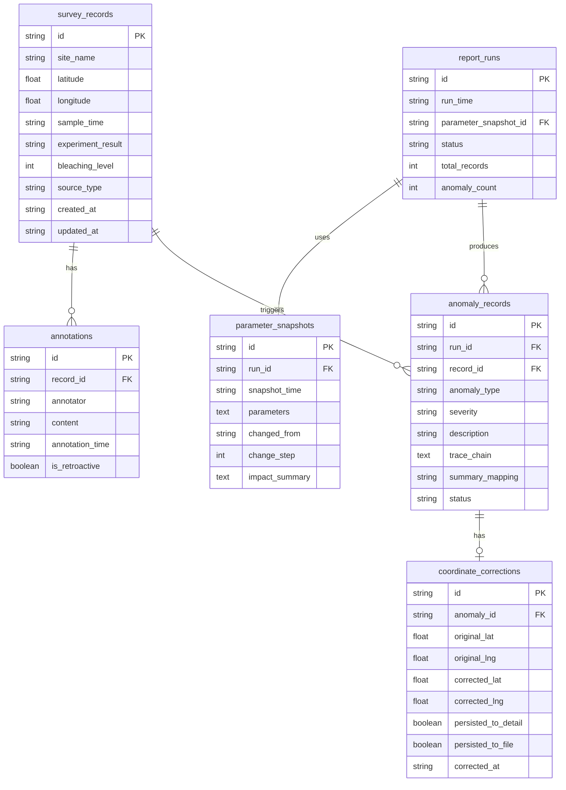

## 1. 架构设计



## 2. 技术说明

- 前端：React@18 + Tailwind CSS@3 + Vite + Zustand（状态管理）
- 初始化工具：vite-init
- 后端：Express@4 + TypeScript（ESM 模式）
- 数据库：SQLite（轻量级，适合单机部署的数据质量监控场景）
- 图标：lucide-react

## 3. 路由定义

| 路由 | 用途 |
|------|------|
| / | 报告汇总主页面：异常队列总览、汇总口径、参数变更快照 |
| /data-entry | 数据录入与校验页：船上记录本录入、后补备注、时空匹配校验 |
| /parameter-trace | 参数追踪页：参数快照时间线、diff 对比、变更影响 |
| /anomaly-detail | 异常明细页：异常记录、溯源链、经纬度反写、历史备注 |
| /export | 报告导出页：沟通版异常队列导出、反写持久化文件 |

## 4. API 定义

### 4.1 数据录入 API

```typescript
interface SurveyRecord {
  id: string;
  site_name: string;
  latitude: number;
  longitude: number;
  sample_time: string;
  experiment_result: string;
  bleaching_level: number;
  source_type: "original" | "retroactive_note";
  annotation_id?: string;
  created_at: string;
  updated_at: string;
}

interface Annotation {
  id: string;
  record_id: string;
  annotator: string;
  content: string;
  annotation_time: string;
  is_retroactive: boolean;
}

// POST /api/records - 创建调查记录
// GET /api/records - 查询调查记录列表
// POST /api/records/:id/annotations - 添加后补备注
// GET /api/records/mismatch - 查询时空错配记录
```

### 4.2 跑批执行 API

```typescript
interface ReportRun {
  id: string;
  run_time: string;
  parameter_snapshot_id: string;
  status: "running" | "completed" | "failed";
  total_records: number;
  anomaly_count: number;
  summary_metrics: SummaryMetrics;
}

interface SummaryMetrics {
  total_surveyed: number;
  bleaching_detected: number;
  coordinate_corrected: number;
  time_mismatch: number;
  retroactive_notes: number;
}

// POST /api/runs - 执行跑批
// GET /api/runs - 查询跑批历史
// GET /api/runs/:id - 查询跑批详情
```

### 4.3 参数快照 API

```typescript
interface ParameterSnapshot {
  id: string;
  run_id: string;
  snapshot_time: string;
  parameters: Record<string, number | string | boolean>;
  changed_from?: string;
  change_step: number;
  impact_summary?: {
    affected_records: number;
    affected_anomaly_types: string[];
  };
}

// GET /api/parameters/snapshots - 查询参数快照列表
// GET /api/parameters/diff?from=snap1&to=snap2 - 参数 diff 对比
```

### 4.4 异常队列 API

```typescript
interface AnomalyRecord {
  id: string;
  run_id: string;
  record_id: string;
  anomaly_type: "time_mismatch" | "coordinate_swap" | "bleaching_anomaly" | "data_gap";
  severity: "critical" | "warning" | "info";
  description: string;
  trace_chain: TraceNode[];
  coordinate_correction?: CoordinateCorrection;
  summary_mapping: string;
  status: "open" | "acknowledged" | "resolved";
}

interface TraceNode {
  step: string;
  detail: string;
  timestamp: string;
}

interface CoordinateCorrection {
  original_lat: number;
  original_lng: number;
  corrected_lat: number;
  corrected_lng: number;
  persisted_to_detail: boolean;
  persisted_to_file: boolean;
  corrected_at: string;
}

// GET /api/anomalies - 查询异常队列
// GET /api/anomalies/:id - 查询异常详情（含溯源链）
// PATCH /api/anomalies/:id/status - 更新异常状态
```

### 4.5 报告导出 API

```typescript
interface ExportRequest {
  run_id: string;
  include_annotations: boolean;
  include_coordinate_corrections: boolean;
  format: "json" | "csv";
}

// POST /api/export - 导出报告
```

## 5. 服务端架构图



## 6. 数据模型

### 6.1 数据模型定义



### 6.2 数据定义语言

```sql
CREATE TABLE survey_records (
  id TEXT PRIMARY KEY,
  site_name TEXT NOT NULL,
  latitude REAL NOT NULL,
  longitude REAL NOT NULL,
  sample_time TEXT NOT NULL,
  experiment_result TEXT NOT NULL,
  bleaching_level INTEGER NOT NULL,
  source_type TEXT NOT NULL CHECK(source_type IN ('original', 'retroactive_note')),
  created_at TEXT NOT NULL DEFAULT (datetime('now')),
  updated_at TEXT NOT NULL DEFAULT (datetime('now'))
);

CREATE TABLE annotations (
  id TEXT PRIMARY KEY,
  record_id TEXT NOT NULL REFERENCES survey_records(id) ON DELETE CASCADE,
  annotator TEXT NOT NULL,
  content TEXT NOT NULL,
  annotation_time TEXT NOT NULL DEFAULT (datetime('now')),
  is_retroactive INTEGER NOT NULL DEFAULT 0
);

CREATE TABLE report_runs (
  id TEXT PRIMARY KEY,
  run_time TEXT NOT NULL DEFAULT (datetime('now')),
  parameter_snapshot_id TEXT REFERENCES parameter_snapshots(id),
  status TEXT NOT NULL CHECK(status IN ('running', 'completed', 'failed')),
  total_records INTEGER NOT NULL DEFAULT 0,
  anomaly_count INTEGER NOT NULL DEFAULT 0
);

CREATE TABLE parameter_snapshots (
  id TEXT PRIMARY KEY,
  run_id TEXT REFERENCES report_runs(id),
  snapshot_time TEXT NOT NULL DEFAULT (datetime('now')),
  parameters TEXT NOT NULL,
  changed_from TEXT,
  change_step INTEGER NOT NULL DEFAULT 0,
  impact_summary TEXT
);

CREATE TABLE anomaly_records (
  id TEXT PRIMARY KEY,
  run_id TEXT NOT NULL REFERENCES report_runs(id),
  record_id TEXT NOT NULL REFERENCES survey_records(id),
  anomaly_type TEXT NOT NULL CHECK(anomaly_type IN ('time_mismatch', 'coordinate_swap', 'bleaching_anomaly', 'data_gap')),
  severity TEXT NOT NULL CHECK(severity IN ('critical', 'warning', 'info')),
  description TEXT NOT NULL,
  trace_chain TEXT NOT NULL,
  summary_mapping TEXT NOT NULL,
  status TEXT NOT NULL DEFAULT 'open' CHECK(status IN ('open', 'acknowledged', 'resolved'))
);

CREATE TABLE coordinate_corrections (
  id TEXT PRIMARY KEY,
  anomaly_id TEXT NOT NULL REFERENCES anomaly_records(id) ON DELETE CASCADE,
  original_lat REAL NOT NULL,
  original_lng REAL NOT NULL,
  corrected_lat REAL NOT NULL,
  corrected_lng REAL NOT NULL,
  persisted_to_detail INTEGER NOT NULL DEFAULT 0,
  persisted_to_file INTEGER NOT NULL DEFAULT 0,
  corrected_at TEXT NOT NULL DEFAULT (datetime('now'))
);

CREATE INDEX idx_annotations_record_id ON annotations(record_id);
CREATE INDEX idx_anomaly_records_run_id ON anomaly_records(run_id);
CREATE INDEX idx_anomaly_records_record_id ON anomaly_records(record_id);
CREATE INDEX idx_anomaly_records_type ON anomaly_records(anomaly_type);
CREATE INDEX idx_parameter_snapshots_run_id ON parameter_snapshots(run_id);
CREATE INDEX idx_coordinate_corrections_anomaly_id ON coordinate_corrections(anomaly_id);
CREATE INDEX idx_survey_records_source_type ON survey_records(source_type);
```
