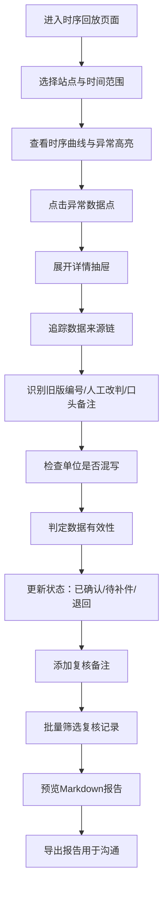

## 1. 产品概述

潮汐能站时序回放系统是面向海洋站值班员及复核人员的专业数据审查工具，用于回放潮汐观测时序数据、追踪异常来源、管理采样记录状态，并生成可直接用于沟通的Markdown复核报告。系统解决了离群值判定争议、数据来源追溯不清、单位混写难追踪、状态分类混乱及报告口径不一致等核心问题。

- 目标用户：海洋站值班员、数据复核人员
- 核心价值：让每一条异常数据都能追溯到源头，让复核结论有据可依
- 使用场景：周一早会前数据准备、月底批量复核、异常数据沟通

## 2. 核心功能

### 2.1 用户角色

| 角色 | 使用方式 | 核心职责 |
|------|----------|----------|
| 值班员 | 日常数据回放、异常标记、状态更新 | 数据初筛、异常标注、提交复核 |
| 复核员 | 批量复核、来源追踪、报告导出 | 数据审定、结论判定、报告输出 |

### 2.2 功能模块

1. **时序回放主页面**：潮位时序曲线、站点地图定位、异常高亮标记、时间轴控制
2. **数据筛选面板**：按状态/时间/站点/单位类型筛选，单位混写专项过滤
3. **数据详情抽屉**：采样瓶编号溯源、修改记录链、人工改判标记、口头备注
4. **状态管理**：已确认/待补件/退回 三态分类，批量操作
5. **Markdown报告导出**：整合状态、备注、结论，生成可直接沟通的报告

### 2.3 页面详情

| 页面名称 | 模块名称 | 功能描述 |
|---------|----------|----------|
| 时序回放主页 | 顶部导航栏 | 站点选择、时间范围、单位筛选、状态标签切换、导出按钮 |
| 时序回放主页 | 左侧站点地图 | 潮汐站空间位置分布、点击切换站点、异常站点红点标记 |
| 时序回放主页 | 中央时序图表 | 潮位曲线、异常点高亮、采样点标注、悬停详情、拖拽缩放 |
| 时序回放主页 | 底部时间轴 | 播放控制、速度调节、进度拖动、关键事件标记 |
| 时序回放主页 | 右侧数据列表 | 采样记录列表、状态标签、来源标识、点击展开详情 |
| 详情抽屉 | 基础信息区 | 采样瓶编号、时间、潮位值、单位、当前状态 |
| 详情抽屉 | 来源追踪链 | 数据来源树（原始采集/旧版编号/人工改判/口头备注），标注影响结论的修改 |
| 详情抽屉 | 操作记录 | 所有修改历史，包含操作人、时间、修改内容 |
| 详情抽屉 | 备注区 | 口头备注展示、新增备注 |
| 详情抽屉 | 状态操作 | 确认/待补件/退回 状态切换按钮 |
| 报告预览弹窗 | 报告内容 | Markdown格式预览，含站点概况、异常汇总、状态统计、逐条结论 |
| 报告预览弹窗 | 导出操作 | 复制Markdown、下载.md文件 |

## 3. 核心流程

### 3.1 日常数据回放与复核流程

值班员登录系统 → 选择站点与时间范围 → 回放时序曲线 → 发现异常点 → 查看详情追踪来源（原始数据/旧版编号/人工改判/口头备注）→ 确认单位是否正确 → 更新状态（已确认/待补件/退回）→ 添加备注 → 月底批量导出Markdown报告

### 3.2 异常数据追溯流程

选中异常数据点 → 展开详情抽屉 → 查看来源链 → 识别影响结论的修改（人工改判标红）→ 查看单位记录（是否存在单位混写）→ 核对采样瓶编号版本（旧版编号标注）→ 读取口头备注 → 判定最终结论

### 3.3 Mermaid 流程图

## 4. 用户界面设计

### 4.1 设计风格

- **设计主题**：深海科研 / 工业仪表风格
- **主色调**：深海蓝 (#0A2540) 为基底，青蓝 (#00D4FF) 为高亮，珊瑚橙 (#FF6B6B) 标记异常
- **辅助色**：墨绿 (#2D6A4F) 已确认，琥珀黄 (#FFB627) 待补件，砖红 (#C92A2A) 退回
- **字体**：标题使用 Space Grotesk（等宽科技感），正文使用 Inter（清晰可读），数据数值使用 JetBrains Mono（等宽数字对齐）
- **按钮风格**：直角微圆角、细边框、悬浮时发光效果，仪表控制台风格
- **布局风格**：三栏式仪表板布局，左侧地图+中央图表+右侧列表，类似专业监控台
- **视觉元素**：网格背景、扫描线动效、数据辉光、深海渐变背景

### 4.2 页面设计概览

| 页面名称 | 模块名称 | UI 元素 |
|---------|----------|---------|
| 时序回放主页 | 整体布局 | 深色深海背景、三栏仪表板、顶部状态栏、底部时间控制条 |
| 时序回放主页 | 站点地图 | 简化海岸线轮廓、站点圆点标记、异常站点脉动红点、悬停浮窗 |
| 时序回放主页 | 时序图表 | 面积图+折线叠加、异常点脉冲环、网格线、坐标轴刻度、缩放拖拽 |
| 时序回放主页 | 数据列表 | 卡片式列表、状态色标签条、来源图标、编号高亮 |
| 详情抽屉 | 来源追踪 | 时间线式来源链、节点图标、影响路径连线、人工改判高亮红框 |
| 详情抽屉 | 单位追踪 | 单位混写专项区块、原始单位/当前单位对比、转换记录 |
| 报告预览 | Markdown渲染 | 代码块样式、标题层次清晰、状态色块、可一键复制 |

### 4.3 响应式

- 桌面端优先，三栏并列布局
- 平板端折叠为左右两栏，地图可收起
- 移动端单列堆叠，抽屉改为全屏弹窗
- 图表支持触摸缩放与滑动

### 4.4 动效设计

- 异常数据点呼吸脉动效果
- 时序回放时扫描线横向移动
- 抽屉展开/收起平滑过渡
- 状态切换时标签色平滑过渡
- 页面加载时数据渐入、延迟错峰出现
