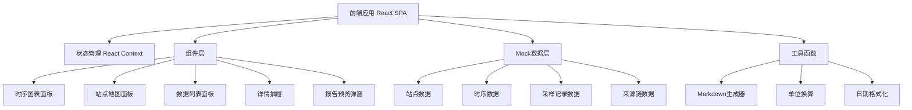
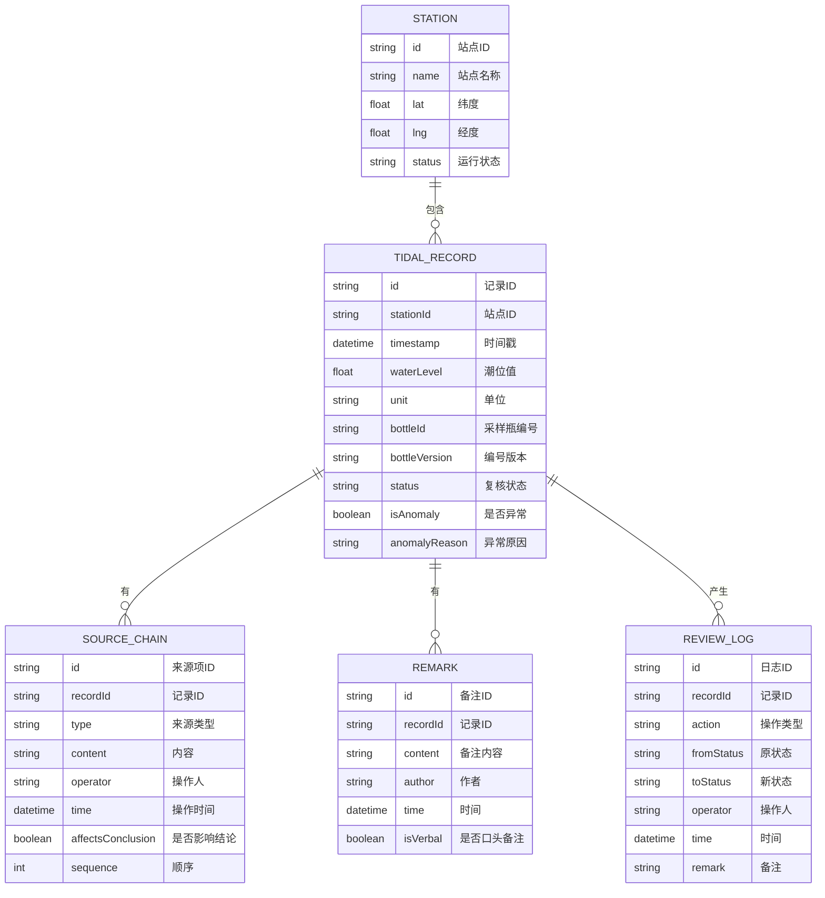

## 1. 架构设计



## 2. 技术描述

- **前端框架**：React@18 + TypeScript
- **构建工具**：Vite@5
- **样式方案**：TailwindCSS@3 + CSS Variables（主题色管理）
- **图表库**：Recharts（时序曲线）+ 自定义SVG（站点地图）
- **状态管理**：React Context + useReducer（全局状态）
- **Markdown渲染**：react-markdown
- **图标**：Lucide React
- **数据来源**：内置Mock数据（模拟真实潮汐站数据）
- **无后端依赖**：纯前端应用，数据本地存储，支持导出

## 3. 路由定义

| 路由 | 用途 |
|------|------|
| / | 时序回放主页面（唯一主页面，所有功能在单页内完成） |

## 4. 数据模型

### 4.1 数据实体关系



### 4.2 类型定义

```typescript
// 站点
interface Station {
  id: string;
  name: string;
  lat: number;
  lng: number;
  status: 'active' | 'maintenance';
  hasAnomaly: boolean;
}

// 复核状态
type ReviewStatus = 'confirmed' | 'pending' | 'returned';

// 来源类型
type SourceType = 'original' | 'old_bottle_id' | 'manual_review' | 'verbal_note';

// 潮汐记录
interface TidalRecord {
  id: string;
  stationId: string;
  timestamp: string;
  waterLevel: number;
  unit: 'm' | 'cm' | 'ft';
  originalUnit: string;
  bottleId: string;
  bottleVersion: 'current' | 'old';
  oldBottleId?: string;
  status: ReviewStatus;
  isAnomaly: boolean;
  anomalyType?: 'outlier' | 'unit_mismatch' | 'bottle_mismatch' | 'manual_change';
  anomalyReason?: string;
  conclusion?: string;
}

// 来源链节点
interface SourceChainItem {
  id: string;
  recordId: string;
  type: SourceType;
  label: string;
  content: string;
  operator: string;
  time: string;
  affectsConclusion: boolean;
  sequence: number;
}

// 备注
interface Remark {
  id: string;
  recordId: string;
  content: string;
  author: string;
  time: string;
  isVerbal: boolean;
}

// 复核日志
interface ReviewLog {
  id: string;
  recordId: string;
  action: string;
  fromStatus?: ReviewStatus;
  toStatus: ReviewStatus;
  operator: string;
  time: string;
  remark?: string;
}

// 全局状态
interface AppState {
  stations: Station[];
  records: TidalRecord[];
  sourceChains: Record<string, SourceChainItem[]>;
  remarks: Record<string, Remark[]>;
  reviewLogs: Record<string, ReviewLog[]>;
  selectedStationId: string;
  selectedRecordId: string | null;
  timeRange: { start: string; end: string };
  statusFilter: ReviewStatus | 'all';
  unitFilter: 'all' | 'm' | 'cm' | 'ft' | 'mixed';
  isPlaying: boolean;
  playSpeed: number;
  currentTimeIndex: number;
  showDetail: boolean;
  showReport: boolean;
}
```

## 5. 核心模块设计

### 5.1 时序图表模块

- 使用 Recharts 的 AreaChart + LineChart 组合
- 自定义散点标记异常值，带脉冲动画
- 支持悬停显示详情、拖拽缩放
- 扫描线动画效果

### 5.2 站点地图模块

- 自定义 SVG 绘制简化海岸线与站点位置
- 站点圆点支持点击选中，异常站点呼吸灯效果
- 悬停显示站点信息浮窗

### 5.3 数据列表模块

- 虚拟滚动（数据量大时）
- 左侧状态色条标识
- 来源类型图标快速识别
- 点击展开详情抽屉

### 5.4 详情抽屉模块

- 基础信息展示
- 来源链时间线可视化
- 单位混写专项区块
- 状态操作按钮
- 备注列表与新增

### 5.5 Markdown报告模块

- 动态生成报告内容
- 站点概况、异常汇总、状态统计、逐条结论
- 支持复制到剪贴板和下载 .md 文件

## 6. 目录结构

```
src/
├── components/
│   ├── layout/
│   │   ├── Header.tsx          # 顶部导航
│   │   └── TimeControlBar.tsx  # 底部时间控制条
│   ├── map/
│   │   └── StationMap.tsx      # 站点地图
│   ├── chart/
│   │   └── TidalChart.tsx      # 时序图表
│   ├── list/
│   │   └── RecordList.tsx      # 数据列表
│   ├── detail/
│   │   ├── DetailDrawer.tsx    # 详情抽屉
│   │   ├── SourceChain.tsx     # 来源链
│   │   ├── UnitTracker.tsx     # 单位追踪
│   │   └── StatusActions.tsx   # 状态操作
│   └── report/
│       ├── ReportModal.tsx     # 报告预览弹窗
│       └── MarkdownPreview.tsx # Markdown渲染
├── context/
│   └── AppContext.tsx          # 全局状态
├── data/
│   ├── stations.ts             # 站点Mock数据
│   ├── records.ts              # 记录Mock数据
│   ├── sourceChains.ts         # 来源链Mock数据
│   └── remarks.ts              # 备注Mock数据
├── utils/
│   ├── markdownGenerator.ts    # Markdown生成器
│   ├── unitConverter.ts        # 单位换算
│   └── dateFormat.ts           # 日期格式化
├── types/
│   └── index.ts                # 类型定义
├── App.tsx
├── main.tsx
└── index.css
```
