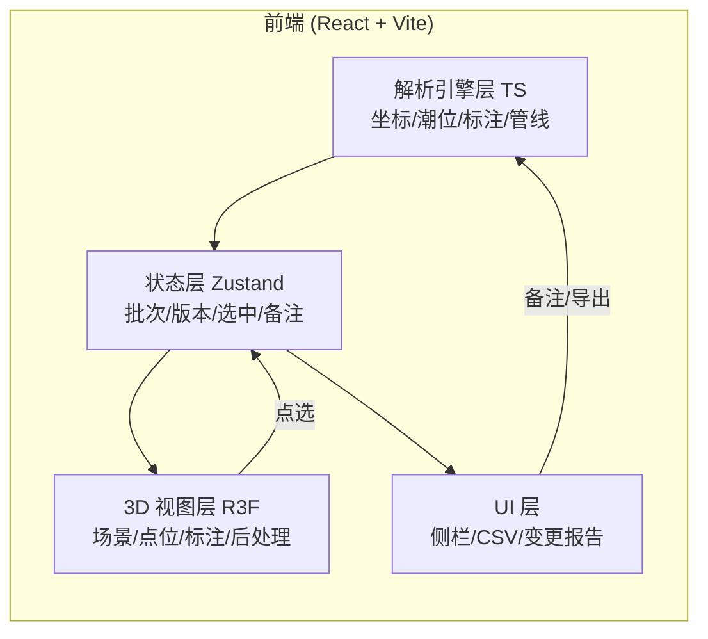
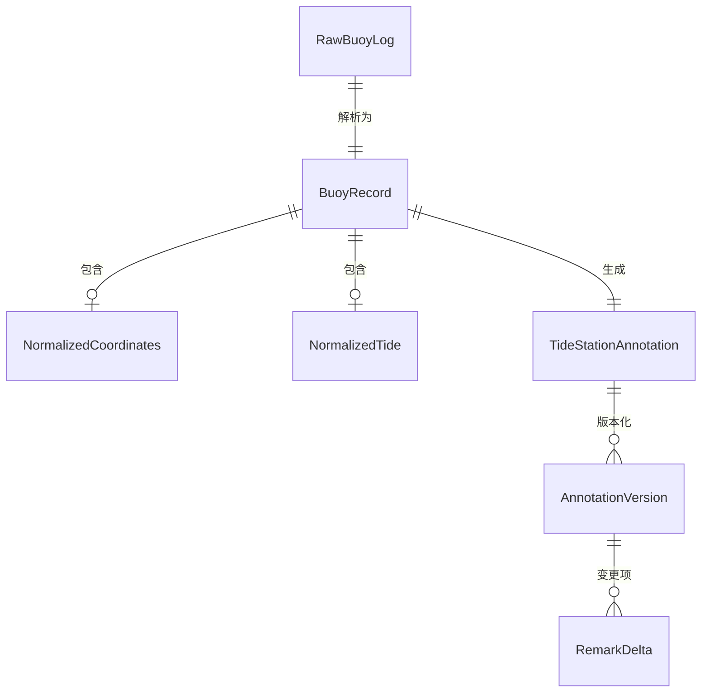

## 1. 架构设计

纯前端 Web3D 应用，无后端服务。将现有 Python 解析逻辑（坐标解析、潮位单位标准化、标注引擎、批处理管线、备注修正与版本对比）移植为 TypeScript 模块，在浏览器内直接运行，保证三维场景、侧边说明与 CSV 预览出自同一份解析结果。

## 2. 技术说明

- 前端：React@18 + TypeScript + Vite + TailwindCSS@3
- 3D：three + @react-three/fiber + @react-three/drei + @react-three/postprocessing
- 状态管理：zustand
- 图标：lucide-react
- 字体：Manrope（显示）+ IBM Plex Mono（技术读数）
- 初始化工具：vite-init（react-ts 模板）
- 后端：无（解析逻辑全部前端 TS 实现，CSV 在浏览器内用 Blob 导出）
- 数据：内置示例浮标日志常量 + 支持粘贴自定义日志；无数据库

## 3. 路由定义

单页应用，单一主路由承载控制台；通过面板切换与选中状态组织信息。

| 路由 | 用途 |
|------|------|
| / | 3D 海图控制台主页面（三维视口 + 侧栏 + CSV 预览） |

## 4. 解析引擎层（TS 移植自现有 Python）

模块对应关系（移植并修复异常不伪装为 0）：

- `src/engine/coordinateParser.ts` ← coordinate_parser.py：decimal/DMS/DDM 解析，失败返回 `null` + 原因，不再回退 0.0
- `src/engine/tideNormalizer.ts` ← tide_normalizer.py：m/cm/ft/中文单位标准化，保留原始值与单位
- `src/engine/annotationEngine.ts` ← annotation_engine.py：统一数据源 → 场景标注/侧边说明/CSV 行三源一致；异常态显式置 EXCEPTION，坐标/潮位字段留空而非 0
- `src/engine/pipeline.ts` ← pipeline.py：批次处理、备注修正规则解析、版本对比、CSV 生成、一致性校验
- `src/engine/types.ts` ← models.py：数据模型与枚举
- `src/engine/sampleLogs.ts`：内置示例浮标日志常量

### 4.1 异常处理契约（关键修复）

- `NormalizedCoordinates` 解析失败时 `latitude`/`longitude` 为 `null`，`parseNotes` 含失败原因。
- `BuoyRecord.isValid=false` 时 `createAnnotation` 置 `status=EXCEPTION`，`csv_row.latitude/longitude/tide_meters` 写空字符串，`issues` 写失败原因与影响判断；`latitude_raw/longitude_raw/tide_original/raw_text` 完整保留原始说法。
- 三维点位：坐标无效的异常站点不落海面，集中到"待核查区"。

## 5. 数据模型

### 5.1 数据模型定义

### 5.2 关键类型（TS）

- `AnnotationStatus = 'processed' | 'reprocessed' | 'exception' | 'pending_review'`
- `TideStationAnnotation`：含 `sceneAnnotation`、`sideNote`、`csvRow`、`status`、`remarks`、`rawTrace`
- `AnnotationVersion`：含 `versionNumber`、`appliedRemark`、`deltas: RemarkDelta[]`
- `RemarkDelta`：`fieldChanged`、`oldValue`、`newValue`、`judgmentImpact`

## 6. 状态管理（Zustand）

单一 store 管理批次、版本、选中点位、备注草稿、导出结果与一致性状态：

- `batch`：当前批次标注与版本
- `selectedAnnotationId`：当前选中站点
- `remarkDraft`：备注草稿与识别到的修正规则
- `consistency`：界面与导出一致性校验结果
- 动作：`loadLogs`、`reprocessWithRemark`、`selectStation`、`exportCsv`、`verifyConsistency`
