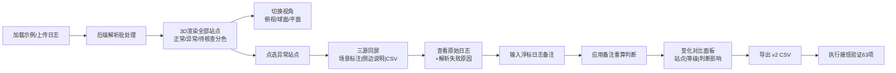

## 1. 产品概述

面向水质分析师阿乔的潮汐能站空间标注 3D 可视化工作台，解决浮标日志多格式解析不直观、异常记录伪装成正常、备注重跑变化难以追踪的痛点。基于 Three.js 三维场景，将浮标日志、空间标注、三源一致性校验、备注重跑全流程在浏览器内闭环完成。

- 解决问题：经纬度写法不统一、潮位单位混写、异常记录被伪装成 0.000000 正常坐标、补备注重跑后变化说不清、三套输出不一致
- 目标用户：水质分析师、海洋能评估工程师

## 2. 核心功能

### 2.1 用户角色

| 角色 | 登录方式 | 核心权限 |
|------|----------|----------|
| 水质分析师（阿乔） | 本地直接启动 | 加载浮标日志、切换视角、点选站点、追加备注、重新计算、导出 CSV、执行接班验证 |

### 2.2 功能模块

1. **日志加载模块**：示例日志一键加载 / 自定义文本粘贴 / 文件上传
2. **3D 空间视图模块**：潮汐能站和浮标点位三维化、正常/异常/待核查三色分类、空间标注图层、可切换视角（地球俯视 / 球面 / 平面）
3. **侧边详情面板**：场景标注文本、原始日志追溯、标准化值 vs 原始写法、解析问题线索列表
4. **备注与重算模块**：对单站追加减潮/订正类备注，一键重算并生成变化对比报告
5. **三源一致性模块**：场景标注、侧边说明、CSV 预览同屏显示，实时校验三者来自同一数据源快照
6. **CSV 导出与接班验证模块**：按版本导出 CSV，执行 60+ 项全链路验证

### 2.3 页面详情

| 页面名称 | 模块名称 | 功能描述 |
|----------|----------|----------|
| 工作台主页面 | 顶栏区 | 批次信息、加载示例按钮、文件上传、备注输入框、重算按钮、导出按钮、验证按钮 |
| 工作台主页面 | 3D 场景区 | 经纬度映射球面点位、正常/异常/待核查颜色编码、点击选中高亮、视角切换按钮组 |
| 工作台主页面 | 左侧站点列表 | 全部站点状态标签、异常站优先置顶、搜索过滤 |
| 工作台主页面 | 右侧详情面板 | Tab 切换：场景标注 / 侧边说明 / CSV 预览 / 变化对比 |
| 工作台主页面 | 底部状态栏 | 批次统计、异常数、待核查数、当前版本号、数据源时间戳 |

## 3. 核心流程

**主流程描述**：
1. 用户进入工作台 → 点击「加载示例浮标日志」
2. 后端调用解析 pipeline → 返回批次结果（含标准化坐标、潮位、三源一致数据、异常标记）
3. 前端 3D 场景渲染全部站点点位，异常站红色警告、待核查黄色、正常绿色
4. 用户切换视角（俯视/球面/平面），点击异常站点
5. 右侧面板展开：查看场景标注、侧边说明、CSV 行预览、原始日志全文、解析失败原因
6. 用户在顶栏输入备注（如"基准面偏高 0.5m，实际减去"）→ 点击「应用备注并重算」
7. 前端显示变化对比面板：哪些站潮位变了、哪些等级跨阈值、哪些仍需人工、判断影响说明
8. 用户点击「导出 v2 CSV」→ 下载文件
9. 点击「执行接班验证」→ 63 项检查通过，流程闭合

## 4. 用户界面设计

### 4.1 设计风格

- **美学方向**：深海科考控制台风格（industrial utilitarian + oceanic depth）
- **主色**：深海蓝 `#0b1a2b` 作为背景基底，海面青光 `#25d0c0` 主强调色
- **异常/待核查强调**：警报珊瑚红 `#ff5e62`（异常）、浮标黄 `#ffc93c`（待核查）
- **辅色**：深靛蓝面板 `#14263f`、分隔线青蓝 `#1f4068`
- **字体**：显示字体用 "JetBrains Mono"（等宽、工业感、适合坐标数值）；正文用 "DM Sans"。绝对避免 Inter / Arial 类通用字体。
- **按钮样式**：直角切边（industrial bevel），0.5px 发光描边，按下内凹阴影
- **图标风格**：线条型图标，尺寸统一 14/16px，颜色随状态联动
- **面板质感**：深色底 + 低透明度玻璃 + 细边框 + 细微颗粒噪点纹理，模拟控制台显示器

### 4.2 页面设计概览

| 页面 | 模块 | UI 元素 |
|------|------|---------|
| 工作台 | 顶栏 | 切边按钮组「加载」「导出」「验证」，备注输入框带发光底边，批次号胶囊 |
| 工作台 | 3D 场景 | 深蓝球面 + 经纬网格 + 青绿色发光浮标柱体（异常红/待核查黄闪烁），左上角视角切换三态按钮，左下角罗盘 |
| 工作台 | 左列表 | 卡片式站点，状态色左边条，hover 时轻微上浮 + 青色描边 |
| 工作台 | 右面板 | 顶部 Tab：场景标注 / 侧边说明 / CSV 预览 / 变化对比，底部等宽字体原始日志框 |
| 工作台 | 状态栏 | 五栏统计：总数/正常/待核查/异常/版本号，每栏等宽胶囊 |

### 4.3 响应式

- Desktop-first（1280×800 及以上），核心操作区横向三栏（左列表 22% / 3D 56% / 右面板 22%）
- 窗口缩小时：左/右面板可折叠为抽屉模式，3D 场景自适应
- 移动端不提供支持（明确桌面端工业应用）

### 4.4 3D 场景指引

- **环境**：深空灰 + 径向渐变至深海蓝，模拟水下观察台窗
- **光照**：三盏方向光 + 半球光（上青下蓝），点位自带 emissive 发光材质
- **相机设置**：PerspectiveCamera，初始俯视角 45°，Fov 50，轨道控制器支持缩放/旋转/平移
- **视角切换动作**：
  - 俯视：camera 沿 y 轴升至 120，看向原点，动画 700ms easeOutCubic
  - 球面：camera 拉至距离 80，倾斜 25°，动画 700ms
  - 平面：相机正交模式（临时切 OrthographicCamera）
- **点位视觉**：
  - 正常站：绿色发光圆柱体 + 顶部球体，高 0.8，不闪烁
  - 待核查：黄色，呼吸式透明度 0.6↔1.0，频率 2s
  - 异常站：红色，顶部加闪烁警戒锥，频率 0.8s
- **交互**：raycaster 点击选中，选中点位移高 30%，浮起信息标签（Sprite）
- **后期**：UnrealBloomPass 给发光点位加辉光，强度 0.4
- **性能预算**：单帧 < 16ms，最多支持 500 个站点点位
