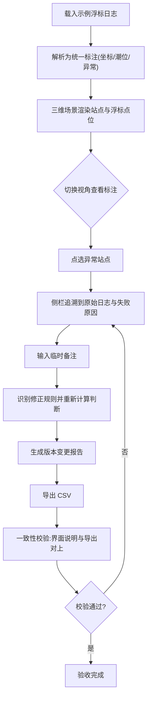

## 1. 产品概述

潮汐能站空间标注控制台（Tidal Annotation Deck）是面向水质分析师阿乔的 Web3D 工作台。它把经纬度写法不一、潮位单位混写的浮标日志，统一解析成空间标注，并在三维海图上呈现潮汐能站、浮标点位与标注图层。核心解决三件事：异常日志不再被伪装成有效坐标、补一条备注后能讲清判断变化、界面与导出 CSV 出自同一份解析结果。

- 目标用户：水质分析师阿乔（及其接班同事），需要在换班前快速核对站点状态、追溯原始日志、临时补备注并复核。
- 市场价值：把原本散落在命令行脚本里的批次留痕、版本对比、CSV 导出流程，收敛进一个可在浏览器里完成验收的三维界面，降低交接成本、杜绝异常被掩盖。

## 2. 核心功能

### 2.1 用户角色

| 角色 | 进入方式 | 核心权限 |
|------|----------|----------|
| 水质分析师 | 直接打开控制台 | 加载日志、切换视角、点选站点、追加备注、重跑、导出 CSV |
| 接班同事 | 同一控制台 | 查看历史版本与变更报告、复核异常待核查项 |

### 2.2 功能模块

1. **3D 海图控制台（主页面）**：三维潮汐能站与浮标点位场景、空间标注图层、视角切换、点位交互
2. **解析与标注引擎**：浮标日志解析、坐标/潮位标准化、异常识别（不伪装成 0）、备注修正与版本对比
3. **侧边说明与 CSV 明细面板**：站点详情、原始日志追溯、CSV 预览、变更报告、CSV 导出

### 2.3 页面详情

| 页面名称 | 模块名称 | 功能描述 |
|----------|----------|----------|
| 3D 海图控制台 | 三维场景视口 | 渲染潮汐能站塔架、浮标点位、海面与等深线网格；视角切换（俯瞰/侧视/环绕）；点选浮标高亮并联动侧栏 |
| 3D 海图控制台 | 日志载入栏 | 加载内置示例浮标日志或粘贴自定义日志；显示批次号、解析进度、正常/待核查/异常计数 |
| 3D 海图控制台 | 站点侧边面板 | 展示选中站点的场景标注、侧边说明、原始日志全文、解析失败原因、影响判断；异常态显式标红并禁用伪装坐标 |
| 3D 海图控制台 | 备注与重跑栏 | 输入临时备注、识别修正规则（减去Xm/修正为Xm）、重新生成结果、展示补充前后变化与仍需人工确认项 |
| 3D 海图控制台 | CSV 明细预览 | 表格化预览当前解析结果全部字段；导出 CSV；一致性校验指示器（界面说明与导出是否对上） |
| 3D 海图控制台 | 版本变更报告 | 列出每个站点受备注影响的判断变更项（状态/潮位等级/潮位值/依据）与需人工确认项 |

## 3. 核心流程

用户在浏览器内完成的验收主流程：加载示例浮标日志 → 解析生成批次与标注 → 切换空间视角查看站点标注 → 点选异常站点追溯到原始日志 → 临时追加一条备注 → 重新生成结果并查看变更 → 导出 CSV → 校验导出明细与界面说明一致。

## 4. 用户界面设计

### 4.1 设计风格

- **设计概念**：深渊海图控制台（Abyssal Chart Console）——深海航道测量站质感，深蓝绿深渊底色 + 生物荧光青色测深网格 + 琥珀色警告 + 珊瑚红异常。
- **主色**：深渊藏青 `#06141c` / `#0a1f2b`；次色：荧光青 `#38e1d6`、深测绿 `#1f7a78`；强调：琥珀 `#f5b342`（待核查）、珊瑚红 `#ff5d5d`（异常）、月光白 `#e6f4f1`（正文）。
- **按钮风格**：扁平带荧光描边，悬停发光，异常态使用珊瑚红填充。
- **字体**：标题用 Space Grotesk 之外更具海洋工业感的 Manrope（显示）+ IBM Plex Mono（技术读数/经纬度/CSV）。避免通用字体。
- **布局**：左侧三维视口为主，右侧三段式侧栏（站点详情 / 备注重跑 / CSV 与变更），顶部状态栏批次留痕。
- **图标**：Lucide 图标，点位状态用自定义发光标记。
- **氛围细节**：海面波动着色器、测深等高线网格、噪点叠加、点位呼吸光、异常点脉冲红环。

### 4.2 页面设计概览

| 页面名称 | 模块名称 | UI 元素 |
|----------|----------|----------|
| 3D 海图控制台 | 三维场景视口 | 深渊背景、海面波动、等深线网格、塔架与浮标点位、状态色光晕、视角切换按钮组、悬停 tooltip |
| 3D 海图控制台 | 顶部状态栏 | 批次号、版本号、正常/待核查/异常计数胶囊、一致性指示灯 |
| 3D 海图控制台 | 站点侧边面板 | 场景标注文本卡、侧边说明、原始日志全文块（等宽字体）、失败原因列表、影响判断标签 |
| 3D 海图控制台 | 备注与重跑栏 | 备注 textarea、识别到的修正规则预览、重跑按钮、变更项卡片（旧→新）、需人工确认清单 |
| 3D 海图控制台 | CSV 预览与导出 | 字段表头、可滚动表格、行高亮联动选中点、导出按钮、一致性校验结果条 |

### 4.3 响应式

桌面优先（分析师工作站在大屏使用），平板自适应侧栏可折叠，触控支持点位点选与视角拖拽。移动端仅作只读概览。

### 4.4 3D 场景指引

- **环境与氛围**：深渊夜海，无 HDRI 资源依赖，用渐变雾与程序化海面着色器营造深度；冷色调主光 + 青色补光。
- **灯光**：主方向光（月光）从高处斜射 + 青色环境光 + 点位自带发光点光源。
- **相机**：透视相机，提供俯瞰/侧视/环绕三套预设，OrbitControls 拖拽，选中点位平滑聚焦。
- **构图与焦点**：潮汐能站塔架为中心地标，浮标点位环绕分布，异常点位脉冲红环作为视觉焦点。
- **交互与动画**：点位呼吸光、悬停放大、点击聚焦相机、海面波动、标注图层飞入。
- **后处理**：UnrealBloomPass 让荧光点位发光；轻度景深突出焦点。
- **资产与性能**：塔架与浮标用程序化几何（无外部模型依赖），点位数量级 < 100，确保流畅。

## 5. 关键修复点（异常不伪装）

- 经纬度解析失败、潮位单位混写、原始备注有歧义的日志，在三维点位与侧边面板显示为 **待核查 / 异常** 状态，绝不写成 `0.000000` 这类看似有效的坐标。
- CSV 明细中 `latitude`/`longitude`/`tide_meters` 字段对异常记录留空或写 `PARSE_FAILED`，同时保留 `latitude_raw`/`longitude_raw`/`tide_original`/`issues`（失败原因与影响判断）。
- 三维场景中异常点位坐标无效时不落海面，改在场景边缘的"待核查区"集中展示，并显式标注状态。
