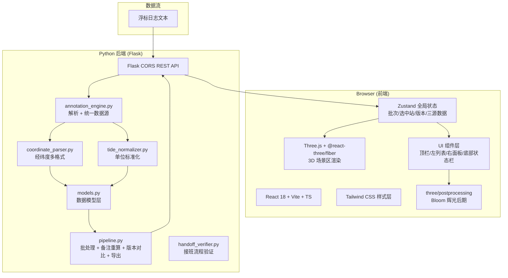
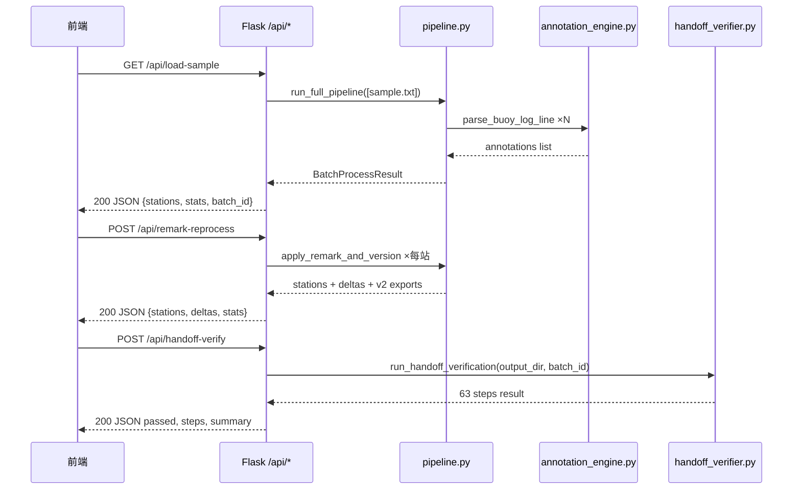
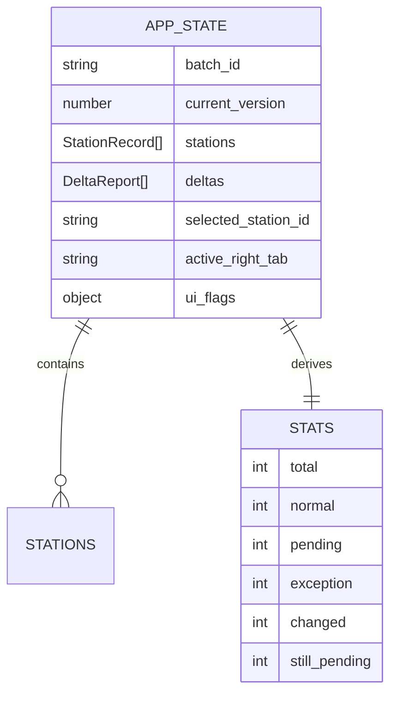

## 1. 架构设计



## 2. 技术说明

- **前端初始化**：`vite-init` + `react-ts` 模板（React 18 + TypeScript + Tailwind CSS + Zustand）
- **3D 库**：`three` + `@react-three/fiber` + `@react-three/drei` + `@react-three/postprocessing`
- **UI 图标**：`lucide-react`
- **后端**：Python 3 + Flask（**不使用 Node Express**，因为已有 Python pipeline 代码直接复用）
- **前后端通信**：Flask 提供 `/api/*` REST JSON 接口，前端 vite dev server 配置 proxy 到 Flask
- **无需数据库**：状态全部驻留内存，批次结果可本地 JSON 下载
- **打包/构建**：Vite 5.x，TypeScript strict 模式

## 3. 路由定义

| 路由 | 用途 |
|------|------|
| `/` | 单页工作台（顶栏 + 左列表 + 3D 场景 + 右面板 + 状态栏），无多路由 |

## 4. API 定义（后端 Flask）

### `/api/load-sample` [GET]
加载内置 `sample_buoy_logs.txt` 示例，返回解析结果。

```typescript
type Response = {
  batch_id: string;
  stations: StationRecord[];
  exports: { v1_csv: string; v1_scene: string; v1_side: string };
  stats: { total: number; normal: number; pending: number; exception: number };
}
```

### `/api/parse-logs` [POST]
解析自定义浮标日志文本。

```typescript
type Request = { logs_text: string }
type Response = SameAsLoadSample
```

### `/api/remark-reprocess` [POST]
追加备注并重算指定站（或全部站）。

```typescript
type Request = {
  batch_id: string;
  remarks: { station_name?: string; log_id?: string; remark_text: string }[];
}
type Response = {
  batch_id: string;
  stations: StationRecord[];
  deltas: DeltaReport[];   // 变化清单
  exports: { v2_csv: string; v2_scene: string; v2_side: string; trace: string };
  stats: { same_count; changed_count; still_pending };
}
```

### `/api/export-csv` [GET]
按版本号下载 CSV 文件。`?batch_id=xx&version=1|2`

### `/api/handoff-verify` [POST]
执行 63 项接班验证。

```typescript
type Request = { batch_id: string; version: 1 | 2 }
type Response = {
  passed: boolean;
  steps: { name: string; passed: boolean; detail: string }[];
  summary: string;
  errors: string[];
}
```

### `StationRecord` 核心类型

```typescript
type StationStatus = "normal" | "pending" | "exception";
type StationRecord = {
  log_id: string;
  record_id: string;
  annotation_id: string;
  station_name: string;

  // 注意：解析失败时这些坐标/潮位必须为 null，绝不能是 0.000000
  latitude: number | null;
  longitude: number | null;
  latitude_raw: string;
  longitude_raw: string;
  coordinate_format: string;
  parse_notes: string[];

  tide_meters: number | null;
  tide_original: string;
  tide_unit_raw: string;
  tide_level: string;   // "超高潮"|"高潮位"|"中潮位"|"低潮位"|"负潮位"|"未知"
  tide_normalize_notes: string[];

  status: StationStatus;
  status_reasons: string[];   // 为什么是 exception / pending
  judgment_impact: string[];  // 异常/待核查对判断的影响说明

  // 三源一致渲染文本（来自同一份 unified_source_snapshot）
  scene_annotation: string;
  side_note: string;
  csv_row: Record<string, string>;

  // 追溯
  raw_text: string;
  source_ref: string;
  timestamp: string;
  remarks: string[];
  has_exception: boolean;
}
```

## 5. 服务器架构图



## 6. 数据模型（前端 Zustand Store）

### 6.1 Zustand Store 结构



### 6.2 关键约束（数据质量）

1. **禁止 0.000000 伪有效值**：经纬度或潮位解析失败，前后端约定一律为 `null`，前端渲染为 `⚠ 解析失败` 红色文本。
2. **status 判定规则（后端）**：
   - `exception`：任一条件：坐标解析失败(null)、潮位解析失败(null)、原始格式完全不匹配
   - `pending`：坐标/潮位解析成功但有警告（格式不一致、单位模糊、超出范围）
   - `normal`：全部解析无警告
3. **三源一致性保证**：`scene_annotation`、`side_note`、`csv_row` 三字段均由后端 `_unified_data_source` 一次生成，前端**只读**，绝不二次拼装。
