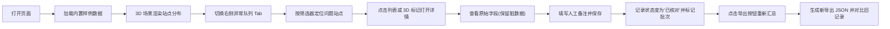

## 1. 产品概述

潮汐能站报告汇总 Web3D 交互工具，用于把遥感截图中采样时间和实验结果对不上的记录捋顺。面向水质分析师（阿乔）与排班同事，解决云遮挡人工扫漏、脏数据溯源困难、重跑导出无法前后对照的问题。通过 3D 空间分布 + 侧边异常队列，一键定位问题站点，人工补备注后可重新汇总导出，旧记录与新结果并置可追溯。

## 2. 核心功能

### 2.1 功能模块

1. **3D 场景主界面**：潮汐能站三维空间分布、站点标记、异常状态高亮、云遮挡范围可视化
2. **侧边列表**：全部站点列表、异常队列视图、筛选器（云遮挡/时间冲突/结果超阈值）
3. **站点详情面板**：原始来源、截图编号、采样时间、实验结果、异常原因、人工备注（保留脏数据原始字段）
4. **重新汇总与导出**：补完备注后一键重新汇总、生成 JSON 导出、新旧记录对比视图
5. **批次标记**：区分原始导入记录与补备注后重算导出记录

### 2.2 页面详细

| 页面名称 | 模块名称 | 功能描述 |
|----------|----------|----------|
| 主界面 | 3D 场景 | 以海洋/海岸线为基底的三维空间，站点按经纬度分布，球体/柱体标记高度表示能量，颜色区分状态（绿正常/黄待确认/红异常/灰云遮挡） |
| 主界面 | 左上角工具栏 | 视图切换（全局/仅异常/按批次）、搜索站点、重置视角、导出按钮 |
| 主界面 | 右侧面板 | Tab 切换：「全部列表」「异常队列」，列表行有异常标记高亮，支持点击定位 3D 站点 |
| 主界面 | 站点详情弹窗 | 展示所有原始字段（含脏数据不修正）、可编辑备注字段、保存后自动标记为已核对 |
| 主界面 | 新旧对比视图 | 显示原始批次数据与重算批次数据的差异，高亮变更字段 |
| 异常队列 | 筛选条 | 复选筛选：云遮挡严重、采样时间冲突、实验结果超阈值，可多条件叠加 |
| 重新汇总 | 导出面板 | 展示当前批次汇总统计，生成导出文件 JSON，说明旧记录和新导出的对应关系 |

## 3. 核心流程

## 4. 用户界面设计

### 4.1 设计风格
- **主色**：深海蓝 `#0A2540` 为背景基底，青绿 `#00D4AA` 作为主强调（代表海水/能量）
- **异常色**：警示黄 `#FFB703`、危险红 `#FF5A5F`、云遮灰 `#8A94A6`
- **辅色**：珊瑚橙 `#FF7A45`（交互热点）、白蓝渐变文字
- **字体**：标题用「Space Grotesk」科技感无衬线；正文用「Noto Sans SC」；数字用「JetBrains Mono」等宽
- **布局**：桌面优先，左侧 3D 场景占 65%，右侧面板占 35%，顶部悬浮工具栏
- **风格基调**：深海科技 / 遥感仪表盘感，深色主题，磨砂玻璃面板，发光标记点
- **动效**：3D 场景缓慢自动旋转，异常站点脉冲光晕，鼠标悬停站点浮出信息卡片

### 4.2 页面设计一览

| 页面名称 | 模块名称 | UI 要素 |
|----------|----------|----------|
| 主界面 | 3D 场景 | 深海渐变背景 + 网格海平面，站点为多面体柱，异常标记带脉冲发光环，云遮挡用半透明灰色笼罩半球 |
| 主界面 | 顶部工具栏 | 毛玻璃横条，发光按钮，搜索框带聚焦光晕，视图切换 Segmented Control |
| 主界面 | 右侧面板 | 深色卡片 Tab 切换，列表行斑马纹，异常行左侧彩色条带，悬停行背景微亮 |
| 主界面 | 详情弹窗 | 模态浮层，双栏：左栏原始数据文本块（等宽字体，红下划线标注异常字段），右栏可编辑备注 + 保存按钮 |
| 异常队列 | 筛选条 | 标签式 Checkbox，选中项发光，重置按钮 |
| 导出面板 | 汇总卡片 | 数字大号展示（正常数/异常数/云遮数），新旧批次对比表格高亮差异单元格 |

### 4.3 响应式
- 桌面优先（≥1280px）：左右两栏布局
- 平板（768–1279px）：右侧面板折叠为抽屉，点击按钮展开
- 移动端（<768px）：3D 场景占满，列表与详情全屏模态切换；不强制适配但可用

### 4.4 3D 场景指引
- **环境**：纯深海蓝底 + 方向光 + 半球光模拟天光，海平面半透明青色网格，添加海面纹理噪点
- **光照**：主方向光冷白 `#E8F4FF`，辅光青绿补光 `#00D4AA` 打在站点底部，异常站点自发光材质
- **相机**：初始透视相机，位置 (0, 80, 120)，lookAt 原点；支持 OrbitControls 拖拽旋转缩放
- **焦点**：站点柱体为主体，异常站点周围半透明环形警告圈持续呼吸脉动
- **交互**：点击站点 → 相机平滑飞向该站点 + 弹出详情面板；双击列表行 → 同样飞行动画
- **后期**：轻微 Bloom 发光效果（站点光晕、工具栏按钮），全局色调映射 ACESFilmic
