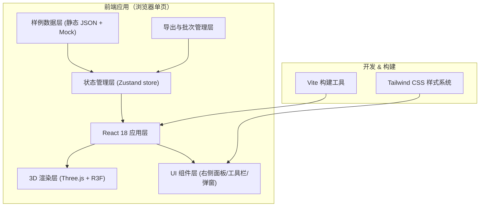
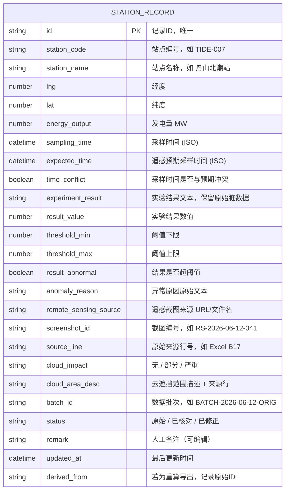

## 1. 架构设计



## 2. 技术选型

- **前端框架**：React@18 + TypeScript（严格模式）
- **构建工具**：Vite@5（快速冷启动 + HMR）
- **3D 渲染**：
  - `three` — 核心 3D 库
  - `@react-three/fiber` — React 声明式 Three.js 封装
  - `@react-three/drei` — 辅助组件（OrbitControls、Text、Stars 等）
  - `@react-three/postprocessing` — 后期 Bloom 发光效果
- **样式**：Tailwind CSS@3 + CSS 变量主题系统
- **状态管理**：Zustand（轻量 store，无 Redux 复杂度）
- **图标**：`lucide-react`
- **后端**：无（纯前端，所有数据内置 mock，导出文件浏览器本地下载 JSON）

## 3. 路由定义

单页应用不使用路由，单页面包含全部功能模块，通过组件状态切换视图。

| 虚拟视图 | 触发方式 | 说明 |
|----------|----------|------|
| 全局视图 | 工具栏「全局」按钮 | 默认视图，显示全部站点 |
| 仅异常视图 | 工具栏「仅异常」按钮 | 3D 场景隐藏正常站点，列表仅异常 |
| 按批次视图 | 工具栏「批次」按钮 | 按批次编号用不同颜色区分 |
| 全部列表 Tab | 右侧面板 Tab 切换 | 默认右侧视图 |
| 异常队列 Tab | 右侧面板 Tab 切换 | 带筛选条，默认全选异常类型 |
| 站点详情弹窗 | 点击 3D 标记或列表行 | 模态浮层展示详情 + 编辑备注 |
| 导出面板 | 顶部「导出」按钮 | 汇总统计 + 新旧对比 + 下载 JSON |

## 4. 数据模型

### 4.1 站点记录数据模型



### 4.2 数据文件结构

- `src/data/sampleStations.ts` — 内置样例数据（约 18 条，覆盖正常/异常/云遮挡/时间冲突等场景）
- `src/types/station.ts` — TypeScript 类型定义
- `src/store/stationStore.ts` — Zustand store，管理记录、筛选、批次、导出状态
- `src/utils/export.ts` — 重新汇总与导出 JSON 工具函数

## 5. 组件结构

```
src/
├── App.tsx                          # 根组件，布局：左3D + 右面板
├── main.tsx                         # 入口
├── index.css                        # Tailwind + 全局主题 CSS 变量
├── types/
│   └── station.ts                   # StationRecord / Filter / Batch 类型
├── data/
│   └── sampleStations.ts            # 内置样例数据 18 条
├── store/
│   └── stationStore.ts              # Zustand: 记录 CRUD、筛选、批次、备注更新
├── utils/
│   └── export.ts                    # 重新汇总 + 生成 JSON 导出 + 批次对比
├── components/
│   ├── scene3d/
│   │   ├── Scene3D.tsx              # Canvas + Camera + Lighting + Controls
│   │   ├── StationMarker.tsx        # 单个站点 3D 柱体 + 发光环 + 交互
│   │   ├── OceanFloor.tsx           # 海平面网格 + 噪点
│   │   └── CloudOverlay.tsx         # 云遮挡半透明半球
│   ├── layout/
│   │   ├── TopToolbar.tsx           # 顶部工具栏：视图切换/搜索/导出
│   │   └── AppLayout.tsx            # 整体左右分栏容器
│   ├── sidepanel/
│   │   ├── SidePanel.tsx            # 右侧面板外壳 + Tab 切换
│   │   ├── StationList.tsx          # 全部站点列表
│   │   ├── AnomalyQueue.tsx         # 异常队列 + 筛选条
│   │   └── StationRow.tsx           # 单行组件，异常高亮
│   ├── modals/
│   │   ├── StationDetail.tsx        # 站点详情弹窗（含脏数据展示+备注编辑）
│   │   └── ExportPanel.tsx          # 导出面板：统计 + 新旧对比 + 下载
│   └── ui/
│       ├── StatusBadge.tsx          # 状态/异常/云遮挡彩色标签
│       └── AnimatedNumber.tsx       # 统计数字动画组件
└── vite-env.d.ts
```

## 6. 批次管理与导出规则

1. **初始批次**：所有样例数据加载后 `batch_id = BATCH-ORIG`，`status = 原始`
2. **备注更新**：用户保存备注时，生成新记录副本：
   - `batch_id = BATCH-<YYYYMMDD-HHmm>-REV`
   - `derived_from = 原始记录ID`
   - `status = 已核对`
   - `updated_at = 当前时间`
   - 原始记录保留不删除（保证溯源）
3. **重新汇总导出**：
   - 遍历当前所有记录，按 `station_code` 取每个站点最新版本（status 非原始优先，updated_at 最新优先）
   - 输出 JSON 含两层：`records`（新导出数据）、`originalRecords`（原始批次快照）、`diff`（变更字段清单）
   - 文件命名：`tidal-stations-report-YYYYMMDD-HHmm.json`
4. **新旧对比视图**：
   - 两列表格并排，按 `station_code` 对齐
   - 变更字段背景高亮（珊瑚橙渐变）
   - 新增/删除行在表格左侧用图标标注
