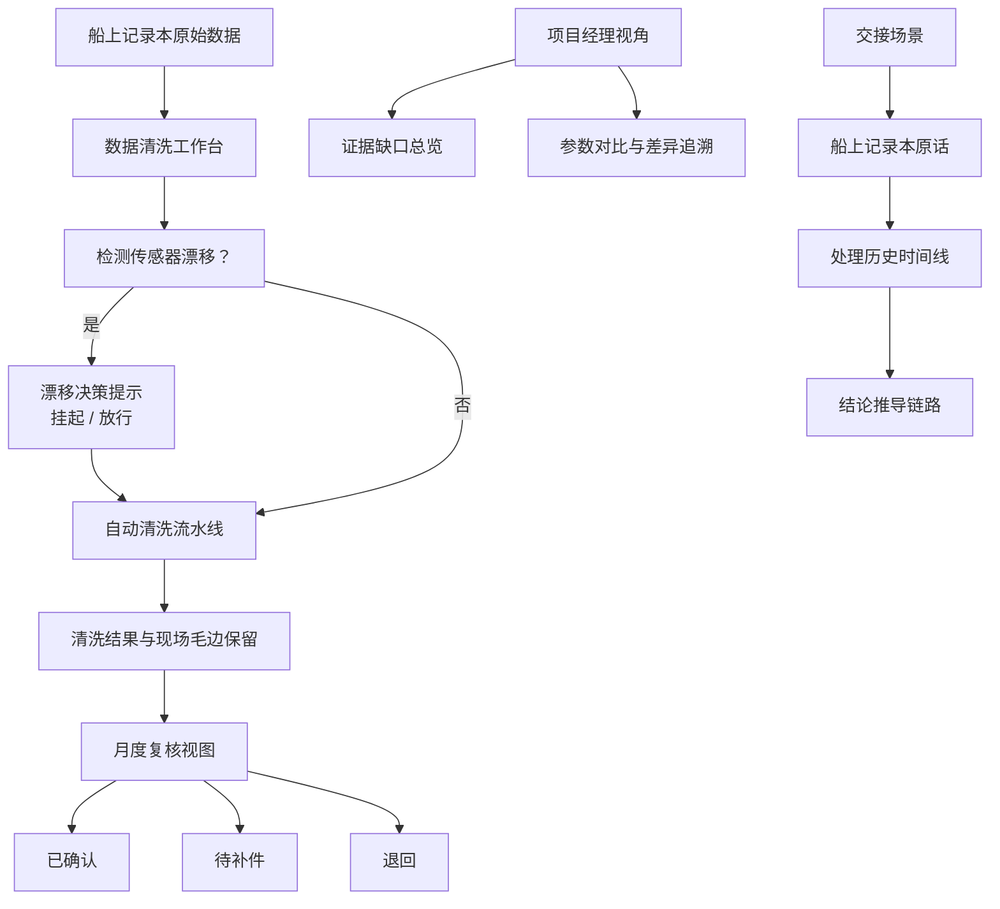

## 1. 产品概述

近岸水质数据清洗工作台是一款面向港口环境监测团队的数据质量管理工具，针对船上记录本中原始水质数据的清洗、复核与交接全流程。解决当前报告仅显示平均值、风险被掩盖、参数变更不可追溯、证据缺失不透明等痛点，让港口工程师老何能精准处理每条带"现场毛边"的记录，让项目经理一眼看清证据缺口与处理脉络。

## 2. 核心功能

### 2.1 用户角色

| 角色 | 说明 | 核心权限 |
|------|------|----------|
| 港口工程师（老何） | 数据清洗的执行者，负责日常清洗、月度复核、工作交接 | 全量数据操作、清洗规则配置、记录状态流转、时间线查看 |
| 项目经理 | 数据质量的监管者，关注结果差异、证据缺失、整体进度 | 参数对比查看、证据缺口总览、状态统计、历史时间线查看 |

### 2.2 功能模块

1. **数据清洗工作台**：船上记录本原始数据列表、清洗步骤流水线、单条记录详情与现场备注
2. **参数对比面板**：多组清洗参数方案对比、差异步骤高亮追溯、结果变化可视化
3. **月度复核视图**：已确认/待补件/退回三栏看板、批量操作、证据缺失标记
4. **交接时间线**：船上记录本原话溯源、处理历史时间线、结论推导链路展示
5. **传感器漂移告警**：漂移检测提示、挂起/放行决策辅助、漂移影响范围标注

### 2.3 页面详情

| 页面名称 | 模块名称 | 功能描述 |
|----------|----------|----------|
| 数据清洗工作台 | 船上记录本列表 | 展示原始记录，含后补备注等现场毛边，支持筛选与搜索 |
| 数据清洗工作台 | 清洗流水线 | 步骤化展示清洗流程：原始值→异常剔除→漂移校正→平滑插值→统计输出 |
| 数据清洗工作台 | 记录详情面板 | 单条记录完整信息：船上原话、传感器状态、现场备注、清洗前后对比 |
| 数据清洗工作台 | 漂移决策提示 | 检测到传感器漂移时，提示挂起或放行的影响分析，辅助工程师决策 |
| 参数对比面板 | 参数方案管理 | 保存多组清洗参数配置，支持切换与对比 |
| 参数对比面板 | 差异步骤追溯 | 高亮显示哪一步清洗导致结果变化，量化差异程度 |
| 参数对比面板 | 结果对比图表 | 两组参数清洗结果的并排可视化对比 |
| 月度复核视图 | 三栏看板 | 已确认、待补件、退回三类记录分栏展示，支持拖拽流转 |
| 月度复核视图 | 证据缺口总览 | 项目经理视角，醒目展示待补证据数量与类型 |
| 月度复核视图 | 批量操作 | 批量确认、批量退回、批量标记待补件 |
| 交接时间线 | 记录本原话 | 高亮展示船上记录本中的原始记录文字 |
| 交接时间线 | 处理时间线 | 按时间顺序展示每次清洗操作、状态变更、决策理由 |
| 交接时间线 | 结论链路 | 从原始数据到最终结论的完整推导链路可视化 |

## 3. 核心流程

港口工程师老何每日打开工作台，从船上记录本导入原始数据，系统自动执行清洗流水线。遇到传感器漂移时弹出决策提示，老何根据现场情况选择挂起或放行。每条带后补备注的"毛边"记录在详情中完整保留原话。月底复核时，老何在三栏看板中将记录分类为已确认、待补件或退回，并标记证据缺口。项目经理进入系统后，首页直接看到证据缺失总览与参数变更影响。交接时，通过时间线视图，先看船上记录本原话，再沿着处理时间线理解每条结论的来龙去脉。

## 4. 用户界面设计

### 4.1 设计风格

- **主色调**：深海蓝 (#0F2B46)，体现港口与海洋的专业感
- **辅助色**：警示橙 (#FF7A45) 用于漂移告警与待补件高亮；确认绿 (#2ECC71) 用于已通过记录；退回红 (#E74C3C) 用于退回记录
- **背景质感**：深色航海仪表盘风格，带微弱网格纹理，模拟船舶控制台氛围
- **字体**：标题使用方正硬朗的工业感无衬线字体，正文使用清晰易读的现代无衬线字体
- **组件风格**：卡片式布局，细微边框与投影，状态标签用色块+文字的硬朗风格
- **动效**：数据加载时的扫描线效果、状态切换时的滑入动画、时间线节点的脉冲提示

### 4.2 页面设计概述

| 页面名称 | 模块名称 | UI元素 |
|----------|----------|--------|
| 数据清洗工作台 | 记录本列表 | 左栏列表，卡片式记录项，带状态色条，后补备注用折角样式标识 |
| 数据清洗工作台 | 清洗流水线 | 横向步骤条，每步显示输入/输出数值，异常步骤用橙色光晕标记 |
| 数据清洗工作台 | 记录详情 | 右侧抽屉式面板，顶部"船上原话"用手写风格区块展示 |
| 参数对比面板 | 方案选择 | 顶部标签页式切换，选中方案有底部色条指示 |
| 参数对比面板 | 差异追溯 | 差异步骤用高亮背景+扩散动画，数值差异用红色/绿色箭头标注 |
| 月度复核视图 | 三栏看板 | 三列等分布局，每列顶部计数徽章，卡片可拖拽，列背景有微弱色晕 |
| 月度复核视图 | 证据缺口 | 顶部醒目横幅，数字大号加粗，下方分类进度条 |
| 交接时间线 | 原话区块 | 顶部模拟便签纸样式，米黄色背景，手写字体，有胶带角装饰 |
| 交接时间线 | 时间线 | 垂直时间线，节点有状态图标，悬停展开详情卡片 |

### 4.3 响应式

桌面端优先设计，主操作区保留充足横向空间展示三栏看板与清洗流水线。平板端自适应调整列数，移动端切换为纵向堆叠布局，保留核心信息展示。

### 4.4 特殊视觉元素

- 船上记录本原话区域：模拟纸质记录的质感，浅米黄色背景，细边框，左上角有模拟胶带的三角形装饰
- 传感器漂移告警：带脉冲动画的橙色圆点，hover 时展开影响范围说明
- "现场毛边"标识：记录卡片右上角有折角效果，暗示这是一条带后补备注的原始记录
- 清洗流水线步骤：每个步骤节点带有输入输出数值的微型仪表盘效果
