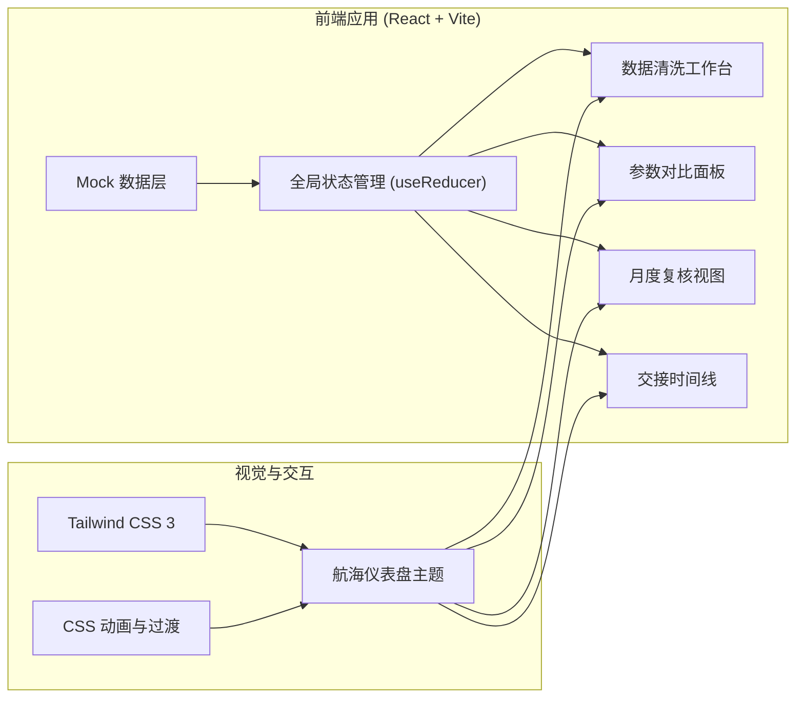
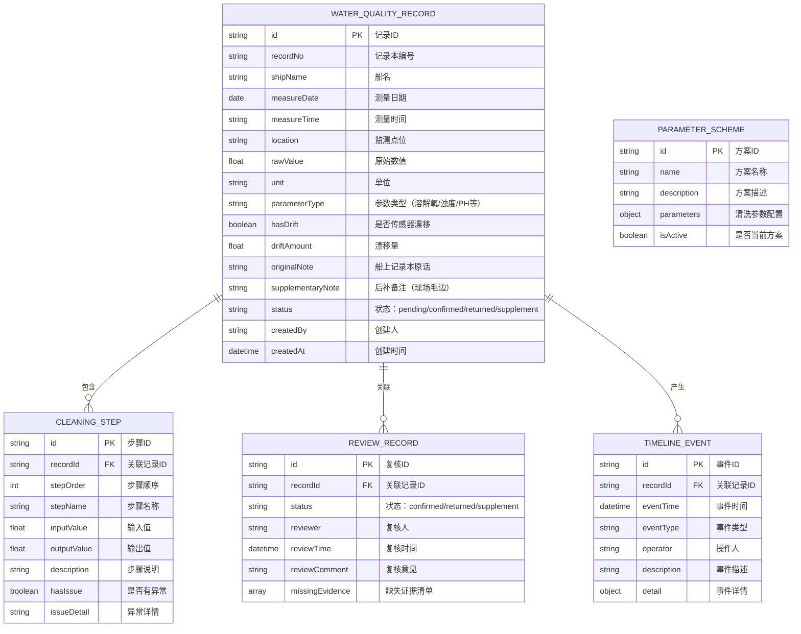

## 1. 架构设计



## 2. 技术描述

- **前端框架**: React@18 + TypeScript，使用函数组件与 Hooks 管理状态
- **构建工具**: Vite@5，提供快速开发体验与优化打包
- **样式方案**: Tailwind CSS@3，配合自定义主题配置实现航海仪表盘风格
- **状态管理**: React useReducer + Context API，集中管理清洗记录、参数方案、复核状态
- **路由方案**: React Router@6，实现单页应用多视图导航
- **数据方案**: 前端 Mock 数据，模拟船上记录本原始数据、清洗参数、历史记录
- **图表可视化**: 原生 SVG 实现小型数据可视化（清洗流水线仪表盘、趋势对比）

## 3. 路由定义

| 路由 | 页面 | 说明 |
|------|------|------|
| / | 数据清洗工作台 | 默认首页，船上记录本列表 + 清洗流水线 + 记录详情 |
| /compare | 参数对比面板 | 多组清洗参数对比，差异步骤追溯 |
| /review | 月度复核视图 | 三栏看板：已确认 / 待补件 / 退回 |
| /handover | 交接时间线 | 船上记录本原话 + 处理历史时间线 |

## 4. 数据模型

### 4.1 数据模型定义



### 4.2 类型定义

```typescript
// 水质记录状态
type RecordStatus = 'pending' | 'confirmed' | 'returned' | 'supplement';

// 水质参数类型
type ParameterType = 'dissolved_oxygen' | 'turbidity' | 'ph' | 'salinity' | 'temperature';

// 水质记录
interface WaterQualityRecord {
  id: string;
  recordNo: string;
  shipName: string;
  measureDate: string;
  measureTime: string;
  location: string;
  parameterType: ParameterType;
  rawValue: number;
  cleanedValue: number;
  unit: string;
  hasDrift: boolean;
  driftAmount: number;
  originalNote: string;
  supplementaryNote: string;
  hasSupplementaryNote: boolean;
  status: RecordStatus;
  cleaningSteps: CleaningStep[];
  createdAt: string;
}

// 清洗步骤
interface CleaningStep {
  id: string;
  stepOrder: number;
  stepName: string;
  inputValue: number;
  outputValue: number;
  description: string;
  hasIssue: boolean;
  issueDetail?: string;
}

// 参数方案
interface ParameterScheme {
  id: string;
  name: string;
  description: string;
  parameters: {
    outlierThreshold: number;
    driftCorrectionEnabled: boolean;
    smoothingWindowSize: number;
    interpolationMethod: string;
  };
  isActive: boolean;
}

// 复核记录
interface ReviewRecord {
  id: string;
  recordId: string;
  status: RecordStatus;
  reviewer: string;
  reviewTime: string;
  reviewComment: string;
  missingEvidence: string[];
}

// 时间线事件
interface TimelineEvent {
  id: string;
  recordId: string;
  eventTime: string;
  eventType: 'create' | 'clean' | 'review' | 'drift' | 'status_change' | 'note';
  operator: string;
  description: string;
  detail?: Record<string, any>;
}
```

## 5. 目录结构

```
src/
├── components/          # 通用组件
│   ├── layout/         # 布局组件（导航、侧边栏等）
│   ├── common/         # 通用UI（卡片、标签、按钮等）
│   └── charts/         # 数据可视化组件
├── pages/              # 页面组件
│   ├── Workbench/      # 数据清洗工作台
│   ├── Compare/        # 参数对比面板
│   ├── Review/         # 月度复核视图
│   └── Handover/       # 交接时间线
├── data/               # Mock 数据
│   ├── records.ts      # 水质记录数据
│   ├── schemes.ts      # 参数方案数据
│   └── timeline.ts     # 时间线事件数据
├── hooks/              # 自定义 Hooks
├── types/              # TypeScript 类型定义
├── utils/              # 工具函数
├── App.tsx             # 应用入口
├── main.tsx            # 渲染入口
└── index.css           # 全局样式与主题
```

## 6. 核心交互设计

1. **清洗流水线动画**：步骤节点依次点亮，模拟数据流转，异常节点有橙色脉冲提示
2. **三栏看板拖拽**：记录卡片可在三栏间拖拽切换状态，带平滑过渡动画
3. **时间线展开收起**：点击时间线节点展开详情卡片，带垂直滑入效果
4. **参数差异高亮**：切换参数方案时，差异步骤有扩散高亮动画，数值变化有箭头指示
5. **船上原话展示**：进入详情时，记录本原话区域有纸张展开的入场动画
