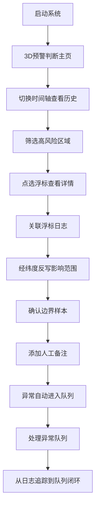
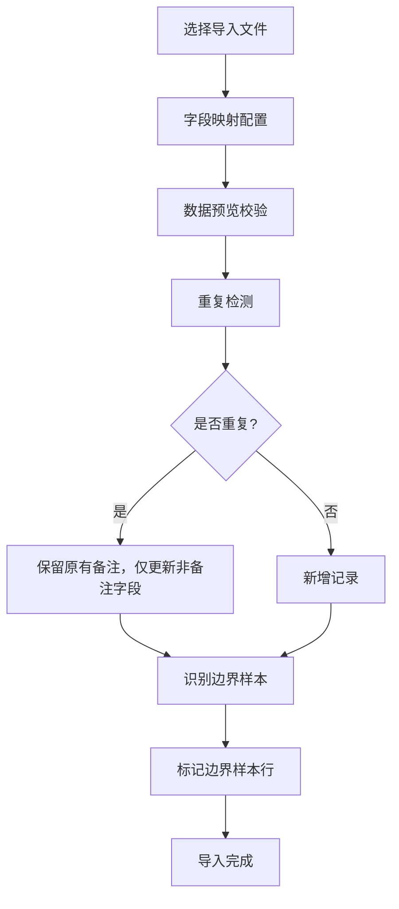

## 1. 产品概述

近岸水质异常预警系统是一款面向港口工程师的 Web3D 水质监测与预警平台，解决传统报告仅展示平均值、难以识别风险的核心痛点。系统以异常预警判断为唯一核心目标，通过浮标日志追踪、3D 可视化联动、异常队列管理，帮助工程师高效定位水质异常来源与影响范围。

- 核心目标：从"看平均值"转变为"预警判断"，让港口工程师能快速识别水质风险
- 目标用户：港口工程师（以老何为代表）、水质监测人员

## 2. 核心功能

### 2.1 用户角色

| 角色 | 注册方式 | 核心权限 |
|------|----------|----------|
| 港口工程师 | 系统账号登录 | 浮标日志管理、3D 预警判断、异常队列处理、数据导入导出 |
| 管理人员 | 系统账号登录 | 查看异常队列、审批处理结果、导出统计报告 |

### 2.2 功能模块

1. **Web3D 预警判断主界面**：近岸海域 3D 可视化、浮标点选、时间轴切换、水质热力图、异常高亮
2. **浮标日志管理**：日志列表、边界样本标记、经纬度反写、来源追踪、人工备注
3. **数据导入模块**：重复导入去重、标准行与边界样本双轨处理、人工备注保护
4. **异常队列管理**：异常列表、联动判断结果、状态流转、影响范围可视化
5. **筛选与联动控制**：多维度筛选、3D 场景-时间轴-异常队列-浮标日志四方联动

### 2.3 页面详情

| 页面名称 | 模块名称 | 功能描述 |
|---------|----------|----------|
| 3D 预警判断主页 | 3D 场景模块 | 近岸海域 3D 地形、浮标分布、水质参数热力图、异常区域高亮闪烁 |
| 3D 预警判断主页 | 时间轴控制 | 时间滑块、播放/暂停、关键时间点标记、异常时间点醒目提示 |
| 3D 预警判断主页 | 筛选面板 | 按水质参数、风险等级、浮标编号、时间范围筛选 |
| 3D 预警判断主页 | 浮标点选详情 | 点击浮标显示该点位详细参数、历史趋势、关联异常记录 |
| 浮标日志管理页 | 日志列表 | 分页展示浮标日志、支持搜索、排序、边界样本标识 |
| 浮标日志管理页 | 经纬度反写 | 自动识别并高亮影响范围、来源行信息，支持人工修正 |
| 浮标日志管理页 | 人工备注 | 每条日志可添加备注，重复导入时备注不被覆盖 |
| 数据导入页 | 导入配置 | 支持 Excel/CSV 导入、字段映射、预览校验 |
| 数据导入页 | 去重处理 | 自动识别重复记录、正常记录不翻倍、保护已有备注 |
| 异常队列页 | 异常列表 | 待处理异常、处理中、已完成分类展示 |
| 异常队列页 | 联动详情 | 点击异常自动同步 3D 场景定位、时间轴跳转、关联日志 |
| 异常队列页 | 处理操作 | 标记处理状态、添加处理说明、关联整改措施 |

## 3. 核心流程

### 3.1 主工作流程

港口工程师进入系统后，首先在 3D 预警判断主页查看整体水质分布。通过时间轴切换不同时段，配合筛选面板定位高风险区域。发现异常后点选浮标查看详情，关联查看浮标日志确认边界样本。系统自动反写经纬度标注影响范围与来源，工程师添加人工备注后，异常自动进入队列。处理异常时，队列与当前页面判断保持一致，确保信息同步。最终可从浮标日志完整追踪到异常队列的全链路。

### 3.2 数据导入流程

## 4. 用户界面设计

### 4.1 设计风格

- **设计基调**：深海科技风格，专业严谨，符合港口工程师工作场景
- **主色调**：深海蓝 (#0A1628) 为背景，海洋蓝 (#1E3A5F) 为面板，亮青色 (#00D4FF) 为高亮警示色
- **辅助色**：异常红 (#FF4757)、警告橙 (#FFA502)、正常绿 (#2ED573)
- **字体**：标题使用 Orbitron 科技感字体，正文使用 Roboto Mono 等宽字体便于数据对比
- **布局**：左侧筛选面板 + 中央 3D 场景 + 右侧详情面板的三栏布局
- **动效**：异常区域脉冲闪烁、时间轴推进时数据平滑过渡、面板展开收起流畅动画

### 4.2 页面设计概览

| 页面名称 | 模块名称 | UI 元素 |
|---------|----------|----------|
| 3D 预警判断主页 | 3D 场景 | 深蓝色海面渐变、带深度感的地形、发光浮标点、异常区域红色脉冲圈 |
| 3D 预警判断主页 | 时间轴 | 底部横贯时间条、关键异常点红色标记、当前时间点亮青竖线、播放控制按钮组 |
| 3D 预警判断主页 | 筛选面板 | 圆角卡片式、标签式参数切换、滑块式阈值调节、色块式风险等级筛选 |
| 浮标日志管理页 | 日志列表 | 斑马纹表格、边界样本行橙色描边、异常行红色背景、备注气泡 |
| 浮标日志管理页 | 经纬度反写 | 影响范围高亮背景色、来源行左侧绿色竖线标记、可折叠详情 |
| 异常队列页 | 异常列表 | 卡片式布局、状态标签角标、联动同步按钮、处理进度条 |
| 异常队列页 | 联动详情 | 点击卡片时 3D 场景飞行动画、时间轴自动跳转、日志面板自动展开 |

### 4.3 响应式设计

- 桌面端（默认）：三栏布局，3D 场景占 60% 宽度，筛选与详情各占 20%
- 平板端：上下布局，3D 场景在上占 70% 高度，控制面板在下可折叠
- 移动端：单页切换模式，底部 Tab 切换 3D 场景、日志、队列三个视图

### 4.4 3D 场景指引

- **环境/HDRI**：使用深海环境贴图，配合辉光后处理营造科技感
- **光照设置**：主光源模拟月光从斜上方照射，补光提升海面通透度，异常区域使用点光源照亮
- **相机设置**：默认俯视 45 度角，支持轨道控制缩放旋转，点选异常时自动调整相机角度
- **构图与焦点**：3D 场景中异常区域为视觉焦点，通过颜色对比和动画吸引注意力
- **交互与动画**：浮标悬停放大显示详情，时间轴变化时水质热力图平滑过渡，异常产生时从浮标向周围扩散动画
- **后处理效果**：Bloom 辉光效果增强科技感，轻微色差模拟监测屏幕，FXAA 抗锯齿
- **性能预算**：3D 场景三角形数量控制在 5 万以内，使用实例化渲染批量浮标，帧率稳定在 60fps

## 5. 数据一致性约束

### 5.1 异常队列与页面判断一致性

- 异常队列展示的判断结论必须与当前 3D 页面的分析结果实时同步
- 任何修改页面筛选条件、切换时间点的操作，都需同步更新异常队列的显示内容
- 队列中的异常处理状态变更，需即时反映到 3D 场景中的浮标状态

### 5.2 浮标日志到异常队列追踪

- 每条浮标日志记录需保留唯一标识，可追溯到由其产生的所有异常
- 异常队列中的每条记录，需能反向定位到原始浮标日志中的触发行
- 边界样本需特殊标记，在日志和队列中双向关联可见
