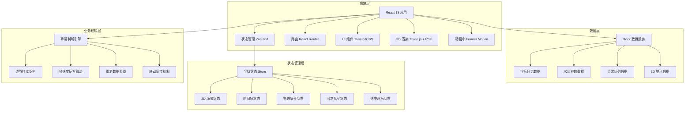
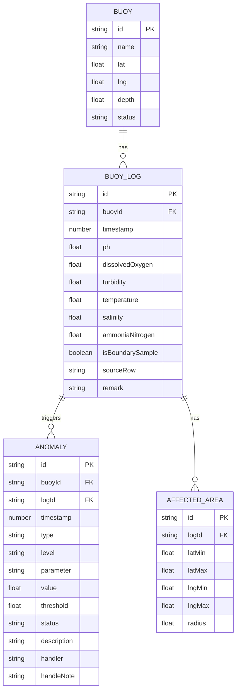

## 1. 架构设计



## 2. 技术说明

- **前端框架**：React@18 + TypeScript@5 + Vite@5
- **状态管理**：Zustand@4，轻量级状态管理，支持状态订阅与选择器
- **路由**：React Router@6，单页应用路由管理
- **UI 框架**：TailwindCSS@3，原子化 CSS 框架
- **3D 渲染**：three@0.160 + @react-three/fiber@8 + @react-three/drei@9 + @react-three/postprocessing@2
- **动画**：Framer Motion@10，UI 交互动画
- **数据处理**：使用 Mock 数据模拟后端服务，内置完整的测试数据集
- **文件上传**：react-dropzone@14，支持 CSV/Excel 文件拖拽上传
- **表格**：@tanstack/react-table@8，高性能数据表格
- **图表**：recharts@2，水质参数趋势图表

## 3. 路由定义

| 路由 | 页面名称 | 核心功能 |
|------|----------|----------|
| / | 3D 预警判断主页 | Web3D 场景、时间轴、筛选面板、浮标点选详情 |
| /logs | 浮标日志管理 | 日志列表、边界样本标记、经纬度反写、人工备注 |
| /import | 数据导入 | 文件上传、字段映射、预览校验、去重处理 |
| /queue | 异常队列 | 异常列表、联动详情、状态处理、追踪链路 |

## 4. 核心状态定义

```typescript
// 浮标数据类型
interface Buoy {
  id: string;
  name: string;
  lat: number;
  lng: number;
  depth: number;
  status: 'normal' | 'warning' | 'danger';
  parameters: WaterQualityParams;
}

// 水质参数
interface WaterQualityParams {
  ph: number;
  dissolvedOxygen: number;
  turbidity: number;
  temperature: number;
  salinity: number;
  ammoniaNitrogen: number;
}

// 浮标日志
interface BuoyLog {
  id: string;
  buoyId: string;
  timestamp: number;
  parameters: WaterQualityParams;
  isBoundarySample: boolean;
  sourceRow?: string;
  affectedArea?: {
    latRange: [number, number];
    lngRange: [number, number];
    radius: number;
  };
  remark?: string;
  anomalies: string[];
}

// 异常记录
interface Anomaly {
  id: string;
  buoyId: string;
  logId: string;
  timestamp: number;
  type: 'parameter_exceed' | 'boundary_anomaly' | 'trend_abnormal';
  level: 'low' | 'medium' | 'high' | 'critical';
  parameter: keyof WaterQualityParams;
  value: number;
  threshold: number;
  status: 'pending' | 'processing' | 'resolved';
  description: string;
  handler?: string;
  handleNote?: string;
}

// 全局状态
interface AppState {
  // 3D 场景
  sceneReady: boolean;
  cameraPosition: [number, number, number];
  selectedBuoyId: string | null;
  
  // 时间轴
  currentTime: number;
  timeRange: [number, number];
  isPlaying: boolean;
  playbackSpeed: number;
  
  // 筛选
  filterParams: {
    parameter: keyof WaterQualityParams | 'all';
    riskLevel: Anomaly['level'] | 'all';
    buoyIds: string[];
  };
  
  // 数据
  buoys: Buoy[];
  logs: BuoyLog[];
  anomalies: Anomaly[];
  
  // 操作方法
  setSelectedBuoy: (id: string | null) => void;
  setCurrentTime: (time: number) => void;
  togglePlayback: () => void;
  setFilter: (filter: Partial<AppState['filterParams']>) => void;
  importLogs: (logs: BuoyLog[]) => ImportResult;
  updateLogRemark: (logId: string, remark: string) => void;
  updateAnomalyStatus: (anomalyId: string, status: Anomaly['status'], note?: string) => void;
}

interface ImportResult {
  success: number;
  duplicates: number;
  boundarySamples: number;
  errors: string[];
}
```

## 5. 数据模型

### 5.1 数据模型定义



### 5.2 Mock 数据设计

**浮标数据 (6 个浮标)**:
- 分布在近岸海域不同位置
- 包含正常、警告、危险三种状态

**浮标日志数据**:
- 每个浮标每小时一条记录，覆盖 7 天数据
- 包含 1 条边界样本（特殊标记，非标准行格式）
- 每条日志包含经纬度反写的影响范围和来源行信息

**异常队列数据**:
- 根据水质参数阈值自动生成异常
- 包含待处理、处理中、已完成三种状态
- 每条异常关联到具体的浮标日志记录

## 6. 核心业务逻辑

### 6.1 边界样本识别算法

```typescript
function detectBoundarySample(log: BuoyLog): boolean {
  // 边界样本特征：
  // 1. 单个参数突增超过 3 倍标准差
  // 2. 多个参数同时接近阈值边界
  // 3. 非标准时间点记录（非整点）
  const params = Object.values(log.parameters);
  const mean = params.reduce((a, b) => a + b, 0) / params.length;
  const std = Math.sqrt(params.reduce((a, b) => a + Math.pow(b - mean, 2), 0) / params.length);
  
  const hasOutlier = params.some(p => Math.abs(p - mean) > 3 * std);
  const isNonStandardTime = new Date(log.timestamp).getMinutes() !== 0;
  const multipleNearThreshold = Object.entries(log.parameters).filter(
    ([key, value]) => value >= getThreshold(key) * 0.9
  ).length >= 3;
  
  return hasOutlier || (isNonStandardTime && multipleNearThreshold);
}
```

### 6.2 经纬度反写算法

```typescript
function calculateAffectedArea(log: BuoyLog): AffectedArea {
  const { lat, lng } = getBuoyById(log.buoyId);
  const anomalyLevel = calculateAnomalyLevel(log);
  
  // 影响半径根据异常等级计算
  const radius = 0.5 + anomalyLevel * 0.3; // km
  
  const latDelta = radius / 111;
  const lngDelta = radius / (111 * Math.cos(lat * Math.PI / 180));
  
  return {
    latMin: lat - latDelta,
    latMax: lat + latDelta,
    lngMin: lng - lngDelta,
    lngMax: lng + lngDelta,
    radius
  };
}
```

### 6.3 重复导入去重逻辑

```typescript
function deduplicateLogs(newLogs: BuoyLog[], existingLogs: BuoyLog[]): {
  toAdd: BuoyLog[];
  toUpdate: BuoyLog[];
  duplicates: number;
} {
  const existingMap = new Map(
    existingLogs.map(log => [`${log.buoyId}-${log.timestamp}`, log])
  );
  
  const toAdd: BuoyLog[] = [];
  const toUpdate: BuoyLog[] = [];
  let duplicates = 0;
  
  for (const newLog of newLogs) {
    const key = `${newLog.buoyId}-${newLog.timestamp}`;
    const existing = existingMap.get(key);
    
    if (existing) {
      duplicates++;
      // 保留原有备注，仅更新其他字段
      toUpdate.push({
        ...newLog,
        id: existing.id,
        remark: existing.remark // 保护人工备注不被覆盖
      });
    } else {
      toAdd.push(newLog);
    }
  }
  
  return { toAdd, toUpdate, duplicates };
}
```

### 6.4 四方联动机制

```typescript
// 任意一个状态变化时，同步更新其他关联状态
function syncAllStates(changeSource: 'scene' | 'timeline' | 'filter' | 'queue') {
  switch (changeSource) {
    case 'timeline':
      // 时间变化 → 更新 3D 场景数据 → 更新异常队列显示
      updateSceneForTime(currentTime);
      updateQueueForTime(currentTime);
      break;
    case 'filter':
      // 筛选变化 → 更新 3D 场景显示 → 更新异常队列 → 更新日志列表
      updateSceneWithFilter(filterParams);
      updateQueueWithFilter(filterParams);
      updateLogsWithFilter(filterParams);
      break;
    case 'queue':
      // 异常选中 → 跳转时间轴 → 3D 场景定位 → 展开关联日志
      jumpToTime(anomaly.timestamp);
      focusSceneOnBuoy(anomaly.buoyId);
      expandLog(anomaly.logId);
      break;
    case 'scene':
      // 浮标点选 → 时间轴跳转至最近异常 → 筛选关联日志 → 队列高亮
      jumpToNearestAnomalyTime(buoyId);
      filterLogsByBuoy(buoyId);
      highlightQueueByBuoy(buoyId);
      break;
  }
}
```

## 7. 项目目录结构

```
src/
├── components/
│   ├── scene3d/          # 3D 场景组件
│   │   ├── Scene.tsx     # 主场景
│   │   ├── Buoy.tsx      # 浮标组件
│   │   ├── Ocean.tsx     # 海面组件
│   │   ├── Terrain.tsx   # 地形组件
│   │   └── Heatmap.tsx   # 热力图
│   ├── timeline/         # 时间轴组件
│   ├── filter/           # 筛选面板
│   ├── logs/             # 日志管理组件
│   ├── queue/            # 异常队列组件
│   ├── import/           # 数据导入组件
│   └── common/           # 通用组件
├── store/
│   └── useAppStore.ts    # 全局状态管理
├── data/
│   ├── mockBuoys.ts      # 浮标 Mock 数据
│   ├── mockLogs.ts       # 日志 Mock 数据（含边界样本）
│   └── mockAnomalies.ts  # 异常 Mock 数据
├── utils/
│   ├── anomalyDetector.ts # 异常检测算法
│   ├── boundaryDetector.ts # 边界样本识别
│   ├── geoCalculator.ts   # 经纬度计算
│   └── deduplicator.ts    # 去重逻辑
├── types/
│   └── index.ts          # TypeScript 类型定义
├── hooks/
│   └── useSyncState.ts   # 四方联动 Hook
├── pages/
│   ├── Home.tsx
│   ├── Logs.tsx
│   ├── Import.tsx
│   └── Queue.tsx
└── App.tsx
```
