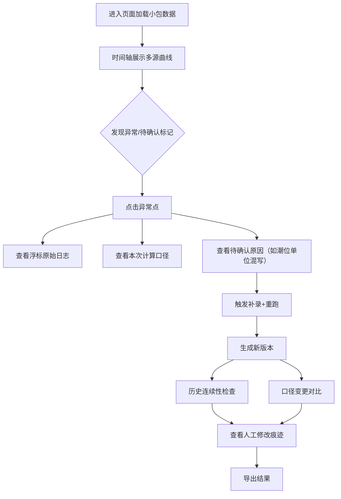

## 1. 产品概述
近岸水质时序回放是面向水质分析师的专业可视化工具，解决浮标传感器数据与人工船上记录时间错位、异常溯源困难、补录重跑口径混乱等核心痛点。
- 目标用户：水质分析师（阿乔）、现场彩排老师、数据审核人员
- 核心价值：让时序异常一眼可见、溯源一键到达、补录口径可追溯、交接信息零遗漏

## 2. 核心功能

### 2.1 用户角色
| 角色 | 核心诉求 | 关键权限 |
|------|----------|----------|
| 水质分析师 | 快速定位异常、查看计算口径、导出结果 | 全功能只读、导出数据 |
| 现场老师 | 查看历史人工修改痕迹 | 只读历史变更记录 |
| 数据运维 | 补录数据、触发重跑 | 数据补录、重跑触发 |

### 2.2 功能模块
1. **时序回放主界面**：时间轴、多源数据曲线叠加、异常标记、待确认状态、播放控制
2. **异常详情面板**：浮标原始日志、计算口径快照、待确认原因说明
3. **历史版本与重跑**：版本列表、连续性检查、人工修改痕迹高亮、口径变更对比
4. **快速上手指引**：样例数据入口、异常热点导航、导出操作入口

### 2.3 页面详情
| 页面名称 | 模块名称 | 功能描述 |
|----------|----------|----------|
| 时序回放主页 | 顶部信息栏 | 展示当前浮标、监测时段、数据包状态、待确认数量 |
| 时序回放主页 | 多源曲线图 | 浮标水质（溶解氧/浊度/pH）、潮位、人工记录点同屏叠加 |
| 时序回放主页 | 时间轴与播放条 | 可拖拽、倍速播放、跳到异常/待确认点 |
| 时序回放主页 | 异常标记层 | 红色异常点、黄色待确认点，悬浮显示摘要 |
| 异常详情面板 | 浮标日志标签 | 传感器原始报文、采集时间戳、设备状态 |
| 异常详情面板 | 计算口径标签 | 参与计算的字段、公式、单位转换规则 |
| 异常详情面板 | 待确认原因标签 | 潮位单位混写等自动检测原因 + 人工补充说明 |
| 历史版本抽屉 | 版本时间线 | 每次重跑生成版本，标注补录/人工修改图标 |
| 历史版本抽屉 | 连续性检查 | 断点可视化、数据断档高亮 |
| 历史版本抽屉 | 口径对比 | 两个版本计算口径字段级差异对比 |
| 快速上手卡片 | 三点指引 | 样例在哪→异常在哪→怎么导出 |

## 3. 核心流程
水质分析师打开页面 → 默认载入小包测试数据 → 时间轴上看到异常和待确认标记 → 点击异常点弹出详情 → 查看浮标日志和计算口径 → 对潮位单位混写待确认项查看原因 → 触发补录后重跑 → 检查历史版本连续性和口径变更 → 彩排前查看人工修改痕迹 → 导出结果

## 4. 用户界面设计

### 4.1 设计风格
- 主色：深海蓝 `#0B3D91`，辅色：潮汐青 `#2EC4B6`，异常红 `#E63946`，待确认琥珀 `#F4A261`
- 配色基调：深蓝科技感 + 数据可视化清晰对比，数据层白色半透明卡片叠加深蓝渐变背景
- 字体：展示用 Noto Serif SC（中文衬线，专业稳重），正文数据用 JetBrains Mono（等宽清晰）
- 按钮：圆角 12px，悬停上浮 2px 加柔和阴影
- 图标：Lucide 线性图标，描边 1.5px，数据密集区用迷你图标
- 布局：左右分栏，左主图右侧面板，可折叠抽屉展示历史

### 4.2 页面设计概述
| 页面名称 | 模块名称 | UI 关键要素 |
|----------|----------|-------------|
| 时序回放主页 | 主图区 | 大尺寸 SVG 折线图，渐变色填充区域，异常点脉冲动画 |
| 时序回放主页 | 时间轴 | 底部贯穿式，刻度精确到分钟，可点击跳转 |
| 时序回放主页 | 快速上手卡片 | 右上角悬浮，三步骤小卡片，支持一键收起 |
| 异常详情面板 | 标签页 | 三标签横向切换，内容区等宽字体展示原始日志 |
| 历史版本抽屉 | 版本条 | 垂直时间线，每个节点带状态图标，点击展开差异 |

### 4.3 响应式
桌面优先设计，≥1280px 完整布局；768-1280px 面板改为底部抽屉；<768px 折叠为单列滚动。
