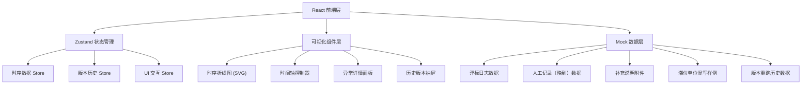

## 1. 架构设计



## 2. 技术说明
- 前端框架：React@18 + TypeScript
- 构建工具：Vite
- 样式方案：TailwindCSS@3
- 状态管理：Zustand
- 路由：react-router-dom（单页面，主页 + 详情锚点）
- 可视化：原生 SVG 自绘折线图（避免引入大型图表库，保持小包轻量）
- 图标库：lucide-react
- 后端：无，全部使用 Mock 数据模拟

## 3. 路由定义
| 路由 | 用途 |
|------|------|
| / | 时序回放主页（默认加载小包测试数据） |

## 4. 数据模型

### 4.1 核心数据类型
```typescript
// 浮标传感器原始日志
interface BuoyLog {
  id: string;
  timestamp: number;        // Unix ms
  deviceId: string;
  dissolvedOxygen: number;  // mg/L
  turbidity: number;        // NTU
  ph: number;
  temperature: number;      // ℃
  tideLevel: number;        // 潮位
  tideUnit: 'm' | 'cm';     // 单位（故意混写制造待确认）
  rawPayload: string;       // 原始报文
  status: 'normal' | 'warning' | 'error';
}

// 人工船上记录（晚到）
interface ManualRecord {
  id: string;
  recordedAt: number;       // 记录时间
  arrivedAt: number;        // 入库时间（晚于 recordedAt）
  location: string;
  sampleDO: number | null;
  sampleTurbidity: number | null;
  operator: string;
  remark: string;
}

// 补充说明附件
interface SupplementaryNote {
  id: string;
  attachedAt: number;
  author: string;
  content: string;
  relatedTimeRange: [number, number];
}

// 异常/待确认事件
interface AnomalyEvent {
  id: string;
  timestamp: number;
  type: 'anomaly' | 'pending_confirmation';
  severity: 'high' | 'medium' | 'low';
  reason: string;           // 如 "潮位单位混写"
  detail: string;
  relatedBuoyLogIds: string[];
  relatedManualIds: string[];
  confirmed: boolean;
  confirmedBy?: string;
}

// 计算口径快照
interface CalculationSpec {
  id: string;
  version: string;
  timestamp: number;
  formula: string;
  unitConversions: Record<string, string>;
  involvedFields: string[];
  thresholds: Record<string, [number, number]>;
}

// 历史版本
interface HistoryVersion {
  id: string;
  versionTag: string;        // v1, v2...
  createdAt: number;
  createdBy: string;
  trigger: 'auto' | 'manual_rerun' | 'supplement_rerun';
  hasManualEdit: boolean;
  manualEditFields?: string[];
  spec: CalculationSpec;
  continuityReport: {
    hasGaps: boolean;
    gaps: Array<{ from: number; to: number; durationMs: number }>;
  };
}
```

## 5. 项目目录结构
```
src/
├── components/
│   ├── TimelineChart.tsx          # 主时序曲线 SVG
│   ├── TimelineController.tsx     # 底部时间轴 + 播放控制
│   ├── AnomalyPanel.tsx           # 异常详情三标签面板
│   ├── HistoryDrawer.tsx          # 历史版本抽屉
│   ├── QuickStartCard.tsx         # 快速上手卡片
│   ├── StatusBadge.tsx            # 状态标签
│   └── Header.tsx                 # 顶部信息栏
├── data/
│   └── mockData.ts                # 所有 Mock 数据
├── hooks/
│   └── useTimeFormatter.ts        # 时间格式化工具
├── pages/
│   └── PlaybackPage.tsx           # 主页面
├── store/
│   ├── usePlaybackStore.ts        # 时序回放状态
│   └── useHistoryStore.ts         # 版本历史状态
├── types/
│   └── index.ts                   # 类型定义
├── App.tsx
├── main.tsx
└── index.css
```
