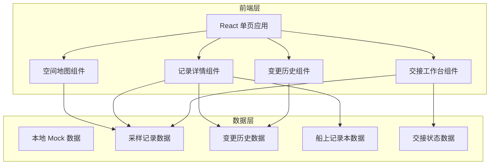
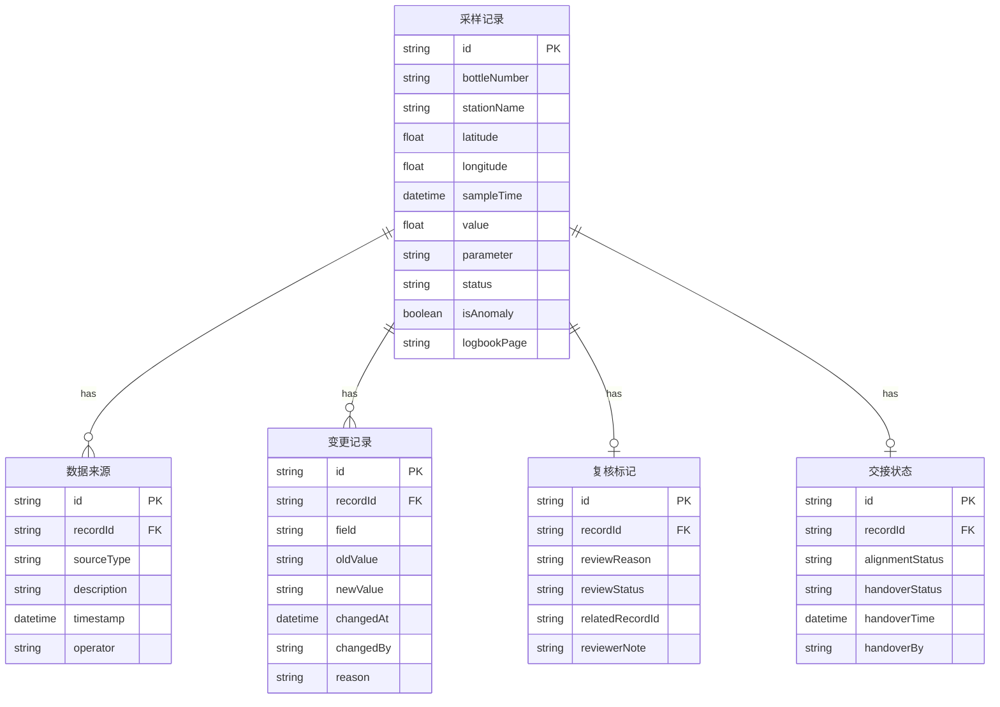

## 1. 架构设计



纯前端架构，数据以 Mock JSON 形式内嵌于前端代码中，无需后端服务。所有状态管理通过 React Context + useReducer 实现。

## 2. 技术说明

- **前端框架**：React@18 + TypeScript
- **样式方案**：Tailwind CSS@3
- **构建工具**：Vite
- **地图引擎**：Leaflet + React-Leaflet（轻量级、无需 API Key、离线可用）
- **状态管理**：React Context + useReducer
- **数据持久化**：localStorage（变更历史、交接状态）
- **后端**：无（纯前端应用，数据通过 Mock JSON 提供）
- **数据库**：无

## 3. 路由定义

| 路由 | 用途 |
|------|------|
| `/` | 空间地图主页：采样点空间分布、异常高亮、船上记录本来源联动 |
| `/record/:id` | 采样记录详情页：完整数据来源时间线、复核标记、附件与备注 |
| `/history` | 变更历史页：结论变更时间线、版本对比 |
| `/handover` | 交接工作台：交接清单、CSV导出、船上记录本核对、交接确认 |

## 4. 数据模型

### 4.1 数据模型定义



### 4.2 数据定义

#### 采样记录 (SampleRecord)

| 字段 | 类型 | 说明 |
|------|------|------|
| id | string | 唯一标识，格式 WQ-XXX |
| bottleNumber | string | 采样瓶编号 |
| stationName | string | 站点名称 |
| latitude | number | 纬度 |
| longitude | number | 经度 |
| sampleTime | string | 采样时间 ISO8601 |
| parameter | string | 检测参数（如 DO、pH、COD） |
| value | number | 检测值 |
| unit | string | 单位 |
| threshold | number | 阈值 |
| isAnomaly | boolean | 是否异常 |
| logbookPage | string | 船上记录本页码 |
| logbookPhoto | string | 记录本照片路径 |
| conclusion | string | 当前结论 |
| createdAt | string | 创建时间 |
| updatedAt | string | 更新时间 |

#### 数据来源 (DataSource)

| 字段 | 类型 | 说明 |
|------|------|------|
| id | string | 唯一标识 |
| recordId | string | 关联采样记录ID |
| sourceType | enum | 来源类型：original / late_attachment / supplementary_note / latest_export |
| description | string | 来源描述 |
| timestamp | string | 来源时间戳 |
| operator | string | 操作人 |
| attachmentUrl | string | 附件路径（可选） |

#### 变更记录 (ChangeRecord)

| 字段 | 类型 | 说明 |
|------|------|------|
| id | string | 唯一标识 |
| recordId | string | 关联采样记录ID |
| field | string | 变更字段 |
| oldValue | string | 变更前值 |
| newValue | string | 变更后值 |
| changedAt | string | 变更时间 |
| changedBy | string | 变更人 |
| reason | string | 变更原因 |

#### 复核标记 (ReviewFlag)

| 字段 | 类型 | 说明 |
|------|------|------|
| id | string | 唯一标识 |
| recordId | string | 关联采样记录ID |
| reviewReason | string | 复核原因（如：重复录入、数据矛盾） |
| reviewStatus | enum | pending / confirmed / resolved |
| relatedRecordId | string | 关联的重复记录ID |
| reviewerNote | string | 复核人备注 |

#### 交接状态 (HandoverStatus)

| 字段 | 类型 | 说明 |
|------|------|------|
| id | string | 唯一标识 |
| recordId | string | 关联采样记录ID |
| alignmentStatus | enum | aligned / misaligned / unchecked |
| handoverStatus | enum | pending / confirmed / completed |
| handoverTime | string | 交接时间 |
| handoverBy | string | 交接人 |

## 5. 关键技术决策

### 5.1 版本区分策略

同一条"近岸水质空间标注"材料重跑时，系统通过 `DataSource.sourceType` 字段区分：
- `original`：原始录入（旧处理）
- `late_attachment`：晚到附件
- `supplementary_note`：后补备注
- `latest_export`：最新导出

每条数据来源记录都带有精确时间戳，确保时序可追溯。

### 5.2 历史保留策略

变更历史通过 `ChangeRecord` 实体永久保留，不删除旧版本。前端展示时：
- 当前状态直接从 `SampleRecord` 读取
- 历史版本从 `ChangeRecord` 链式回溯
- 版本对比通过 diff 算法高亮差异字段

### 5.3 重复采样瓶检测

录入时系统自动检查 `bottleNumber` 唯一性。若发现重复：
1. 自动创建 `ReviewFlag`，reviewReason 为"重复录入"
2. 两条记录互相引用（relatedRecordId）
3. 地图上重复点以特殊图标标记
4. 详情页显示复核区域，接手人可看到两条记录的差异

### 5.4 CSV 导出格式

导出 CSV 包含以下列：
- 基础字段：采样瓶编号、站点、经纬度、采样时间、检测参数、检测值、单位
- 来源字段：数据来源类型、来源时间戳、操作人
- 复核字段：复核状态、复核原因、复核人备注
- 交接字段：对齐状态、交接状态
- 结论字段：当前结论、结论变更次数

## 6. 目录结构

```
src/
├── components/
│   ├── map/              # 地图相关组件
│   ├── record/           # 记录详情相关组件
│   ├── history/          # 变更历史相关组件
│   └── handover/         # 交接工作台相关组件
├── contexts/             # React Context
├── data/                 # Mock 数据
├── hooks/                # 自定义 Hooks
├── pages/                # 页面组件
├── types/                # TypeScript 类型定义
└── utils/                # 工具函数
```
