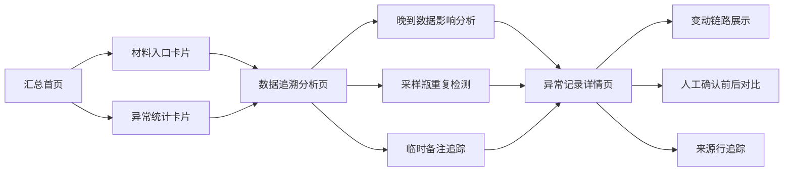

## 1. 产品概述

近岸水质报告汇总系统是面向海洋站值班员和现场老师的数据追溯与异常分析工具。系统解决人工记录水质报告变动繁琐、晚到数据影响难以追溯、采样瓶重复依赖人眼排查等痛点，提供从汇总视图到异常记录的完整追溯链路。

- 核心目标：让水质报告的每一处变动都有据可查、有迹可循
- 目标用户：海洋站值班员、现场老师、报告审核人员
- 产品价值：降低人工记录负担，提升报告可追溯性和复盘效率

## 2. 核心功能

### 2.1 用户角色

| 角色 | 使用场景 | 核心诉求 |
|------|----------|----------|
| 值班员 | 日常录入与汇总 | 快速定位异常、记录变动原因 |
| 现场老师 | 审核与复盘 | 从汇总追到明细、看清判断变化 |
| 彩排人员 | 进场前核查 | 人工确认前后差别一目了然 |

### 2.2 功能模块

1. **汇总首页**：材料入口导航、报告总览、异常统计卡片
2. **数据追溯分析页**：晚到数据影响分析、采样瓶重复检测、来源行追踪
3. **异常记录详情页**：人工确认前后对比、变动链路、附件影响说明

### 2.3 页面详情

| 页面名称 | 模块名称 | 功能描述 |
|-----------|-------------|---------------------|
| 汇总首页 | 材料入口区 | 传感器数据、实验室结果表、船上记录三类材料入口卡片，显示更新时间和状态 |
| 汇总首页 | 报告总览 | 显示当前报告编号、采样站点、日期范围、结论摘要 |
| 汇总首页 | 异常统计 | 晚到数据、采样瓶重复、人工修正三类异常的数量统计卡片 |
| 数据追溯分析页 | 晚到数据影响 | 以时间线展示数据到达顺序，标注晚到的实验室结果/船上记录，说明对结论的具体影响 |
| 数据追溯分析页 | 采样瓶重复检测 | 列出重复的采样瓶编号，展示影响范围（涉及哪些指标、哪些行）和来源行 |
| 数据追溯分析页 | 临时备注追踪 | 彩排前补充的实验室结果表备注，高亮显示其改变了哪些判断 |
| 异常记录详情页 | 变动链路 | 从汇总结论一路追溯到具体异常记录的完整路径 |
| 异常记录详情页 | 前后对比 | 人工确认前后的数据对比视图，清晰展示差别 |
| 异常记录详情页 | 来源追踪 | 显示异常数据的来源表格、行号、原始值与修正值 |

## 3. 核心流程

用户从汇总首页进入，通过材料入口或异常统计卡片快速定位关注点，进入分析页查看晚到数据影响和采样瓶重复情况，点击具体异常可进入详情页查看完整变动链路和前后对比。

## 4. 用户界面设计

### 4.1 设计风格

- 主色调：深海蓝（#0F4C81）作为主色，搭配浅灰蓝背景，体现海洋数据专业感
- 辅助色：警示橙（#FF8C42）标记晚到数据，异常红（#E63946）标记重复/错误，确认绿（#2A9D8F）标记人工确认
- 字体：思源黑体/Noto Sans SC，清晰易读，适合数据密集场景
- 布局：左侧导航 + 主内容区，卡片式模块划分
- 风格：简洁专业的政务/科研风格，朴素实用，信息密度高但不杂乱

### 4.2 页面设计概览

| 页面名称 | 模块名称 | UI元素 |
|-----------|-------------|----------|
| 汇总首页 | 材料入口区 | 三张并列卡片，带图标、名称、更新时间、状态标签 |
| 汇总首页 | 报告总览 | 标题区 + 关键信息行，结论摘要用底色突出 |
| 汇总首页 | 异常统计 | 三列数字卡片，带下钻箭头 |
| 数据追溯分析页 | 时间线 | 纵向时间轴，节点带状态颜色和描述 |
| 数据追溯分析页 | 影响说明 | 卡片式展开，原始结论 vs 变更后结论对比 |
| 数据追溯分析页 | 重复列表 | 表格展示，重复瓶号标红，影响范围可展开 |
| 异常记录详情页 | 面包屑导航 | 显示追溯路径 |
| 异常记录详情页 | 前后对比 | 左右分栏或上下对比，差异处高亮 |
| 异常记录详情页 | 来源信息 | 表格 + 行号引用，可跳转定位 |

### 4.3 响应式

桌面端优先设计，保证数据表格和时间线的展示效果。平板端自适应布局，卡片可换行堆叠。

### 4.4 动效设计

- 页面切换使用淡入淡出过渡
- 异常高亮使用脉冲动画吸引注意
- 展开/收起使用平滑高度过渡
- 时间线节点滚动时依次出现
