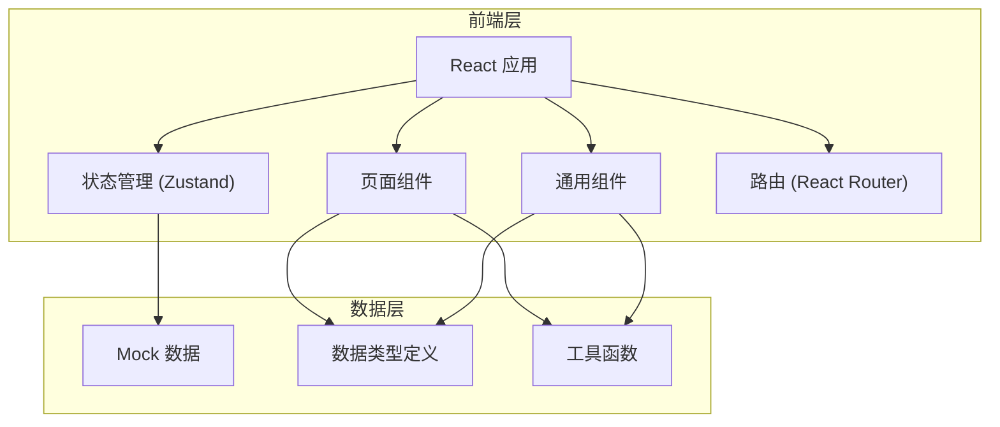

## 1. 架构设计



## 2. 技术描述

- 前端框架：React 18 + TypeScript
- 构建工具：Vite
- 样式方案：TailwindCSS 3
- 状态管理：Zustand
- 路由：React Router DOM v6
- 图标：Lucide React
- 后端：无（纯前端演示，使用 Mock 数据）
- 数据：内置 Mock 数据模拟水质报告、异常记录、追溯链路

## 3. 路由定义

| 路由 | 页面名称 | 用途 |
|-------|---------|------|
| / | 汇总首页 | 材料入口、报告总览、异常统计 |
| /trace | 数据追溯分析页 | 晚到数据影响、采样瓶重复、临时备注 |
| /anomaly/:id | 异常记录详情页 | 变动链路、前后对比、来源追踪 |

## 4. 数据模型

### 4.1 数据类型定义

```typescript
// 水质报告汇总
interface WaterQualityReport {
  id: string;
  reportNo: string;
  stationName: string;
  dateRange: { start: string; end: string };
  conclusion: string;
  materials: MaterialInfo[];
  anomalies: AnomalySummary[];
}

// 材料入口信息
interface MaterialInfo {
  type: 'sensor' | 'lab' | 'ship';
  name: string;
  updateTime: string;
  status: 'normal' | 'delayed' | 'updated';
  recordCount: number;
}

// 异常摘要
interface AnomalySummary {
  type: 'delayed' | 'duplicate' | 'manual';
  count: number;
  description: string;
}

// 晚到数据记录
interface DelayedRecord {
  id: string;
  materialType: 'lab' | 'ship';
  materialName: string;
  arriveTime: string;
  expectedTime: string;
  delayHours: number;
  impactDescription: string;
  originalConclusion: string;
  revisedConclusion: string;
  affectedIndicators: string[];
  sourceRows: SourceRow[];
}

// 采样瓶重复记录
interface DuplicateBottle {
  id: string;
  bottleNo: string;
  duplicateCount: number;
  affectedIndicators: string[];
  sourceRows: SourceRow[];
  impactScope: string;
  isManualChecked: boolean;
  checkTime?: string;
  checker?: string;
  originalBottleData: BottleData;
  currentBottleData: BottleData;
}

// 来源行信息
interface SourceRow {
  tableName: string;
  rowNumber: number;
  columnName: string;
  originalValue: string;
  currentValue: string;
  remark?: string;
}

// 采样瓶数据
interface BottleData {
  bottleNo: string;
  collectTime: string;
  depth: string;
  indicators: Record<string, number | string>;
}

// 临时备注
interface TempRemark {
  id: string;
  materialType: 'lab';
  content: string;
  addTime: string;
  addedBy: string;
  changedJudgments: ChangedJudgment[];
}

// 变更的判断
interface ChangedJudgment {
  indicator: string;
  originalJudgment: string;
  newJudgment: string;
  reason: string;
}

// 异常详情
interface AnomalyDetail {
  id: string;
  type: 'delayed' | 'duplicate' | 'remark';
  title: string;
  tracePath: TraceStep[];
  beforeData: any;
  afterData: any;
  sourceRows: SourceRow[];
  manualConfirm?: {
    operator: string;
    time: string;
    comment: string;
  };
}

// 追溯步骤
interface TraceStep {
  step: number;
  name: string;
  description: string;
  time?: string;
}
```

### 4.2 数据结构说明

系统围绕"异常追溯"核心，包含三类主要数据：
1. **报告汇总数据**：报告基本信息、材料入口状态、异常统计
2. **追溯分析数据**：晚到记录、重复瓶号、临时备注及影响分析
3. **异常详情数据**：完整追溯链路、前后对比数据、来源行定位

所有数据使用 Mock 方式内置，便于演示和离线使用。

## 5. 目录结构

```
src/
├── components/          # 通用组件
│   ├── Layout.tsx       # 布局组件
│   ├── MaterialCard.tsx # 材料入口卡片
│   ├── AnomalyCard.tsx  # 异常统计卡片
│   ├── Timeline.tsx     # 时间线组件
│   ├── DataTable.tsx    # 数据表格
│   └── TraceBreadcrumb.tsx # 追溯面包屑
├── pages/               # 页面组件
│   ├── Dashboard.tsx    # 汇总首页
│   ├── TraceAnalysis.tsx # 追溯分析页
│   └── AnomalyDetail.tsx # 异常详情页
├── data/                # Mock 数据
│   └── mockData.ts      # 模拟数据
├── types/               # 类型定义
│   └── index.ts         # 类型汇总
├── utils/               # 工具函数
│   └── format.ts        # 格式化工具
├── store/               # 状态管理
│   └── useReportStore.ts
├── App.tsx
├── main.tsx
└── index.css
```
