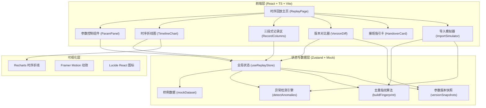

## 1. 架构设计



## 2. 技术描述

- 前端：React@18 + TypeScript + Vite + TailwindCSS@3
- 状态管理：Zustand（轻量全局 store，跨组件同步参数/版本/记录状态）
- 图表库：Recharts（时序折线图、双 Y 轴、自定义打点）
- 动效库：Framer Motion（抽屉开合、卡片浮现、差异闪烁、折线绘制动画）
- 图标：Lucide React
- 后端：无，全流程使用内置 Mock 数据 + 前端计算引擎模拟（异常检测、去重、版本快照均在前端计算）
- 初始化工具：vite-init，使用 `react-ts` 模板（纯前端，无需 Express）
- 包管理器：pnpm（优先），回退 npm

## 3. 路由定义

| 路由 | 用途 |
|------|------|
| `/` | 时序回放主页，单页应用，所有模块在同一页面通过抽屉/标签切换 |

## 4. 核心数据模型

### 4.1 数据结构定义

```typescript
// 单条时序记录
interface SurveyRecord {
  id: string;
  siteName: string;          // 站点名（可能含命名不一致脏数据）
  timestamp: string;         // ISO 时间
  coverage: number;          // 海草覆盖度 %
  tideLevel: number;         // 潮位数值
  tideUnit: 'm' | 'cm' | 'ft'; // 潮位单位（故意混写）
  waterQuality: number;      // 水质指数
  sourceRow: number;         // 原始来源行号（留痕迹用）
  sourceBatch: string;       // 导入批次
  flags: {
    isOutlier: boolean;      // 疑似离群/噪声
    isUnitMismatch: boolean; // 单位混写标记
    isNameMismatch: boolean; // 站点名与规范对不上
    isPendingMaterial: boolean; // 缺材料待补
  };
  anomalyTags?: string[];    // 异常说明标签
  remark?: string;           // 人工备注（永不被覆盖）
  manualOverride?: {         // 人工改判
    by: string;
    at: string;
    reason: string;
    newStatus: 'normal' | 'outlier_keep' | 'outlier_reject' | 'pending';
  };
  processedAt?: string;      // 处理时间
}

// 参数快照
interface ParamSnapshot {
  version: string;           // v1, v2, ...
  createdAt: string;
  params: {
    smoothWindow: number;    // 平滑窗口 1-15
    outlierThreshold: number; // 阈值系数 1.0-4.0
    normalizeUnit: boolean;  // 是否自动归一化单位
    keepSuspicious: boolean; // 是否保留可疑点（不删除）
    nameFuzzyMatch: number;  // 命名模糊匹配阈值 0-100
  };
  affectedRecordIds: string[]; // 本参数下状态发生变化的记录 id
  diffFromPrev?: {
    paramKey: keyof ParamSnapshot['params'];
    oldValue: any;
    newValue: any;
  }[];
}

// 去重导入结果
interface ImportResult {
  totalIncoming: number;
  skippedDuplicate: number;
  remarkPreserved: number;
  merged: number;
  details: {
    fingerprint: string;
    action: 'insert' | 'skip_duplicate' | 'preserve_remark' | 'merge';
    recordId: string;
  }[];
}
```

### 4.2 核心算法

1. **异常检测引擎** `detectAnomalies(records, params)`
   - 使用 IQR（四分位距）× 阈值系数 判定离群点，`keepSuspicious=true` 时仅标记不删除
   - 扫描潮位单位列，出现 `cm`/`ft` 与 `m` 混用时，加 `isUnitMismatch` 标记，保留 `sourceRow`
   - 站点名与规范名库做模糊匹配，低于 `nameFuzzyMatch` 分数时加 `isNameMismatch` 标记

2. **指纹去重** `buildFingerprint(record)` → `siteName + timestamp.slice(0,10) + round(coverage,2)`
   - 匹配到相同指纹时，新导入记录跳过（不翻倍）
   - 旧记录的 `remark` 字段永不被新值覆盖，仅当旧值为空时写入

3. **版本差异计算** `diffParams(prev, curr)` → 只列出发生变化的参数键，并反查受影响记录 id 列表

## 5. 页面组件拆分

| 组件路径 | 职责 |
|---------|------|
| `src/pages/ReplayPage.tsx` | 主页面编排，左右布局，子组件挂载 |
| `src/components/HeaderBar.tsx` | 顶部标题 + 站点信息 + 导出/指引卡入口 |
| `src/components/ParamPanel.tsx` | 参数滑条 + 重跑按钮 + 当前版本徽章 |
| `src/components/TimelineChart.tsx` | Recharts 双 Y 轴折线图，异常点自定义渲染，悬浮弹层 |
| `src/components/RecordColumns.tsx` | 三段式卡片（已处理/待补/改判），内部滚动列表 |
| `src/components/VersionDiffDrawer.tsx` | 底部抽屉，多版本参数并排，差异高亮闪烁 |
| `src/components/HandoverCard.tsx` | 右下角悬浮卡片，样例/异常/导出三按钮 |
| `src/components/ImportSimulator.tsx` | 参数面板旁的小模块，模拟重复导入按钮 + 结果提示条 |
| `src/store/useReplayStore.ts` | Zustand store，含 records / currentParams / versions / actions |
| `src/utils/anomaly.ts` | 异常检测 + 指纹去重 + 版本对比算法 |
| `src/utils/mockData.ts` | 样例数据生成器（内置命名不一致、潮位单位混写、离群点） |
| `src/types/index.ts` | 类型定义集中导出 |

## 6. 初始样例数据要点

- 共 28 条时序记录，覆盖 2024-03 至 2024-06 月的月/半月采样频率
- 故意放置：
  - 1 条旧记录站点名写 "海沟湾三号"（规范名应为"海沟湾站3号"）→ 触发命名不一致
  - 3 条潮位单位写成 `cm`（其他为 `m`）→ 触发单位混写
  - 2 个离群点（覆盖度跳变 > IQR × 2.5）→ 疑似噪声但保留
  - 2 条待补材料（`isPendingMaterial` = true，标记缺现场照片/缺水质记录）
- 预设 v1 / v2 / v3 三个参数版本，每个版本变化一个参数，对应 2-4 条记录状态变化，便于演示版本对比
